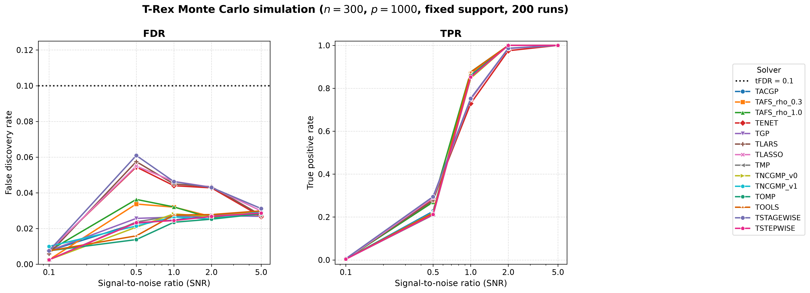
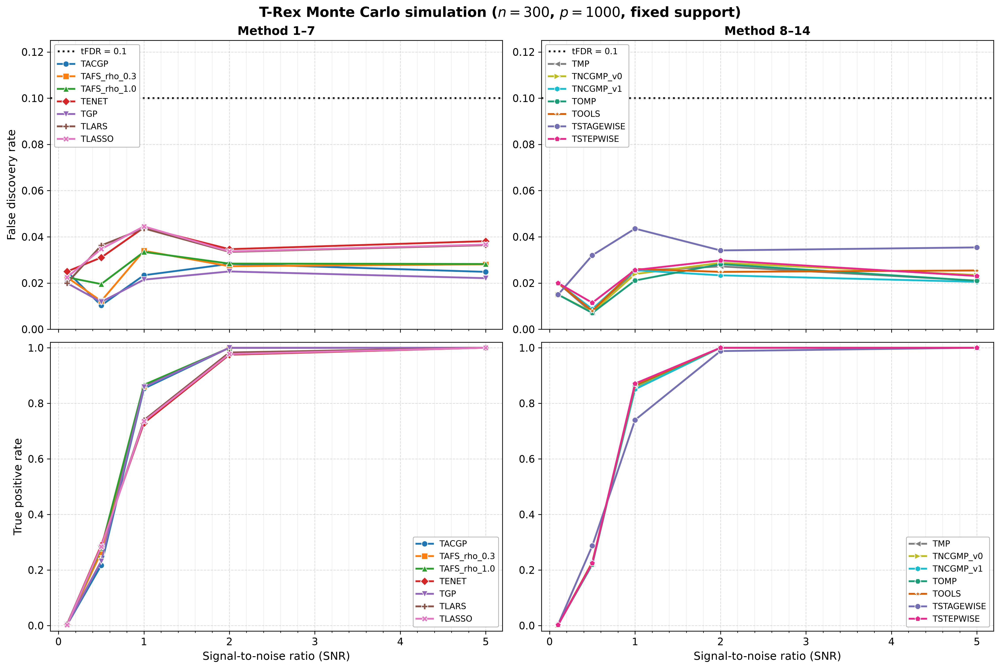

# Demo 02: Monte Carlo Simulation with Fixed Support

## Purpose

Evaluate T-Rex selector performance (FDR and TPR) across a range of **Signal-to-Noise Ratios (SNR)** with a fixed true support structure, comparing many base solvers. This is the foundational empirical validation demo for the classical T-Rex algorithm.

---

## Data Generation Parameters

- **Sample size**: $n = 300$
- **Number of features**: $p = 1000$
- **True support**: a set of **10 unique random indices** drawn once (before the MC loop) from `std::mt19937 rng(24)` via a uniform distribution over $\{0, \ldots, p-1\}$; the same support is reused across every solver, SNR level, and MC trial. It is **not** the first 10 features.
- **True coefficients**: fixed $\beta_j = 1$ (`rnd_coef = false`)
- **SNR range**: $\{0.1, 0.5, 1.0, 2.0, 5.0\}$
- **Monte Carlo repetitions**: `num_MC = 200` trials per solver × SNR level
- **DGP**: $\mathbf{y} = \mathbf{X}\boldsymbol{\beta} + \boldsymbol{\epsilon}$, $\boldsymbol{\epsilon} \sim N(0, \sigma^2 I_n)$

`main()` runs only the high-dimensional configuration ($n = 300$, $p = 1000$); the low-dimensional call ($n = 1000$, $p = 300$) is compiled but guarded by `if (false)`.

---

## Control Parameters

```
K = 20                           # Random experiments per T-loop iteration
max_dummy_multiplier = 10        # Max dummies L = 10p
use_max_T_stop = true            # Cap T ≤ ceil(n/2)
dummy_distribution = Normal      # Dummy predictors drawn from N(0,1)
lloop_strategy = STANDARD        # Fresh i.i.d. dummy matrix per L-loop iteration
tloop_stagnation_stop = true     # Early exit when R_mat stagnates
tloop_max_stagnant_steps = 7     # Stagnation window (7 consecutive unchanged iterations)
opt_threshold = 0.75             # Optimization grid point
parallel_rnd_experiments = false # Sequential dummy experiments
use_memory_mapping = false       # In-memory data
tFDR = 0.1                       # Target FDR control level
```

The MC loop itself is parallelized with OpenMP (`omp_set_num_threads(6)`).

---

## Solvers Compared

The shared list `make_default_solvers_to_test()` in `trex_sim_utils.hpp` provides **14** T-Rex base solvers. All 14 are benchmarked, and their selections are **not** identical — each solver drives a different underlying path/pursuit algorithm, so FDR/TPR differ across solvers:

- **TLARS** — least-angle regression
- **TLASSO** — lasso
- **TENET** — elastic net ($\lambda_2 = 0.1$)
- **TSTAGEWISE** — forward stagewise
- **TSTEPWISE** — forward stepwise
- **TOMP** — orthogonal matching pursuit
- **TGP** — gradient pursuit
- **TACGP** — adaptive-conjugate gradient pursuit
- **TMP** — matching pursuit
- **TAFS_rho_0.3**, **TAFS_rho_1.0** — adaptive forward selection ($\rho_{\text{afs}} = 0.3$ and $1.0$)
- **TNCGMP_v1**, **TNCGMP_v0** — nonlinear conjugate-gradient matching pursuit (two variants)
- **TOOLS** — orthogonal one-line-search

---

## Output Files

Both files are written to `simulation_results/data/`. Stems are built from `n`, `p`, and the stagnation window (`tloop_max_stagnant_steps = 7`), prefixed with `demo_trex_02_mc_sim_fixed_support_`.

### Main Result File
**`demo_trex_02_mc_sim_fixed_support_trex_results_n300_p1000_stagnation_window_7.txt`**

Aligned tabular format showing FDR and TPR for each solver across SNR levels:

```
======================================================================
=== T-Rex Results (averaged over 200 Monte Carlo runs) ===
======================================================================

Solver         Metric    SNR       0.1       0.5       1.0       2.0       5.0
------------------------------------------------------------------------------
TLARS          FDR              ...       ...       ...       ...       ...
               TPR              ...       ...       ...       ...       ...

TLASSO         FDR              ...       ...       ...       ...       ...
               TPR              ...       ...       ...       ...       ...

... (12 more solvers)
```

Only FDR and TPR rows are printed for this demo (Avg L and Avg T are not computed here).

### Tidy-Format CSV
**`demo_trex_02_mc_sim_fixed_support_trex_results_n300_p1000_stagnation_window_7.csv`**

Long/stacked format for R/Python plotting. The header column order is **`solver,metric,snr,value`** (metric before snr):
```
solver,metric,snr,value
TLARS,FDR,0.100000,...
TLARS,TPR,0.100000,...
TLARS,FDR,0.500000,...
TLARS,TPR,0.500000,...
...
```

---

## Results Visualization

The suite-level plotting module [../trex_plt_utils.py](../trex_plt_utils.py)
renders the tidy CSV three ways (all written to `simulation_results/plots/`).

### Overview (all 14 solvers)

FDR and TPR versus SNR (log-scaled x-axis), all solvers on one pair of panels:



*Left:* FDR stays comfortably below the target `tFDR = 0.1` (black dotted line)
across all SNR levels for every solver. *Right:* TPR rises from near-zero at SNR
0.1 to near-perfect recovery by SNR 2.0.

### Grouped 2×2 view (de-cluttered)

The same data with the solvers split into two halves (columns) and FDR/TPR on the
two rows, so each panel carries only ~7 curves — easier to read where they bunch
up. Both FDR panels share a y-scale for comparison:



### Interactive (Plotly HTML)

`..._fdr_tpr_vs_snr.html` is a self-contained interactive figure — hover for exact
values and **click a solver in the legend to isolate its curve** in both panels.
Open it directly in a browser (it is not rendered inline on GitHub):

```bash
open simulation_results/plots/demo_trex_02_mc_sim_fixed_support_trex_results_n300_p1000_stagnation_window_7_fdr_tpr_vs_snr.html
```

Vector (PDF) copies of both static figures sit alongside the PNGs.

### Regenerating the figures

Quickest way — the wrapper picks up the repo's local `.venv` automatically, so no
manual path or `activate` is needed. By default it produces all three views
(overview + grouped static figures and the interactive HTML):

```bash
# From this demo folder:
./generate_plots.sh                 # overview + grouped (png+pdf) + interactive html
./generate_plots.sh --no-plotly     # skip the interactive html
./generate_plots.sh --plotly-cdn    # tiny html that loads plotly.js from a CDN
./generate_plots.sh --tfdr 0.05     # e.g. a different target-FDR line
```

One-time setup: the plotter needs `matplotlib` and `plotly` (the repo `.venv`
already ships `pandas`) — `pip install matplotlib plotly`.

The underlying `../trex_plt_utils.py` is shared by every demo in this suite whose
results use the tidy `solver,metric,snr,value` schema (demos 02/03/04/05) — it
infers the row colours from the data and writes the figures into the
`simulation_results/plots/` sibling of a `data/` CSV. To call it directly against
another results file:

```bash
python ../trex_plt_utils.py path/to/results.csv --title "..." --legend-title "..." --formats png pdf
```

---

## Running the Demo

```bash
./build/debug/bin/trex_selector_methods/trex/demo_trex_02_mc_sim_fixed_support/demo_trex_02_mc_sim_fixed_support
```

The MC loop runs 200 trials × 5 SNR levels × 14 solvers, so wall-clock time depends heavily on the machine and thread count.

---

## Key Findings

### FDR Control
- FDR is **maintained near or below target tFDR = 0.1** across SNR levels for the LARS-path solvers.
- At low SNR, FDR tends to be conservative due to few selections; it stabilizes as SNR increases.

### Power (TPR)
- **Weak signals** (SNR 0.1): low TPR (little detected).
- **Moderate signals** (SNR 0.5–1.0): TPR increases smoothly.
- **Strong signals** (SNR 2.0+): TPR approaches near-perfect recovery.

### Solver Comparison
- The 14 solvers do **not** produce identical selections; FDR/TPR curves differ between them.
- This lets you compare the statistical behaviour of the different base solvers under a shared DGP and FDR target.

---

## Interpretation Guide

**What to look for:**
1. **FDR constraint satisfaction**: Is FDR $\leq$ tFDR across SNR levels for each solver?
2. **Power progression**: Does TPR increase monotonically with SNR?
3. **Solver differences**: How do the FDR/TPR curves diverge across the 14 solvers?

**Typical use case:**
- Baseline validation of the algorithm implementation.
- Comparison of base solvers within the T-Rex framework.
- Parameter tuning (varying tFDR, K, stagnation window).

---

**Last updated**: 2026-07-10
