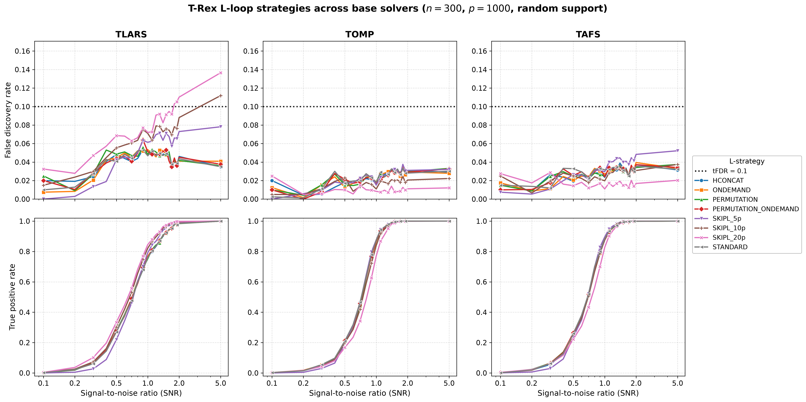
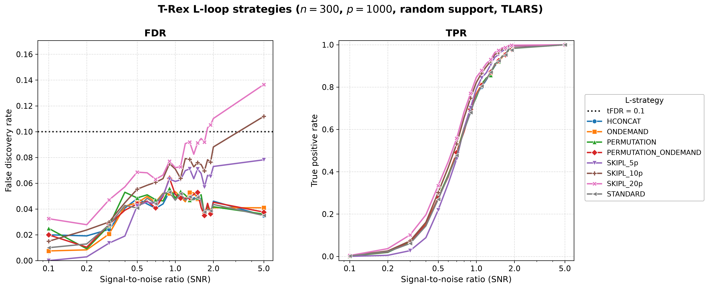

# Demo 04: L-Loop Strategy Comparison

## Purpose

Compare the **L-loop strategies** of the T-Rex Selector — the different mechanisms by which the dummy-variable structure is generated/expanded across L-loop iterations — and repeat the whole comparison across **three base solver families** (TLARS, TOMP, TAFS). This shows how the L-loop strategy affects FDR control, power (TPR), and the calibrated dummy multiplier $L$ / stopping time $T$, and — crucially — whether the fixed-budget `SKIPL` FDR overshoot seen under TLARS is **specific to the LARS path** or persists under the greedy solvers. (The demo originally fixed the solver at TLARS; it now sweeps all three, one result-file pair per solver, precisely to settle that question.)

---

## Data Generation Parameters

- **Sample size**: $n = 300$
- **Number of features**: $p = 1000$
- **True support**: a random subset of size $s = 10$, **redrawn per trial** (`block_support = false`) by shuffling $\{0, \ldots, p-1\}$ with `std::mt19937(seed + 500000)`, keeping 10 indices and sorting them. A contiguous block support $\{0, \ldots, s-1\}$ is available via the `block_support = true` call, which is compiled but guarded by `if (false)`.
- **True coefficients**: fixed $\beta_j = 1$ (`rnd_coef = false`)
- **SNR grid**: 21 values — $\{0.1, 0.2, \ldots, 2.0\}$ plus $5.0$
- **Monte Carlo repetitions**: `num_MC = 200` trials per strategy × SNR level
- **DGP**: $\mathbf{y} = \mathbf{X}\boldsymbol{\beta} + \boldsymbol{\epsilon}$, $\boldsymbol{\epsilon} \sim N(0, \sigma^2 I_n)$, Normal predictors and Normal noise
- **Base solvers** (outer sweep, one result-file pair each): **TLARS** (equiangular LARS path; stagnation stop AUTO-resolves to *disabled*), **TOMP** (greedy orthogonal matching pursuit; stagnation stop *enabled*), **TAFS** (greedy adaptive forward selection, `rho_afs = 0.3`; stagnation stop *enabled*) — the same three families as demo 05
- **tFDR**: $0.1$

---

## L-Loop Strategies Tested

`make_lloop_strategies()` sweeps the **six L-loop strategy types** defined by the library `LLoopStrategy` enum, with `SKIPL` evaluated at three fixed dummy levels (5p, 10p, 20p) — **eight rows** in total.

The strategies span two orthogonal axes: **dummy source** (fresh independent draws per experiment vs one shared base matrix whose rows are permuted per experiment) and **storage** (*stored* strategies keep matrices in the `DummyGenerator` for the whole run; *on-demand* strategies re-derive everything from the seed at each step, with zero persistent state):

1. **STANDARD** — stored; fresh i.i.d. dummy matrices at each L-loop iteration (conservative default, matches the CRAN R reference).
2. **HCONCAT** — stored; horizontally expand (concatenate) dummy columns; prefix-stable.
3. **PERMUTATION** — stored base dummy matrix, re-used via deterministic **row permutations** per experiment.
4. **PERMUTATION_ONDEMAND** — seed-derived base + row permutations per experiment; nothing stored. Bit-identical to PERMUTATION for the same seed.
5. **ONDEMAND** — seed-derived independent dummies per experiment; nothing stored.
6. **SKIPL** — skip the L-loop entirely and use $L = \text{max\_dummy\_multiplier}$, evaluated at:
   - **SKIPL_5p** ($L = 5p$)
   - **SKIPL_10p** ($L = 10p$)
   - **SKIPL_20p** ($L = 20p$)

The library enum has **no** "Doubling" or "Fixed" strategy. (The former `DIRECT` / `PERMUTATION_DIRECT` names were renamed to `ONDEMAND` / `PERMUTATION_ONDEMAND`; the old names no longer exist.)

---

## Control Parameters

Set per solver × strategy (see the solver / strategy loops):

```
solver_type = <varies>           # TLARS / TOMP / TAFS (outer sweep)
solver_params.rho_afs = 0.3      # TAFS regularization (ignored by TLARS/TOMP)
K = 20                           # Random experiments per T-loop iteration
max_dummy_multiplier = 10        # Default for adaptive strategies; 5 / 10 / 20 for SKIPL
use_max_T_stop = true            # Cap T ≤ ceil(n/2)
dummy_distribution = Normal      # Dummy predictors drawn from N(0,1)
lloop_strategy = <varies>        # Inner sweep across the 6 strategy types (8 rows)
tFDR = 0.1                       # Target FDR control level
```

The MC loop is parallelized with OpenMP (`omp_set_num_threads(6)`).

---

## Output Files

All files are written to `simulation_results/data/`. One `.txt` + `.csv` pair is written **per base solver**; the stem encodes the solver and the support scenario (`random_support` for the active run):

### Main Result Files
**`demo_trex_04_lloop_strategies_results_n300_p1000_{tlars,tomp,tafs}_random_support.txt`**

Aligned table (written by the shared `save_and_print_mc_results`) with four metric rows — FDR, TPR, Avg L, Avg T — per strategy across the 21 SNR columns. The row label is the strategy name (STANDARD, HCONCAT, PERMUTATION, PERMUTATION_ONDEMAND, ONDEMAND, SKIPL_5p, SKIPL_10p, SKIPL_20p):

```
======================================================================
=== T-Rex Results (averaged over 200 Monte Carlo runs) ===
======================================================================

Solver         Metric    SNR       0.1       0.2  ...       2.0       5.0
--------------------------------------------------------------------------
STANDARD       FDR              ...
               TPR              ...
               Avg L            ...
               Avg T            ...

HCONCAT        ...
...
```

### Tidy-Format CSVs
**`demo_trex_04_lloop_strategies_results_n300_p1000_{tlars,tomp,tafs}_random_support.csv`**

Long/stacked format, header column order **`solver,metric,snr,value`** (here the "solver" column holds the strategy name; the base solver is encoded in the file name), with `FDR`, `TPR`, `AvgL`, `AvgT` rows.

---

## Results Visualization

`./generate_plots.sh` renders two complementary views into
`simulation_results/plots/`: a **cross-solver comparison grid** (the figure for
this demo's core question) and the standard **per-solver figure sets**. Both are
regenerated only after the demo has been run for all three base solvers (so the
three per-solver CSVs exist).

### Cross-solver comparison grid

The headline figure — a 2×3 grid, rows = metric (FDR / TPR), columns = base
solver (TLARS / TOMP / TAFS), with all eight L-loop strategies drawn as lines in
every panel. Colours and markers are keyed to the strategy, so a given strategy is
the same colour in every panel and can be tracked across solvers; all FDR panels
share one y-scale and all TPR panels share `[0, 1]`, so the columns are directly
comparable:



This grid exists to answer one question: **is the fixed-budget `SKIPL` FDR
overshoot specific to the LARS path?** Read the top (FDR) row across the three
columns and check whether the `SKIPL_20p` / `SKIPL_10p` curves cross the
`tFDR = 0.1` line under TOMP and TAFS the way they do under TLARS. It is produced
by the suite plotter's `grid` mode (`../trex_plt_utils.py grid --labels TLARS TOMP
TAFS --csvs ...`), which reads all three solver CSVs at once and renders them on a
shared scale.

#### What TLARS establishes, and the test the other columns run

Under **TLARS** (established, `num_MC = 200`, so a stable effect and not Monte
Carlo noise), the adaptive strategies (STANDARD, HCONCAT, PERMUTATION,
PERMUTATION_ONDEMAND, ONDEMAND) hold FDR near or below target — STANDARD even
trends *down* to ≈0.037 at SNR 5 — while the fixed-budget `SKIPL` levels break FDR
control in ascending order of budget: `SKIPL_5p` stays under target (max FDR
≈0.078), `SKIPL_10p` crosses only at the very top of the grid (max ≈0.112), and
`SKIPL_20p` climbs steadily past the line from SNR ≈1.8 to **≈0.136** at SNR 5 — a
~3.6 pp overshoot. The overshoot is **monotone in the dummy budget** and tracks a
runaway stopping time `T`: at SNR 5 the `Avg T` rows read `SKIPL_5p` `T ≈ 23`,
`SKIPL_10p` `T ≈ 86`, `SKIPL_20p` `T ≈ 146` — versus the true support size
`s = 10`.

**Mechanism.** `SKIPL` disables the L-loop and freezes the dummy multiplier at
`L = {5, 10, 20}·p`, so the calibration that the adaptive strategies use to *pick*
`L` (and thereby place the relative-occurrences threshold and the T-loop stop) is
gone. A larger fixed pool of null dummies dilutes each dummy's relative occurrence,
which pushes the calibrated threshold down and lets the T-loop run much further
before it trips — so many more original variables are admitted past the true
support, and the dummy-based FDP estimate no longer matches the realized FDP.

**Working hypothesis: this is LARS-specific.** Once the 10 true variables are in
(early, at high SNR), the equiangular LARS path keeps admitting variables
*equiangular* to the current residual, so borderline noise variables and null
dummies enter at very similar correlation levels and are poorly separated in the
ordering — exactly the regime where an over-large fixed `L` biases the FDP estimate
optimistic. A greedy-orthogonal solver (TOMP) removes the selected direction's
component at each step, which should separate late noise from dummies more cleanly
and blunt the effect; TAFS (greedy adaptive forward selection) is the second
greedy check. The **TOMP** and **TAFS** columns of the grid are that test: if
`SKIPL_20p` stays controlled under the greedy solvers, the overshoot is a property
of the LARS path rather than of `SKIPL` in general. (Demo 05 already shows the
*adaptive* STANDARD strategy holds FDR across all three families; this extends that
check to the fixed-budget SKIPL regime.)

> **Verdict:** to be read off the regenerated grid once the demo has been run for
> TOMP and TAFS. Fill in here after the run.

### Per-solver figure sets

For each base solver, the suite-level [../trex_plt_utils.py](../trex_plt_utils.py)
also renders the usual overview (all eight strategies on one FDR | TPR pair), a
de-cluttered grouped 2×2 view, and a self-contained interactive Plotly HTML (the
CSV's "solver" column holds the strategy name, so the strategies are the legend).
The TLARS overview, for example:



The `_grouped` PNG/PDF and the interactive `.html` (hover for values, **click a
strategy in the legend to isolate it** in both panels) sit alongside, one set per
solver (`tlars` / `tomp` / `tafs`). Open an HTML directly in a browser:

```bash
open simulation_results/plots/demo_trex_04_lloop_strategies_results_n300_p1000_tlars_random_support_fdr_tpr_vs_snr.html
```

Vector (PDF) copies of every static figure sit alongside the PNGs.

### Regenerating the figures

Run the demo first (it writes the three per-solver CSVs), then the wrapper — it
picks up the repo's local `.venv` automatically and renders **all** three
per-solver sets plus the comparison grid:

```bash
# From this demo folder:
./generate_plots.sh                 # 3 per-solver sets (png+pdf+html) + the grid
./generate_plots.sh --no-plotly     # skip the interactive html
./generate_plots.sh --tfdr 0.05     # e.g. a different target-FDR line
```

---

## Running the Demo

```bash
# Release build recommended — this sweep is 3 solvers × 8 strategies × 21 SNR × 200 MC.
./build/release/bin/trex_selector_methods/trex/demo_trex_04_mc_sim_lloop_strategies/demo_trex_04_mc_sim_lloop_strategies
```

It writes one `.txt` + `.csv` pair per base solver into `simulation_results/data/`
(`..._tlars_...`, `..._tomp_...`, `..._tafs_...`), re-saving after each solver
finishes. The full run is long (the fixed-budget `SKIPL_20p`/`SKIPL_10p` points at
high SNR dominate, where the T-loop runs to `T ≈ 90–150`), so expect a
multi-hour/overnight run. Once the three CSVs exist, render every figure with
`./generate_plots.sh`.

---

## Key Questions Addressed

1. **Do all L-loop strategies maintain FDR control?**
   - Expected: FDR $\leq$ tFDR across strategies.

2. **How does the calibrated $L$ differ between adaptive strategies and the SKIPL levels?**
   - The Avg L rows show the adaptive strategies' calibrated $L$ versus SKIPL's fixed 5p/10p/20p.

3. **Is TPR comparable across strategies at matched SNR?**
   - Expected: broadly comparable power, with strategy-specific variation.

4. **Is the `SKIPL` FDR overshoot specific to the LARS path?**
   - Compare the TLARS column of the grid (where `SKIPL_20p`/`SKIPL_10p` overshoot) against the greedy TOMP / TAFS columns. If the overshoot is absent or muted under the greedy solvers, it is a LARS-path property rather than a general `SKIPL` defect.

---

## Interpretation Guide

**What to look for:**
- **FDR control**: the adaptive strategies keep FDR $\leq$ tFDR; the fixed-budget SKIPL levels do **not** in general — `SKIPL_10p` and `SKIPL_20p` overshoot at high SNR under TLARS (see the discussion above). At `num_MC = 200` these curves are stable, so the overshoot is a real property of the fixed-budget regime, not sampling noise.
- **Cross-solver**: whether that overshoot survives under the greedy TOMP / TAFS columns of the grid — the LARS-specificity test.
- **Avg L / Avg T**: how each strategy calibrates the dummy structure and when the T-loop stops; note the runaway `Avg T` under the larger SKIPL budgets.

**Practical significance:**
- The seed-based ONDEMAND / PERMUTATION_ONDEMAND strategies avoid holding any dummy matrix in memory — the preferred choice at scale.
- PERMUTATION and PERMUTATION_ONDEMAND produce bit-identical selections for the same seed; they differ only in memory footprint.
- SKIPL trades adaptivity for a fixed, larger dummy budget — and, as this demo shows, an over-large fixed budget can break FDR control. It is a convenience/speed knob, not a drop-in replacement for the calibrated L-loop.

This C++ demo is based on `R/trex_selector_methods/trex/demo_trex_04_mc_sim_lloop_strategies.R`, and extends it: the R version fixes the base solver at TLARS, whereas the C++ version sweeps TLARS / TOMP / TAFS to test the LARS-specificity of the SKIPL overshoot.

---

**Last updated**: 2026-07-14
