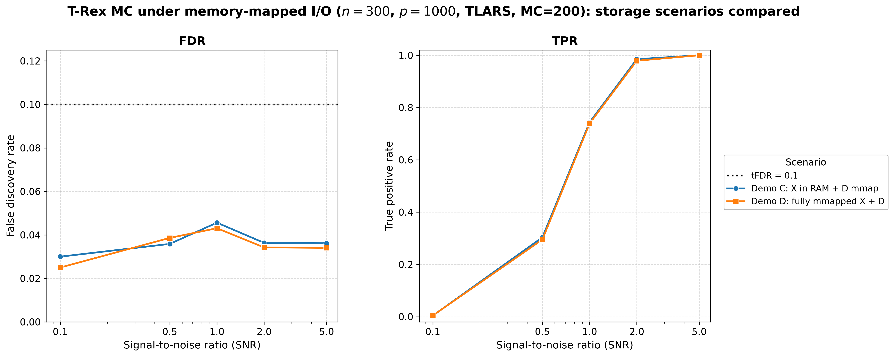
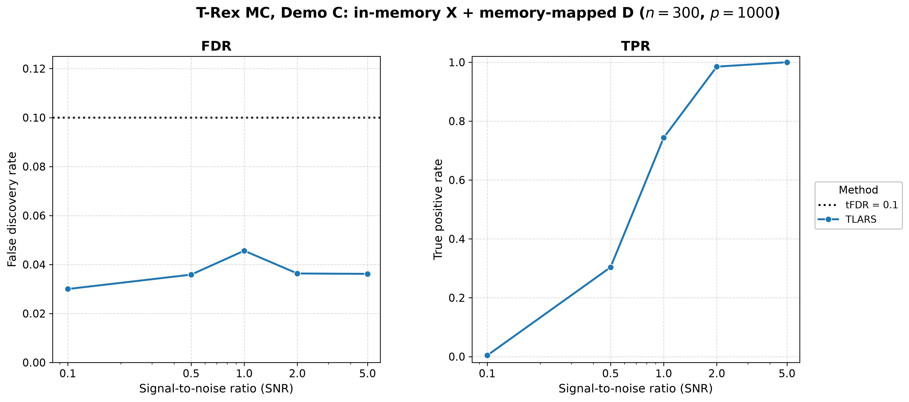
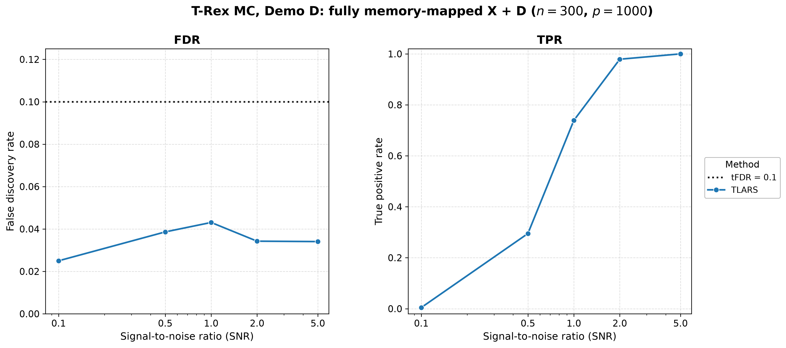

# Demo 07: Monte Carlo Simulation with Memory-Mapped Data

## Purpose

Validate **T-Rex selector performance under memory-mapped (mmap) I/O** over many Monte Carlo trials, mirroring the single-run patterns of Demo 06. Two scenarios are run: (C) in-memory $\mathbf{X}$ with mmap dummy matrices $\mathbf{D}$ + solver serialization, and (D) a fully memory-mapped pipeline where each MC iteration creates and destroys its own mmap-backed $\mathbf{X}/\mathbf{y}$ files.

---

## Data Generation Parameters

Both scenarios use the same high-dimensional configuration:

- **Sample size**: $n = 300$
- **Number of features**: $p = 1000$
- **True support**: a set of **10 unique random indices** drawn once from `std::mt19937 rng(24)` (uniform over $\{0, \ldots, p-1\}$), fixed across all MC trials
- **True coefficients**: fixed $\beta_j = 1$ (`rnd_coef = false`)
- **SNR range**: $\{0.1, 0.5, 1.0, 2.0, 5.0\}$
- **Monte Carlo repetitions**: `num_MC = 200` for both scenarios — the two runs are directly comparable
- **Base solver**: TLARS only
- **DGP**: $\mathbf{y} = \mathbf{X}\boldsymbol{\beta} + \boldsymbol{\epsilon}$, $\boldsymbol{\epsilon} \sim N(0, \sigma^2 I_n)$
- **tFDR**: $0.1$

---

## Scenarios

### Demo C: MC — In-Memory $\mathbf{X}$ + `use_memory_mapping = true`
- $\mathbf{X}$ generated in RAM per trial; dummy matrices $\mathbf{D}$ memory-mapped and solver LARS-path state serialized to disk.
- Purpose: verify the D-mmap + solver-serialization pipeline yields stable, reproducible FDR/TPR over many runs.

### Demo D: MC — Fully Memory-Mapped Pipeline ($\mathbf{X}$ + $\mathbf{D}$ + solver serialization)
- Each MC iteration writes its own mmap-backed $\mathbf{X}/\mathbf{y}$ files (per-thread paths derived from the filestem `X_mmap_mc` and `omp_get_thread_num()`), which are removed by an RAII `MmapFileGuard` at the end of the iteration scope — exception-safe.

---

## Control Parameters

```
K = 20                           # Random experiments per T-loop iteration
max_dummy_multiplier = 10        # Max L = 10p
use_max_T_stop = true            # Cap T ≤ ceil(n/2)
dummy_distribution = Normal      # Dummy predictors drawn from N(0,1)
lloop_strategy = HCONCAT         # Horizontally concatenated dummy columns
tloop_stagnation_stop = true     # Early exit when R_mat stagnates
tloop_max_stagnant_steps = 7     # Stagnation window (7) → "sw7" in the output stem
opt_threshold = 0.75             # Optimization grid point
parallel_rnd_experiments = false # Sequential dummy experiments
use_memory_mapping = true        # D mmap + solver serialization
solver_type = TLARS              # Base solver
tFDR = 0.1                       # Target FDR control level
```

The MC loop is parallelized with OpenMP (`omp_set_num_threads(6)`).

---

## Output Files

Written to `simulation_results/data/`. Each scenario writes one `.txt` and one `.csv`, with stems encoding `n`, `p`, and the stagnation window (`sw7`):

- **Demo C**: `d03_trex_mmap_demo_c_n300_p1000_sw7.{txt,csv}`
- **Demo D**: `d03_trex_mmap_demo_d_n300_p1000_sw7.{txt,csv}`

Figures are written separately to `simulation_results/plots/` by `./generate_plots.sh` (see *Results Visualization*);
the demo binary itself writes only the `.txt` / `.csv` pair per scenario.

The `.txt` file (written by the shared `save_and_print_mc_results`) is an aligned table with FDR, TPR, Avg L, and Avg T rows for the single TLARS solver across the 5 SNR columns:

```
======================================================================
=== T-Rex Results (averaged over 200 Monte Carlo runs) ===
======================================================================

Solver         Metric    SNR       0.1       0.5       1.0       2.0       5.0
------------------------------------------------------------------------------
TLARS          FDR              ...
               TPR              ...
               Avg L            ...
               Avg T            ...
```

Both scenarios report "averaged over 200 Monte Carlo runs". The `.csv` uses the tidy header **`solver,metric,snr,value`** with `FDR`, `TPR`, `AvgL`, `AvgT` rows.

---

## Results Visualization

The suite-level plotting module [../trex_plt_utils.py](../trex_plt_utils.py) renders the tidy CSVs into
`simulation_results/plots/`. Only the `FDR` and `TPR` rows are plotted; the `AvgL` / `AvgT` rows are ignored by the
plotter (they remain in the CSV and the `.txt` table).

### Storage scenarios compared (headline figure)

Both scenarios run the identical sweep, so they belong on one pair of axes: this demo's question is whether the
storage medium is visible in the *results*, and two curves that lie on top of each other answer it directly. The
scenario takes the place of the "solver" row that the other demos sweep:



*Left:* FDR stays far below the target `tFDR = 0.1` (black dotted line) across the whole SNR grid under **both**
storage pipelines, peaking at only $0.046$ (C) / $0.043$ (D) at $\mathrm{SNR}=1$. *Right:* the power curves are
indistinguishable — TPR climbs from $\approx 0.004$ at $\mathrm{SNR}=0.1$ to full recovery ($1.000$ in both) by
$\mathrm{SNR}=5$.

The two pipelines agree to within **$0.005$ (FDR)** and **$0.009$ (TPR)** at every grid point — the scale of Monte
Carlo noise at $\mathrm{MC}=200$, not of a systematic effect. This is the result the demo exists to show: memory
mapping $\mathbf{X}$ and $\mathbf{D}$ is transparent to the selector, so it buys its memory savings without moving
the statistics. Note the curves are *not* expected to coincide exactly — the two scenarios drive different data
paths, so their MC trials are not bit-identical draws.

### Per-scenario overviews

The same data one scenario at a time, for reading a single pipeline's numbers off a figure. A single TLARS row per
scenario means there is nothing for the grouped 2×2 view to de-clutter, so it is skipped:





### Interactive (Plotly HTML)

Each static figure has a self-contained `.html` twin — hover for exact values, click a scenario in the legend to
isolate its curve in both panels. Open it directly in a browser (it is not rendered inline on GitHub):

```bash
open simulation_results/plots/d03_trex_mmap_demo_c_vs_d.html
```

Vector (PDF) copies of every static figure sit alongside the PNGs.

### Regenerating the figures

```bash
# From this demo folder:
./generate_plots.sh                 # overlay + per-scenario (png+pdf) + interactive html
./generate_plots.sh --no-plotly     # skip the interactive html
./generate_plots.sh --formats png   # extra args pass through to trex_plt_utils.py
```

The overlay is assembled by merging the two per-scenario CSVs into one tidy frame whose `solver` column carries the
scenario name — that column is the plotting module's generic "what this demo varies" dimension. The merge is a
temporary file, so `simulation_results/data/` keeps only what the demo binary writes.

---

## Running the Demo

```bash
./build/debug/bin/trex_selector_methods/trex/demo_trex_07_mc_sim_mmap/demo_trex_07_mc_sim_mmap
```

`main()` runs Demo C then Demo D, each at `num_MC = 200`.

---

## Key Questions Addressed

1. **Does FDR control hold with mmap storage?**
   - Expected: FDR $\leq$ tFDR — the storage medium is transparent to the algorithm.

2. **Does the fully-mmapped pipeline (Demo D) manage its per-iteration files safely?**
   - Expected: yes; RAII `MmapFileGuard` cleanup runs even if `select()` throws.

3. **Do the two storage pipelines agree?**
   - Expected: yes, up to MC noise. Both scenarios run the same sweep at `num_MC = 200`, so any systematic
     gap would point at the mmap pipeline rather than at sampling variability.
   - Observed: max $|\text{C} - \text{D}|$ of $0.005$ (FDR) and $0.009$ (TPR) — see *Results Visualization*.

---

## Interpretation Guide

**What to look for:**
- **FDR stability**: FDR should stay $\leq$ tFDR across SNR.
- **TPR progression**: increases with SNR toward full recovery.
- **Avg L / Avg T**: dummy-multiplier and stopping-time behaviour under the mmap pipeline.
- **Reliability**: no leaked mmap files, no crashes.

**Comparison with Demo 06 (single-run mmap):**
- Demo 06 validates basic mmap correctness (one run per scenario).
- Demo 07 validates robustness and FDR guarantees over many MC trials.

---

**Last updated**: 2026-07-17
