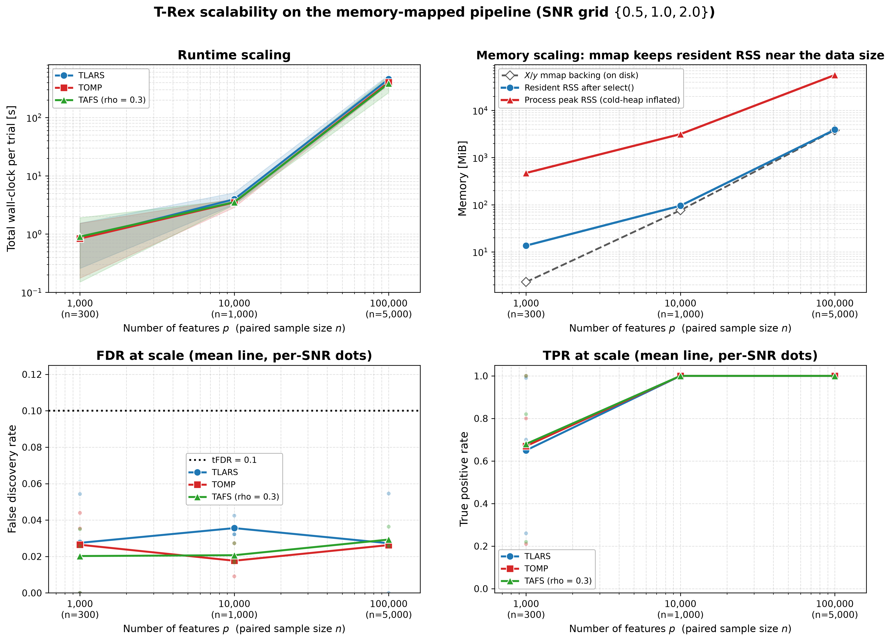

# Demo 08: Scalability Benchmark

## Purpose

Characterize **T-Rex selector runtime and memory usage** as $n$ and $p$ scale to large sizes.
On the **fully memory-mapped pipeline**: every Monte Carlo trial generates its data directly into
memory-mapped $X$/$y$ backing files (`SyntheticDataMapped` over `memmap::MemoryMappedMatrix`.
$X$ is never materialized in RAM), and `use_memory_mapping = true` additionally memory-maps the
internal dummy matrices $D$ and serializes solver warm-start state to disk. The benchmark reports:

- **Runtime scaling**: wall-clock time per algorithm phase (data generation, `select()`, per-$T$-iteration)
    as a function of $n$ and $p$
- **Memory scaling**: resident set size (RSS) after selection, process peak RSS, and the $X$/$y$ mmap
    backing-file sizes on disk
- **Solver comparison**: computational efficiency of TLARS vs. TOMP vs. TAFS at scale
- **Selection quality at scale**: FDR, TPR, average dummy multiplier $L$, average stopping time $T$ as a sanity check

The benchmark is a **2D sweep**: every scenario × solver combination is run over the SNR grid $\{0.5, 1.0, 2.0\}$.

---

## Scenarios

| Scenario | $n$ | $p$ | num_MC | Purpose |
| ---------- | ----- | ----- | -------- | --------- |
| A | 300 | 1,000 | 10 | Baseline |
| B | 1,000 | 10,000 | 10 | Moderate scale |
| C | 5,000 | 100,000 | 3 | Large sample |

### Memory behaviour

The whole pipeline is memory-mapped; thus $X$/$y$ are generated on disk, dummy matrices $D$ mmap-backed,
solver warm-start state serialized between T-loop iterations.
The **resident** memory stays bounded even at scenario-C scale:
measured max RSS is ~4.4 GiB while C's $X$ backing file alone is ~3.7 GiB, and most of that RSS is
reclaimable page cache of the touched mmap regions.

The **physical footprint** is a different story, and is why the `FootprMiB` column exists: the per-experiment
coefficient-path matrices ($(p + L \cdot p) \times \text{path-steps}$, allocated per experiment per
T-iteration and never touched again) accumulate as cold anonymous heap.
At scenario C scale this reached ~75 GiB — macOS's memory compressor swaps it out (observed ~49 GB swap in use),
so the process does **not** OOM, but on systems without generous swap/compression this allocation pattern is the
 scalability limit.
It is what killed an earlier $n = 10{,}000$, $p = 100{,}000$ attempt, and it is the main upstream optimization
 opportunity this benchmark surfaces (free or stream the beta paths after each T-iteration's $\Phi$ computation).

Disk sizing: the $X$ backing file is $n \cdot p \cdot 8$ bytes per trial and the mmap dummy matrix $D$ grows up to
 `max_dummy_multiplier` $\times$ that.

The benchmark runs the **scenario loop outermost** (every solver finishes the current scenario before the next, larger
 one starts) and **re-saves the result files after each completed scenario**, so a crash or OOM kill on a later
 scenario preserves all results finished so far.

Every Monte Carlo trial uses the memory-mapped data model from the beginning: $X$ and $y$ are generated directly into
 Boost memory-mapped backing files (`SyntheticDataMapped` over `memmap::MemoryMappedMatrix`), fed to the selector
 through `Eigen::Map` views, and removed per trial by an RAII `MmapFileGuard`.
 On top of that, `use_memory_mapping = true` is set for **all** scenarios, so the internal dummy matrices $D$ are
 memory-mapped and solver warm-start state is serialized to disk between T-loop iterations in every grid point.

A tiny smoke-test scenario (`make_smoke_scenarios()`, $n = 150$, $p = 500$) is gated behind `if (false)` in `main()`
 for end-to-end pipeline verification.

---

## Data Generation Parameters

The DGP mirrors **Demo 03** (variable support):

- **True support cardinality**: fixed at $s = 10$; the **indices** are redrawn per trial — each trial shuffles $\{0,
  \ldots, p-1\}$ with `std::mt19937(seed + 500000)`, keeps the first 10, and sorts them
- **True coefficients**: fixed $\beta_j = 1$ (`rnd_coef = false`)
- **SNR grid**: $\{0.5, 1.0, 2.0\}$ — each scenario × solver grid point is swept over all three SNR levels
- **DGP**: $\mathbf{y} = \mathbf{X}\boldsymbol{\beta} + \boldsymbol{\epsilon}$, Normal predictors and Normal noise
- **Seeding**: base seed $24 + 1000 \cdot (3 \cdot \text{scenario index} + \text{SNR index})$, unique per (scenario,
   SNR) and shared across solvers so every solver sees identical data

Unlike the other MC demos, trials run **sequentially** (no OpenMP parallel MC loop) so wall-clock and RSS measurements
 are undistorted; `omp_set_num_threads(6)` still applies to Eigen/solver internals.

---

## Control Parameters

```text
K = 20                           # Random experiments per T-loop iteration
max_dummy_multiplier = 10        # Max dummies L = 10p
use_max_T_stop = true            # Cap T ≤ ceil(n/2)
dummy_distribution = Normal      # Dummy predictors drawn from N(0,1)
lloop_strategy = HCONCAT         # Horizontally concatenated dummy columns
tloop_stagnation_stop = true     # Early exit when R_mat stagnates
tloop_max_stagnant_steps = 5     # Stagnation window
use_memory_mapping = true        # All scenarios: D mmap + solver serialization
tFDR = 0.1                       # Target FDR control level
```

---

## Solvers Compared

Three base solvers spanning the LARS-path and greedy families (Demo 05 configuration):

- **TLARS** — equiangular LARS path; terminates on its own
- **TOMP** — greedy orthogonal matching pursuit
- **TAFS** — greedy adaptive forward selection, `rho_afs = 0.3` (TLARS/TOMP take `0`); the figures label it
  `TAFS (rho = 0.3)`, so the setting is not lost when a plot is read apart from this README

---

## Measurements

Per scenario × solver × SNR, averaged over `num_MC` sequential trials:

| Metric | Meaning |
| -------- | --------- |
| `FDR`, `TPR` | Averaged false discovery / true positive rates |
| `Avg L`, `Avg T` | Averaged dummy multiplier and stopping time |
| `DGP s` | Data generation wall-clock (seconds) |
| `Select s` | Selector construction + `select()` wall-clock (L-loop + T-loop) (seconds) |
| `s/T-iter` | Select time per T-loop iteration (`select_s / T_stop`) (seconds) |
| `Total s` | `DGP s + Select s` (seconds) |
| `RSS MiB` | Max post-`select()` resident set size across trials (MiB) |
| `FootprMiB` | Max post-`select()` physical footprint across trials (MiB) — anonymous heap **including compressed/swapped pages** (Activity Monitor's "Memory"); captures the cold coefficient-path allocations that RSS misses |
| `PeakRSS` | Process peak RSS at grid-point end (MiB) — monotone over the process lifetime, i.e. a running maximum |
| `X+y MiB` | Data footprint: $X$/$y$ mmap backing-file sizes on disk (MiB) |

RSS is read via `mach task_info(MACH_TASK_BASIC_INFO)` (macOS) / `/proc/self/statm` (Linux); the physical footprint
via `task_info(TASK_VM_INFO).phys_footprint` (macOS) / `VmRSS + VmSwap` (Linux); peak RSS via `getrusage`.

---

## Output Files

Both files are written to `simulation_results/data/` with stem `demo_trex_08_scalability_results`.

### Main Result File

**`demo_trex_08_scalability_results.txt`**

Scenario info block (label, $n$, $p$, num_MC) followed by an aligned table in the demo 02–07 style — one column per
 scenario × SNR combination (labelled `<scenario>/<snr>`, e.g. `A/0.5`), twelve metric rows per solver.

### Tidy-Format CSV

**`demo_trex_08_scalability_results.csv`**

Long/stacked format for plotting, header column order **`scenario,solver,n,p,num_mc,snr,metric,value`**:

```text
scenario,solver,n,p,num_mc,snr,metric,value
A,TLARS,300,1000,10,0.500000,FDR,0.045000
A,TLARS,300,1000,10,0.500000,TPR,0.290000
...
```

---

## Results Visualization

Demo 08's CSV uses the wider `scenario,solver,n,p,num_mc,snr,metric,value` schema
rather than the suite's tidy `solver,metric,snr,value`, so the suite plotter
handles it in a dedicated `scalability` mode (`../trex_plt_utils.py scalability
<csv> ...`): the wide CSV is read by `read_scalability()` and rendered by
`plot_scalability_dashboard()`, writing a single dashboard into
`simulation_results/plots/`.

### Scalability dashboard

A 2×2 grid with the x-axis = number of features $p$ on a log scale (annotated
with the paired sample size $n$: scenario A = 1k/300, B = 10k/1k, C = 100k/5k),
one line per base solver, aggregated over the SNR grid $\{0.5, 1.0, 2.0\}$:



- **Runtime scaling** (top-left, log-log): total wall-clock per trial, mean over
  SNR with a min–max band. The three solvers track each other closely; cost grows
  steeply from ~1 s at scenario A to ~7–9 min at scenario C.
- **Memory scaling** (top-right, log-log): the story is in the *gaps* between three
  quantities. The resident RSS after `select()` (blue) hugs the on-disk $X$/$y$
  mmap backing size (dashed) — memory-mapping keeps the working set near the data
  size (~3.8 GiB resident at scenario C, whose $X$ backing is ~3.7 GiB). The
  process **peak** RSS (red) runs ~10× higher: that is the cold per-experiment
  coefficient-path heap the demo flags as the true scalability limit (swapped out
  by the OS rather than OOM-killed — see *Memory behaviour* above).
- **FDR at scale** (bottom-left): mean line per solver with translucent per-SNR
  dots. FDR stays well under `tFDR = 0.1` at every scale — calibration holds as
  $p$ grows by two orders of magnitude.
- **TPR at scale** (bottom-right): power holds — TPR is already high at scenario A
  and saturates to 1.0 at scenarios B and C, where the larger $n$ makes recovery
  easy at every SNR.

A vector (PDF) copy sits alongside the PNG.

### Regenerating the figure

The wrapper picks up the repo's local `.venv` automatically:

```bash
# From this demo folder:
./generate_plots.sh                 # scalability dashboard (png+pdf)
./generate_plots.sh --formats png   # png only
./generate_plots.sh --tfdr 0.05     # e.g. a different target-FDR line
```

The plotter needs `matplotlib` and `pandas` (both already in the repo `.venv`).

---

## Running the Demo

```bash
./build/debug/bin/trex_selector_methods/trex/demo_trex_08_mc_sim_scalability/demo_trex_08_mc_sim_scalability
```

Scenarios run outermost (every solver finishes the current scenario before the
next, larger one starts) and the result files are re-saved after each completed
scenario, so an OOM/crash on a later scenario preserves everything finished so
far. Scenario C is heavy (large $n \times p$ and the cold-heap footprint noted
above) — expect minutes per grid point and tens of GiB of swap/compression.

---

**Last updated**: 2026-07-17
