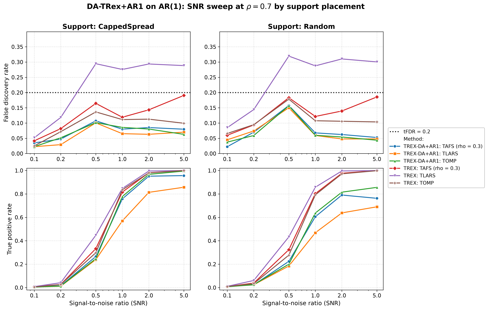
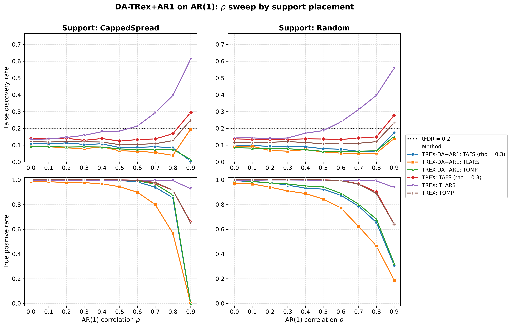
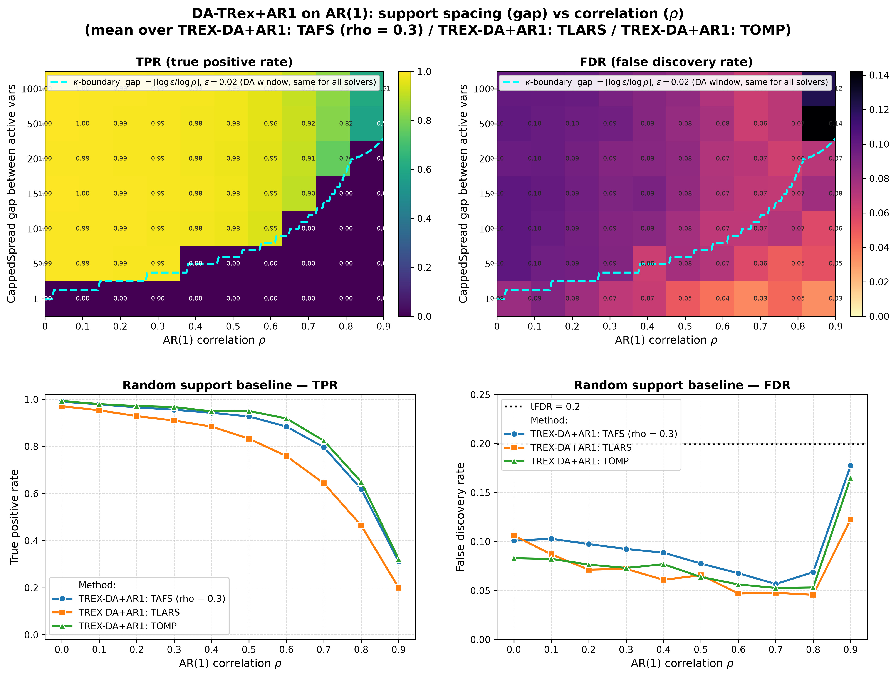

# Demo 01: DA-TRex+AR1 on AR(1) Toeplitz Data

The following demo presents Monte-Carlo results for **DA-TRex+AR1** —
the AR(1)-model dependency-aware T-Rex selector — vs. the
**classical (no-DA) T-Rex selector** on AR(1) Toeplitz data
($n=300$, $p=1000$, $s=10$, amplitude $3.0$, $\mathrm{tFDR}=0.2$, $K=20$ random experiments,
$\mathrm{MC}=200$ per grid point; solvers TLARS / TAFS / TOMP).

The greedy solvers use *exchangeable tie-breaking* (`exch_tie_alpha = 0.25` for TAFS/TOMP, `0` for TLARS).
Look up `Exchangeable_Tie_Breaking_DA_TRex.md` in the TRex_Research documentation.
TAFS additionally runs with its AFS correlation parameter `rho_afs = 0.3` (`0` for TLARS/TOMP), which
is why the figures label it `TAFS (rho = 0.3)`.
With this fix, **all three DA solvers are FDR-controlled across the entire $\rho$ grid and both support placements** —
including the previously violating greedy-solver cells at $\rho = 0.9$ with power
(e.g. gap=100: TAFS $0.24 \to 0.15$, TOMP $0.21 \to 0.13$), where TAFS/TOMP now also retain more power than DA-TLARS.

---

## Setup — data generating process and selector configuration

**Linear model.** Each Monte-Carlo trial draws

$$
y = X\beta + \varepsilon, \qquad X \in \mathbb{R}^{n \times p},\; n = 300,\; p = 1000,
$$

where $\beta$ has $s = 10$ nonzero entries of amplitude $3.0$ on the support (placed by the `CappedSpread` or
`Random` policy, see the parts below) and $\varepsilon_i \stackrel{\text{iid}}{\sim} \mathcal{N}(0, \sigma^2)$ with
the noise variance calibrated to the target signal-to-noise ratio,
$\sigma^2 = \widehat{\mathrm{Var}}(X\beta) / \mathrm{SNR}$.

**Covariance model (AR(1) Toeplitz).** The rows of $X$ are i.i.d. zero-mean Gaussian with autoregressive
column dependence,

$$
X_{i,1} = \eta_{i,1}, \qquad
X_{i,j} = \rho\, X_{i,j-1} + \sqrt{1-\rho^2}\; \eta_{i,j}, \qquad
\eta_{i,j} \stackrel{\text{iid}}{\sim} \mathcal{N}(0,1),
$$

so that

$$
\Sigma_{jk} = \rho^{|j-k|}
$$
— neighboring columns are the strongest-correlated, decaying geometrically with index distance.

In the following we refer to a linear signal to noise ratio
$$
\mathrm{SNR} = \frac{\mathrm{Var}(X\beta)}{\sigma^2}
$$
to assess the performance of the method.

---

## Running the Demo

```bash
./build/release/bin/trex_selector_methods/trex_da/demo_trex_da_01_mc_sim_ar1/demo_trex_da_01_mc_sim_ar1
```

Afterwards, regenerate the figures from the CSVs with [`generate_plots.sh`](generate_plots.sh).

---

## Output Files

Data tables are written to `simulation_results/data/` (`.txt` pretty-printed, `.csv` tidy long format):

- `da_trex_mc_da_ar1_snr_capped.txt` / `.csv`
- `da_trex_mc_da_ar1_snr_random.txt` / `.csv`
- `da_trex_mc_da_ar1_rho_capped.txt` / `.csv`
- `da_trex_mc_da_ar1_rho_random.txt` / `.csv`
- `da_trex_mc_da_ar1_gap_rho.txt` / `.csv`

Figures (PNG/PDF, plus interactive Plotly `.html` for the per-CSV overviews) go to `simulation_results/plots/`.

---

## Part 1 — SNR sweep (at $\rho = 0.7$)

DA-TRex+AR1 vs. base T-Rex over $\mathrm{SNR} \in \{0.1, 0.2, 0.5, 1, 2, 5\}$, CappedSpread vs. Random support:



All three DA solvers stay below $\mathrm{tFDR}=0.2$ at every SNR; base T-Rex TLARS violates from $\mathrm{SNR}=0.5$ on
(FDR $\approx 0.29$). The DA TPR cost concentrates at high SNR (e.g. TLARS $0.81$ vs. $1.00$ at $\mathrm{SNR}=2$).

---

## Part 2 — $\rho$ sweep (at $\mathrm{SNR} = 2$)

DA-TRex+AR1 vs. base T-Rex over $\rho \in \{0.0, 0.1, \dots, 0.9\}$.



- **CappedSpread (max_gap = 20), left column:** the $\rho = 0.9$ point is the **collapse regime** for this support
  gap $20 < \kappa = 38$, so all active variables fall inside each other's correction windows, DA suppresses
  everything (TPR $\approx 0$), and the tiny residual FDR values are rare lone-survivor events (binary per-trial
  FDP — hence the large sd in the tables).
- **Random support, right column:** most actives stay isolated, so power persists to $\rho = 0.9$
  (TPR $\approx 0.31$–$0.33$ for the greedy DA solvers) while FDR stays controlled ($0.14$–$0.17$); base T-Rex
  TLARS climbs to $\approx 0.56$.

---

## Part 3 — 2D gap × $\rho$ study ($\mathrm{SNR} = 2$)

`CappedSpread(gap)` for gap $\in \{100, 50, 20, 15, 10, 5, 1\}$ plus a Random-support column, over the full $\rho$
grid, per solver. The overlaid $\kappa$-boundary ($\kappa = \lceil \log \varepsilon / \log \rho \rceil$,
$\varepsilon = 0.02$) marks where active
variables enter each other's DA correction windows: below it, TPR collapses by construction.



- **Heatmaps (top row)** show the **mean over the three DA solvers** per (gap, $\rho$) cell; the dashed
  $\kappa$-boundary is the DA correction-window threshold gap $= \lceil \log 0.02 / \log \rho \rceil$
  ($\varepsilon = 0.02$ = `rho_thr_DA`) — a property of the correction itself, identical for all three solvers.
- **Random-support baseline (bottom row)** shows one line per method.
- **TPR heatmap** — the sharp $\kappa$-boundary cliff (gap $< \kappa \Rightarrow$ TPR $\approx 0$) is a structural
  property of the AR1 correction window, not a solver artifact.
- **FDR heatmap** — with the exchangeable-tie fix, the wide-gap / high-$\rho$ corner (gap $= 100/50$, $\rho = 0.9$)
  is now controlled for TAFS ($0.15$/$0.18$) and TOMP ($0.13$/$0.16$); before the fix these cells sat at
  $0.21$–$0.27$, driven by collinear shadows (distance-1 neighbors of true actives) that greedy winner-take-all
  selection let through the DA deflation.

---

## References

- Machkour, J., Muma, M., & Palomar, D. P., "FDR-Controlled Sparse Index Tracking with Autoregressive Stock
  Dependency Models", European Signal Processing Conference (EUSIPCO), 2024, pp. 2662–2666, [DOI link](https://ieeexplore.ieee.org/document/10715329).

---

**Last updated:** 2026-07-16
