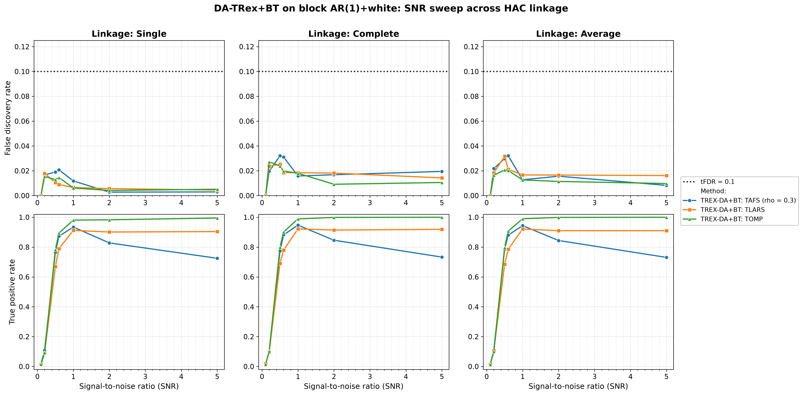
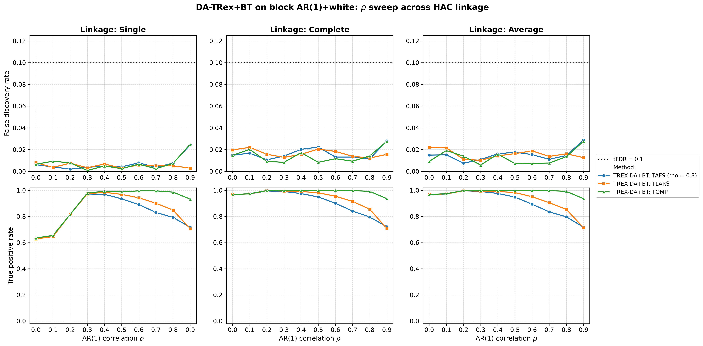
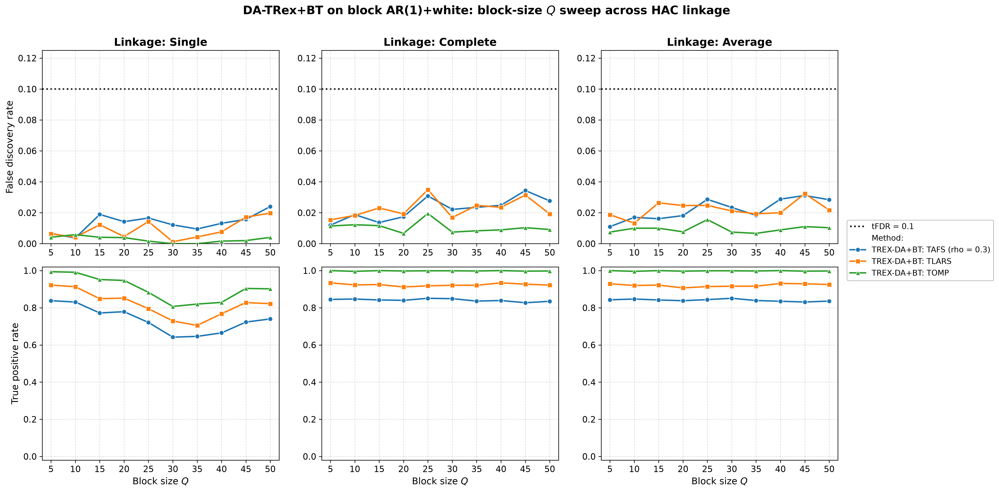
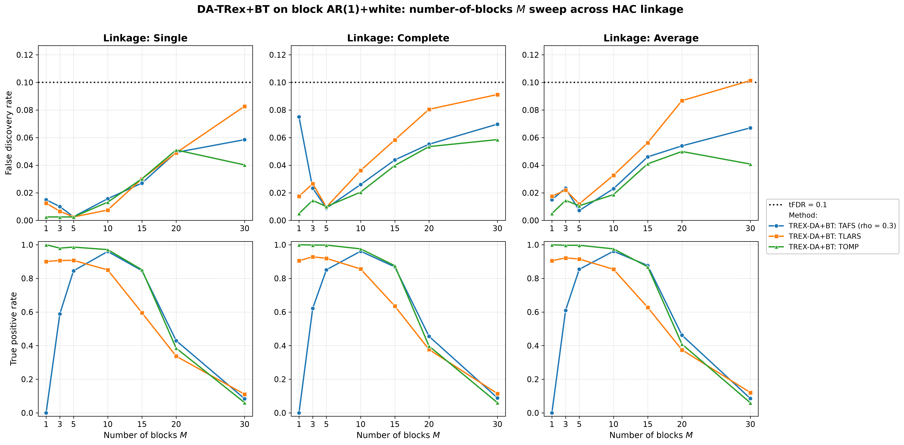

# Demo 02: DA-TRex+BT (Binary-Tree Dependency-Aware T-Rex) on Block AR(1) + White-Noise Data

Monte-Carlo results for **DA-TRex+BT** — the Binary-Tree Dependency-Aware T-Rex selector
(`DAMethod::BT`) — on a block-diagonal AR(1) design diluted by a large block of i.i.d. white-noise
columns, sweeping SNR, $\rho$, block size $Q$, and number of blocks $M$, each across the three HAC
linkage methods (Single / Complete / Average).
Common setup: $n=300$, $p_{\text{total}}=1000$, amplitude $1.0$, $\mathrm{tFDR}=0.1$, $K=20$ random
experiments, $\mathrm{MC}=200$ per grid point; solvers TLARS / TAFS / TOMP.
Corresponds to R reference `demo_trex_da_06_bt_ar1_plus_white_block_sweeps.R` (numbered "06" in the
R suite but "02" in this C++ folder — a naming lineage quirk, not a bug).

The greedy solvers use *exchangeable tie-breaking* (`exch_tie_alpha = 0.25` for TAFS/TOMP, `0` for
TLARS); see `Exchangeable_Tie_Breaking_DA_TRex.md` in the TRex_Research documentation.
TAFS additionally runs with its AFS correlation parameter `rho_afs = 0.3` (`0` for TLARS/TOMP), which
is why the figures label it `TAFS (rho = 0.3)`.

---

## Setup — the DA-TRex+BT selector

As in the other DA demos, the selector deflates each variable's ordinary relative occurrence
$\Phi_{T,L}(j)$ by a penalty built from its most similar competitor within a group of correlated
variables,

$$
\Phi^{\mathrm{BT}}_{T,L}(j) := \Psi^{\mathrm{BT}}_{T,L}(j) \cdot \Phi_{T,L}(j),
\qquad
\Psi^{\mathrm{BT}}_{T,L}(j) :=
\begin{cases}
\displaystyle \frac{1}{2 - \underset{j' \in \mathrm{Gr}(j)}{\min}
  \left| \Phi_{T,L}(j) - \Phi_{T,L}(j') \right|}\,,
& \mathrm{Gr}(j) \neq \emptyset \\[10pt]
\displaystyle 1/2, & \mathrm{Gr}(j) = \emptyset
\end{cases}
$$

but — unlike the correlation-threshold group design of DA-TRex+NN (Demo 07) — the **BT group design**
obtains $\mathrm{Gr}(j)$ from a **binary tree**: variables are clustered by hierarchical agglomerative
clustering (HAC) on the dissimilarity $1 - |\mathrm{corr}(\boldsymbol{x}_j, \boldsymbol{x}_{j'})|$,
and the dendrogram cut defines disjoint variable groups. The **linkage method** sets the
between-cluster distance during agglomeration:

- **Single** — $d(A,B) = \min_{j \in A,\, j' \in B} d(j, j')$ (nearest member; prone to chaining),
- **Complete** — $d(A,B) = \max_{j \in A,\, j' \in B} d(j, j')$ (farthest member; compact clusters),
- **Average** — $d(A,B) = \operatorname{mean}_{j \in A,\, j' \in B}\, d(j, j')$ (UPGMA).

Whether this choice materially changes FDR/TPR on a clean block design is this demo's core question,
so every sweep below is run once per linkage.

## Setup — data generating process (`dgp_ar1_block_white`)

The design concatenates $M$ statistically independent AR(1) blocks of size $Q$ with a large block of
white-noise columns. The within-block correlation follows the $Q \times Q$ Toeplitz matrix

$$
\left[\boldsymbol{\Sigma}_{m}(\rho)\right]_{j,k} = \rho^{|j-k|},
\qquad m = 1, \ldots, M,
$$

generated per block via the recursion $z_{j} = \rho\, z_{j-1} + \sqrt{1-\rho^{2}}\,\varepsilon_{j}$
with $z_1, \varepsilon_j \sim \mathcal{N}(0,1)$, so $p_{\text{ar}} = M \cdot Q$. The $(M+1)$-th block
holds $p_{\text{white}} = p_{\text{total}} - p_{\text{ar}}$ i.i.d. $\mathcal{N}(0,1)$ columns,
giving the block-diagonal total covariance

$$
\boldsymbol{\Sigma} =
\begin{bmatrix}
\boldsymbol{\Sigma}_1(\rho) & & & \\
& \ddots & & \\
& & \boldsymbol{\Sigma}_M(\rho) & \\
& & & \boldsymbol{I}_{p_{\text{white}}}
\end{bmatrix} \in \mathbb{R}^{p_{\text{total}} \times p_{\text{total}}},
\qquad p_{\text{total}} = p_{\text{ar}} + p_{\text{white}} = 1000 \text{ fixed}.
$$

**Support (`OnePerBlock`).** The true support draws exactly one representative per AR(1) block,

$$
\mathcal{S} = \{s_1, \ldots, s_M\}, \qquad s_m \in \{(m-1)Q + 1, \ldots, mQ\},
$$

so $s = M$ and all actives lie in the AR part — the white block is pure null padding that makes the
problem high-dimensional ($p_{\text{total}} > n$).

**Linear model and SNR control.** Each trial draws $y = X\beta + \varepsilon$ with active amplitude
$\beta_{s_m} = 1.0$, $\varepsilon_i \stackrel{\text{iid}}{\sim} \mathcal{N}(0, \sigma^2)$, and
$\sigma^2 = \widehat{\mathrm{Var}}(X\beta)/\mathrm{SNR}$.

**Base parameters** (each sweep varies one dimension, ceteris paribus): $M=5$, $Q=5$
($p_{\text{ar}}=25$, $p_{\text{white}}=975$, $s=5$), $\rho=0.7$, $\mathrm{SNR}=2.0$, seed $2026$.

---

## Running the Demo

```bash
./build/release/bin/trex_selector_methods/trex_da/demo_trex_da_02_mc_sim_ar1_blocks_plus_white/demo_trex_da_02_mc_sim_ar1_blocks_plus_white
```

Afterwards, regenerate the figures from the CSVs with [`generate_plots.sh`](generate_plots.sh).

---

## Output Files

Data tables are written to `simulation_results/data/` (24 files = 12 scenario stems, one
`.txt`+`.csv` pair each):

- `da_trex_mc_da_ar1_blocks_plus_white_snr_{Single,Complete,Average}.txt` / `.csv`
- `da_trex_mc_da_ar1_blocks_plus_white_rho_{Single,Complete,Average}.txt` / `.csv`
- `da_trex_mc_da_ar1_blocks_plus_white_Q_{Single,Complete,Average}.txt` / `.csv`
- `da_trex_mc_da_ar1_blocks_plus_white_M_{Single,Complete,Average}.txt` / `.csv`

Figures go to `simulation_results/plots/`: one FDR/TPR overview (PNG/PDF + interactive Plotly HTML)
per sweep × linkage, plus one linkage-comparison grid (Single/Complete/Average columns) per sweep —
the four grids embedded below.

---

## Part 1 — SNR sweep ($\mathrm{SNR} \in \{0.1, 0.2, 0.5, 0.6, 1, 2, 5\}$)

- **FDR is very tightly controlled**: at most $0.044$ across every linkage × solver × SNR cell —
  far below the (already stricter) $\mathrm{tFDR}=0.1$ target. With $975$ uncorrelated null columns
  diluting the design, there is little correlated structure for false discoveries to latch onto.
- TPR: TOMP is essentially perfect from $\mathrm{SNR}=1$ on ($0.98$–$1.0$); TLARS plateaus around
  $0.9$; TAFS peaks at $\mathrm{SNR}=1$ ($0.94$–$0.95$) and then *declines* to $\approx 0.73$ at
  $\mathrm{SNR}=5$ — a notable non-monotonicity unique to TAFS in this design.
- The choice of linkage barely matters at the base point ($M=5$, $Q=5$, $\rho=0.7$).



---

## Part 2 — $\rho$ sweep ($\rho \in \{0.0, 0.1, \ldots, 0.9\}$)

- **This is where linkage matters most — at *low* $\rho$**: with Single linkage, TPR drops to
  $\approx 0.60$–$0.65$ for all solvers at $\rho \leq 0.1$, while Complete/Average hold
  $\approx 0.91$–$0.97$. With weak within-block correlation there is no clean chain for
  single-linkage to follow, so the dendrogram cut mis-groups the blocks; compact-cluster linkages are
  robust. From $\rho \geq 0.3$ all three linkages coincide.
- FDR stays controlled over the whole grid (max $0.085$, TLARS at $\rho=0$ under Average linkage);
  at $\rho=0.9$ all solvers tick up to $\approx 0.04$ but remain well under target.
- At high correlation TPR declines moderately ($\rho=0.9$: TLARS $0.70$, TAFS $0.75$,
  TOMP $\approx 0.96$) — the within-block shadows become harder to separate, and the DA deflation
  spends power to keep FDR down.



---

## Part 3 — Block-size $Q$ sweep ($Q \in \{5, 10, \ldots, 50\}$; $p_{\text{ar}} = 5Q$, $p_{\text{white}} = 1000 - 5Q$)

- FDR is controlled everywhere (max $0.093$, TLARS with Single linkage at large $Q$).
- **Single linkage costs power as blocks grow**: at $Q = 40$–$50$ it reaches only TPR
  $\approx 0.83$–$0.91$ (TOMP), $0.74$–$0.78$ (TLARS), $0.67$–$0.74$ (TAFS), while Complete/Average
  keep TOMP at $1.0$ and TLARS/TAFS near their small-$Q$ levels ($\approx 0.9$ / $0.83$). Larger
  in-block chains give single-linkage more opportunities to merge blocks with the white pool.



---

## Part 4 — Number-of-blocks $M$ sweep ($M \in \{1, 3, 5, 10, 15, 20, 30\}$; $s = M$)

- This is the stress dimension: $s = M$ grows while $n = 300$ and the amplitude ($1.0$) stay fixed,
  so the per-signal SNR shrinks. **TPR collapses once $M \gtrsim 20$** ($\approx 0.34$–$0.51$ at
  $M=20$, $\approx 0.1$ at $M=30$) for every solver and linkage.
- At $M=15$ the greedy solvers clearly outlast TLARS (TAFS/TOMP $\approx 0.86$–$0.90$ vs. TLARS
  $\approx 0.6$).
- FDR stays essentially at or below target throughout the collapse — the selector fails *safe*
  (selects little rather than selecting wrongly), with only marginal TLARS excursions to
  $0.108$–$0.111$ under Complete/Average linkage.



---

## Interpretation

- Compare directly against **Demo 03** (same block AR(1) core, *no* white-noise columns) to isolate
  the effect of a much larger overall $p$ with mostly-null structure: the white padding *helps* FDR
  control (max realized FDR $\approx 0.09$ here vs. hovering around target in Demo 03) without
  hurting the detection of the true blocks at the base point.
- The linkage question gets a two-sided answer: linkage is irrelevant at the well-correlated base
  point, but **Single linkage is fragile** exactly where the block structure is weak (low $\rho$) or
  large (high $Q$) — Complete or Average are the safer defaults for this DGP.
- The $M$ sweep shows a graceful, FDR-safe power collapse as the signal budget is spread over more
  and more active variables.

---

**Last updated**: 2026-07-16
