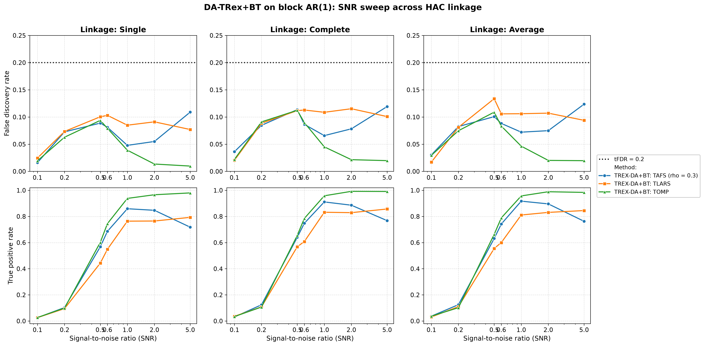
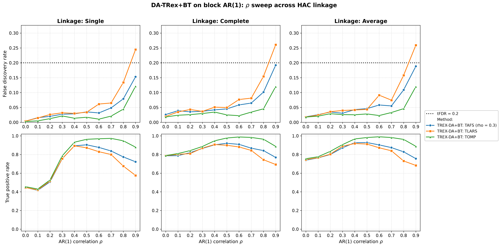
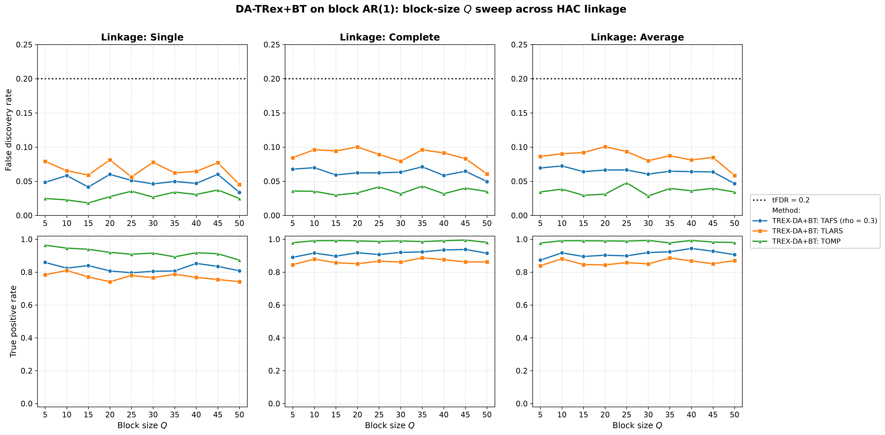
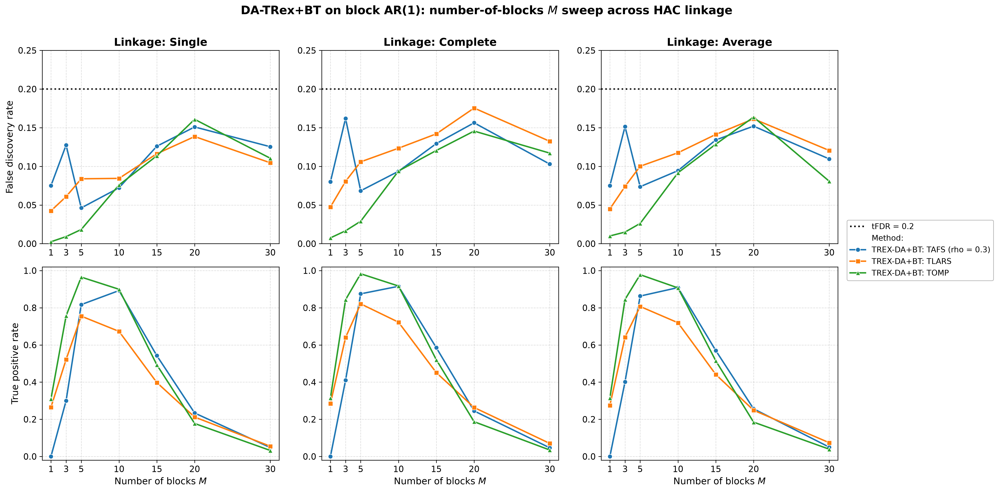

# Demo 03: DA-TRex+BT (Binary-Tree Dependency-Aware T-Rex) on Block-Diagonal AR(1) Data

Monte-Carlo results for **DA-TRex+BT** — the Binary-Tree Dependency-Aware T-Rex selector
(`DAMethod::BT`) — on a clean block-diagonal AR(1) design (no white-noise padding), sweeping SNR,
$\rho$, block size $Q$, and number of blocks $M$, each across the three HAC linkage methods
(Single / Complete / Average).
Common setup: $n=150$, amplitude $1.0$, $\mathrm{tFDR}=0.2$, $K=20$ random experiments,
$\mathrm{MC}=200$ per grid point; solvers TLARS / TAFS / TOMP.
Corresponds to R reference `demo_trex_da_05_bt_ar1_block_sweeps.R` (numbered "05" in the R suite but
"03" in this C++ folder — a naming lineage quirk, not a bug).

The greedy solvers use *exchangeable tie-breaking* (`exch_tie_alpha = 0.25` for TAFS/TOMP, `0` for
TLARS); see `Exchangeable_Tie_Breaking_DA_TRex.md` in the TRex_Research documentation.
TAFS additionally runs with its AFS correlation parameter `rho_afs = 0.3` (`0` for TLARS/TOMP), which
is why the figures label it `TAFS (rho = 0.3)`.

---

## Setup — the DA-TRex+BT selector

The selector deflates each variable's ordinary relative occurrence $\Phi_{T,L}(j)$ by the penalty
$\Psi^{\mathrm{BT}}_{T,L}(j) \in [1/2, 1]$ built from its most similar competitor within its
variable group,

$$
\Phi^{\mathrm{BT}}_{T,L}(j) := \Psi^{\mathrm{BT}}_{T,L}(j) \cdot \Phi_{T,L}(j),
$$

where the **BT group design** obtains the groups $\mathrm{Gr}(j)$ from a **binary tree**: variables
are clustered by hierarchical agglomerative clustering (HAC) on the dissimilarity
$1 - |\mathrm{corr}(\boldsymbol{x}_j, \boldsymbol{x}_{j'})|$ and the dendrogram cut defines disjoint
groups (see [Demo 02](../demo_trex_da_02_mc_sim_ar1_blocks_plus_white/README.md) for the full penalty
formula). The **linkage method** sets the between-cluster distance during agglomeration —
**Single** ($\min$, prone to chaining), **Complete** ($\max$, compact clusters), **Average**
(mean, UPGMA) — and every sweep below runs once per linkage to probe its influence.

## Setup — data generating process (`dgp_ar1_block`)

The design consists of $M$ statistically independent AR(1) blocks of size $Q$ — and nothing else:
unlike Demo 02 there is no white-noise padding, so *every* column belongs to a correlated block and
$p = M \cdot Q$. The within-block correlation follows the $Q \times Q$ Toeplitz matrix

$$
\left[\boldsymbol{\Sigma}_{m}(\rho)\right]_{j,k} = \rho^{|j-k|},
\qquad m = 1, \ldots, M,
$$

generated per block via the recursion $z_{j} = \rho\, z_{j-1} + \sqrt{1-\rho^{2}}\,\varepsilon_{j}$
with $z_1, \varepsilon_j \sim \mathcal{N}(0,1)$, giving the block-diagonal covariance

$$
\boldsymbol{\Sigma} =
\begin{bmatrix}
\boldsymbol{\Sigma}_1(\rho) & & \\
& \ddots & \\
& & \boldsymbol{\Sigma}_M(\rho)
\end{bmatrix} \in \mathbb{R}^{p \times p},
\qquad p = M \cdot Q.
$$

At the base point the problem is *low-dimensional* ($p = 25 \ll n = 150$); the $Q$ sweep pushes it
past $p > n$ ($p = 250$ at $Q = 50$), and the $M$ sweep reaches $p = n = 150$ at $M = 30$.

**Support (`OnePerBlock`).** Exactly one representative per AR(1) block,

$$
\mathcal{S} = \{s_1, \ldots, s_M\}, \qquad s_m \in \{(m-1)Q + 1, \ldots, mQ\},
$$

so $s = M$ and every block carries a signal.

**Linear model and SNR control.** Each trial draws $y = X\beta + \varepsilon$ with active amplitude
$\beta_{s_m} = 1.0$, $\varepsilon_i \stackrel{\text{iid}}{\sim} \mathcal{N}(0, \sigma^2)$, and
$\sigma^2 = \widehat{\mathrm{Var}}(X\beta)/\mathrm{SNR}$.

**Base parameters** (each sweep varies one dimension, ceteris paribus): $M=5$, $Q=5$ ($p=25$,
$s=5$), $\rho=0.7$, $\mathrm{SNR}=2.0$, seed $2026$.

---

## Running the Demo

```bash
./build/release/bin/trex_selector_methods/trex_da/demo_trex_da_03_mc_sim_ar1_blocks/demo_trex_da_03_mc_sim_ar1_blocks
```

Afterwards, regenerate the figures from the CSVs with [`generate_plots.sh`](generate_plots.sh).

---

## Output Files

Data tables are written to `simulation_results/data/` (24 files = 12 scenario stems, one
`.txt`+`.csv` pair each):

- `da_trex_mc_da_ar1_blocks_snr_{Single,Complete,Average}.txt` / `.csv`
- `da_trex_mc_da_ar1_blocks_rho_{Single,Complete,Average}.txt` / `.csv`
- `da_trex_mc_da_ar1_blocks_Q_{Single,Complete,Average}.txt` / `.csv`
- `da_trex_mc_da_ar1_blocks_M_{Single,Complete,Average}.txt` / `.csv`

Figures go to `simulation_results/plots/`: one FDR/TPR overview (PNG/PDF + interactive Plotly HTML)
per sweep × linkage, plus one linkage-comparison grid (Single/Complete/Average columns) per sweep —
the four grids embedded below.

---

## Part 1 — SNR sweep ($\mathrm{SNR} \in \{0.1, 0.2, 0.5, 0.6, 1, 2, 5\}$)

- **FDR stays under the $\mathrm{tFDR}=0.2$ target at every SNR** (worst cell $0.134$, TLARS at
  high SNR under Average linkage) — but visibly higher than the white-noise-diluted Demo 02
  ($\leq 0.044$ at the same base point): in an all-block design every false discovery candidate is a
  correlated shadow.
- TPR: TOMP is the strongest throughout ($0.97$–$0.99$ from $\mathrm{SNR}=2$); TLARS reaches
  $0.76$–$0.86$; TAFS peaks at $\mathrm{SNR}=2$ ($0.85$–$0.90$) and then *declines* to
  $\approx 0.72$–$0.77$ at $\mathrm{SNR}=5$ — the same non-monotonicity seen in Demo 02.
- Linkage has only a mild effect here; Complete/Average buy a few TPR points over Single.



---

## Part 2 — $\rho$ sweep ($\rho \in \{0.0, 0.1, \ldots, 0.9\}$)

- **FDR rises steadily with $\rho$ and TLARS breaks the target at $\rho=0.9$** under every linkage
  ($0.245$ / $0.261$ / $0.259$ for Single/Complete/Average); TAFS grazes it ($0.15$–$0.19$) and
  TOMP stays controlled ($0.12$). Strong within-block correlation makes the block shadows
  progressively harder to deflate — the block-design counterpart of the high-$\rho$ corner seen in
  Demos 01 and 07.
- **Single linkage again loses power at low $\rho$**: TPR $0.42$–$0.46$ at $\rho \leq 0.1$ vs.
  $0.74$–$0.81$ for Complete/Average — without a clear chain to follow, single-linkage mis-groups
  the weakly-correlated blocks. All linkages coincide from $\rho \approx 0.3$.
- TPR peaks mid-$\rho$ and falls toward $\rho=0.9$ (TOMP $0.88$–$0.89$, TAFS $\approx 0.76$,
  TLARS $0.58$–$0.69$).



---

## Part 3 — Block-size $Q$ sweep ($Q \in \{5, 10, \ldots, 50\}$; $p = 5Q$ grows to $250 > n$)

- FDR is comfortably controlled over the whole sweep (max $0.101$, TLARS) even as the design crosses
  into the high-dimensional regime ($p = 250 > n = 150$ at $Q=50$).
- Complete/Average linkage handle growing blocks gracefully (TOMP $0.98$–$1.0$, TAFS $\approx 0.92$
  throughout); **Single linkage bleeds power as $Q$ grows** (TOMP down to $0.87$, TLARS $0.74$ at
  $Q=50$) — the same fragility as in Demo 02's $Q$ sweep, though milder without the white pool to
  merge into.



---

## Part 4 — Number-of-blocks $M$ sweep ($M \in \{1, 3, 5, 10, 15, 20, 30\}$; $s = M$, $p = 5M$)

- The stress dimension: $s = M$ grows while $n = 150$ and the amplitude stay fixed. **TPR collapses
  for $M \gtrsim 20$** ($\approx 0.18$–$0.26$ at $M=20$, $\leq 0.07$ at $M=30$, where $p = n$),
  while FDR stays below target throughout (max $0.175$) — the selector fails *safe*.
- The $M=1$ corner is degenerate ($p=5$, one active variable): all solvers are weak
  (TPR $\leq 0.32$) and TAFS selects nothing at all — with a single signal there is no occurrence
  spread for the DA deflation to work with.
- The sweet spot sits at $M \approx 5$–$10$, where TOMP holds $\approx 0.9$+ TPR with FDR
  $\approx 0.1$.



---

## Interpretation

- Read this demo against **Demo 02** (same block AR(1) core plus $975$ white-noise columns,
  $n=300$): the pure block design at half the sample size shows uniformly higher realized FDR —
  culminating in TLARS's $\rho=0.9$ violation — and lower TPR. Diluting the design with null columns
  *helps* the selector; concentrating it into correlated blocks is the harder problem.
- The linkage story is consistent across both demos: irrelevant at the well-correlated base point,
  but **Single linkage is the fragile choice** at low $\rho$ and large $Q$; Complete or Average are
  the safer defaults.
- Solver ranking on block designs: **TOMP is the most robust** (best TPR *and* lowest FDR in nearly
  every cell), TAFS in between with its high-SNR power decline, TLARS the most FDR-fragile at strong
  within-block correlation.

---

**Last updated**: 2026-07-16
