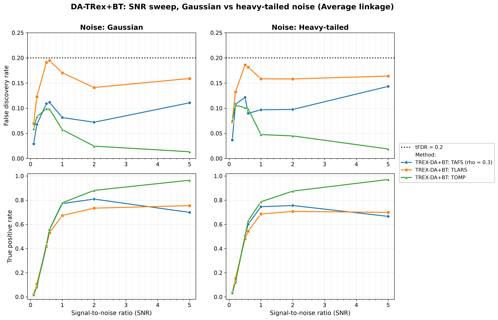
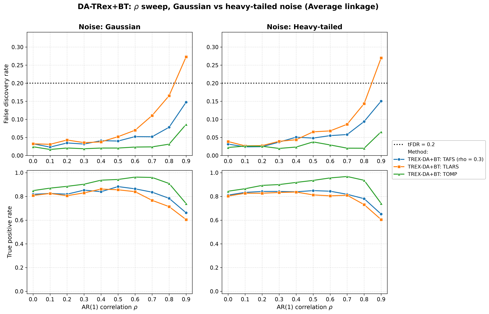
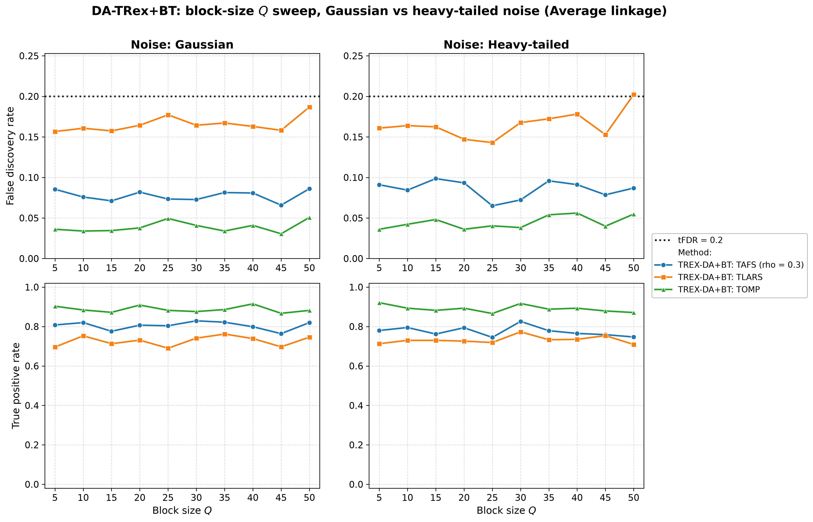
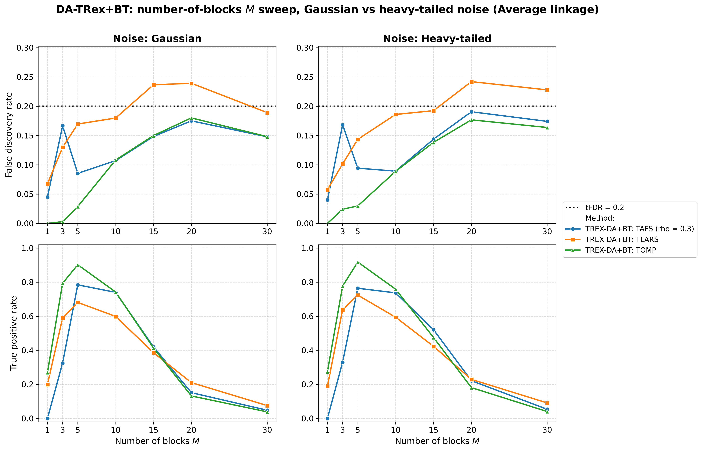
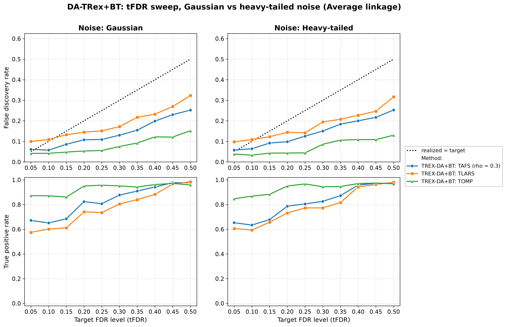
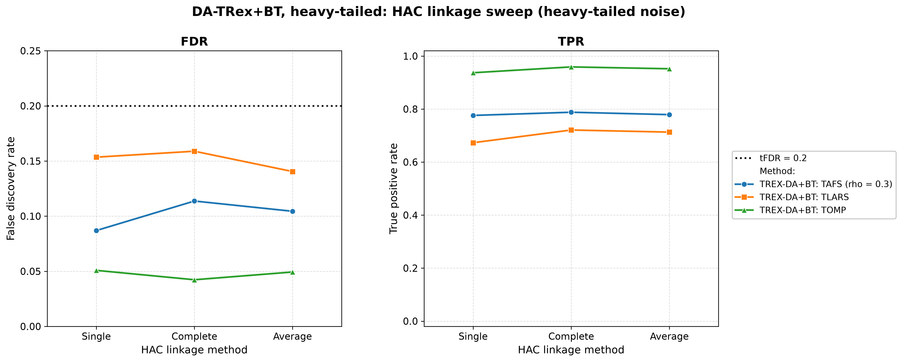

# Demo 04: DA-TRex+BT (Binary-Tree Dependency-Aware T-Rex) on Heavy-Tailed Block Data

Monte-Carlo results for **DA-TRex+BT** — the Binary-Tree Dependency-Aware T-Rex selector
(`DAMethod::BT`) — on a **heavy-tailed** block-diagonal Toeplitz design: the predictors always follow
a multivariate Student-$t(\nu{=}3)$ law, and the response noise is either Gaussian (**s1_Gauss**) or
$t(\nu{=}3)$ (**s2_Heavy**). Five ceteris-paribus sweeps (SNR, $\rho$, block size $Q$, number of
blocks $M$, target FDR) plus a dedicated linkage sweep are each run under both noise scenarios and
the three HAC linkage methods (Single / Complete / Average).
Common setup: $n=150$, amplitude $1.0$, $\rho=0.8$, $\nu=3$, $\mathrm{tFDR}=0.2$, $K=20$ random
experiments, $\mathrm{MC}=200$ per grid point; solvers TLARS / TAFS / TOMP.
This is the heavy-tailed analogue of the Gaussian block design in the R legacy reference
[`Results_trex_da_05_bt_ar1_block_sweeps`](#references); it corresponds to the R script
`demo_trex_da_07_bt_heavy_tailed_sweeps.R` (numbered "07" in the R suite but "04" in this C++ folder
— a naming lineage quirk, not a bug).

The greedy solvers use *exchangeable tie-breaking* (`exch_tie_alpha = 0.25` for TAFS/TOMP, `0` for
TLARS); see `Exchangeable_Tie_Breaking_DA_TRex.md` in the TRex_Research documentation.
TAFS additionally runs with its AFS correlation parameter `rho_afs = 0.3` (`0` for TLARS/TOMP), which
is why the figures label it `TAFS (rho = 0.3)`.

---

## Setup — the DA-TRex+BT selector

The selector deflates each variable's ordinary relative occurrence $\Phi_{T,L}(j)$ by the penalty
$\Psi^{\mathrm{BT}}_{T,L}(j) \in [1/2, 1]$ built from its most similar competitor within its
variable group,

$$
\Phi^{\mathrm{BT}}_{T,L}(j) := \Psi^{\mathrm{BT}}_{T,L}(j) \cdot \Phi_{T,L}(j),
$$

where the **BT group design** obtains the groups $\mathrm{Gr}(j)$ from a **binary tree**: variables
are clustered by hierarchical agglomerative clustering (HAC) on the dissimilarity
$1 - |\mathrm{corr}(\boldsymbol{x}_j, \boldsymbol{x}_{j'})|$ and the dendrogram cut defines disjoint
groups (see [Demo 02](../demo_trex_da_02_mc_sim_ar1_blocks_plus_white/README.md) for the full penalty
formula). The **linkage method** sets the between-cluster distance during agglomeration —
**Single** ($\min$, prone to chaining), **Complete** ($\max$, compact clusters), **Average**
(mean, UPGMA). Because heavy-tailed data make the sample correlations that drive HAC noisier, every
sweep is run once per linkage and Section 6 probes linkage directly.

## Setup — data generating process (`dgp_block_toeplitz_hvt`)

The design consists of $M$ statistically independent AR(1) blocks of size $Q$ — and nothing else: as
in Demo 03 there is no white-noise padding, so *every* column belongs to a correlated block and
$p = M \cdot Q$. The within-block correlation follows the $Q \times Q$ Toeplitz matrix

$$
\left[\boldsymbol{\Sigma}_{m}(\rho)\right]_{j,k} = \rho^{|j-k|},
\qquad m = 1, \ldots, M,
$$

giving the block-diagonal scale matrix

$$
\boldsymbol{\Sigma} =
\begin{bmatrix}
\boldsymbol{\Sigma}_1(\rho) & & \\
& \ddots & \\
& & \boldsymbol{\Sigma}_M(\rho)
\end{bmatrix} \in \mathbb{R}^{p \times p},
\qquad p = M \cdot Q.
$$

**Heavy-tailed predictors.** Each block is drawn as a **multivariate Student-$t$** with $\nu$ degrees
of freedom and scale matrix $\boldsymbol{\Sigma}_m$, via the Gaussian scale-mixture

$$
\boldsymbol{X}_i^{(m)} = \sqrt{\tfrac{\nu}{u_{i,m}}}\; \boldsymbol{L}_m \boldsymbol{z}, \qquad
\boldsymbol{z} \sim \mathcal{N}(\boldsymbol{0}, \boldsymbol{I}_Q),\;\;
u_{i,m} \sim \chi^2_{\nu},
$$

where $\boldsymbol{L}_m$ is the Cholesky factor of $\boldsymbol{\Sigma}_m$ and the mixing variable
$u_{i,m}$ is drawn independently per row $i$ and block $m$. The correlation structure $\rho^{|j-k|}$
is preserved; the marginals are $t(\nu)$ (finite variance $\tfrac{\nu}{\nu-2}$ for $\nu=3$), so the
tails are much heavier than Gaussian.

**Support (`OnePerBlock`).** Exactly one representative per AR(1) block (the block's first column),

$$
\mathcal{S} = \{s_1, \ldots, s_M\}, \qquad s_m = (m-1)Q + 1,
$$

so $s = M$ and every block carries a signal.

**Linear model, noise scenarios, and SNR control.** Each trial draws $y = X\beta + \varepsilon$ with
active amplitude $\beta_{s_m} = 1.0$ and SNR-calibrated noise variance
$\sigma^2 = \widehat{\mathrm{Var}}(X\beta)/\mathrm{SNR}$. The two scenarios differ only in the noise
law:

- **s1_Gauss:** $\varepsilon_i \stackrel{\text{iid}}{\sim} \mathcal{N}(0, \sigma^2)$;
- **s2_Heavy:** $\varepsilon_i \propto t(\nu)$, variance-matched to $\sigma^2$ (scaled by
  $\sqrt{\sigma^2 (\nu-2)/\nu}$).

Note that the **predictors are heavy-tailed in *both* scenarios** — the s1/s2 switch isolates the
additional effect of heavy-tailed *noise* on top of an already heavy-tailed design.

**Base parameters** (each sweep varies one dimension, ceteris paribus): $M=5$, $Q=5$ ($p=25$,
$s=5$), $\rho=0.8$, $\nu=3$, $\mathrm{SNR}=2.0$, seed $2026$.

---

## Running the Demo

```bash
./build/release/bin/trex_selector_methods/trex_da/demo_trex_da_04_mc_sim_ht_blocks/demo_trex_da_04_mc_sim_ht_blocks
```

Afterwards, regenerate the figures from the CSVs with [`generate_plots.sh`](generate_plots.sh).

---

## Output Files

Data tables are written to `simulation_results/data/` (64 files — the largest output set of any demo
here: 32 scenario stems, one `.txt`+`.csv` pair each). Five sweeps
(`snr`, `rho`, `Q`, `M`, `tFDR`) × 2 noise scenarios × 3 linkages = 30 stems following the pattern
`da_trex_mc_da_ht_blocks_{snr|rho|Q|M|tFDR}_{s1_Gauss|s2_Heavy}_{Single|Complete|Average}.{txt,csv}`, plus
the dedicated linkage-sweep section's 2 stems
`da_trex_mc_da_ht_blocks_linkage_{s1_Gauss|s2_Heavy}.{txt,csv}` (which omit the trailing linkage suffix
since linkage itself is the swept variable).

Figures go to `simulation_results/plots/`: per-CSV FDR/TPR overviews (PNG/PDF + interactive Plotly
HTML), one linkage-comparison grid per (sweep × scenario), and — embedded below — one
**Gaussian-vs-heavy scenario grid** per sweep (at Average linkage), the figure for this demo's core
question: how much do heavy tails cost in FDR control and power?

---

## Part 1 — SNR sweep ($\mathrm{SNR} \in \{0.1, 0.2, 0.5, 0.6, 1, 2, 5\}$)

- **TOMP is the clear winner**: FDR falls to $\approx 0.03$–$0.06$ at high SNR while TPR climbs to
  $0.94$–$0.97$. TAFS peaks around $\mathrm{SNR}=1$ (TPR $\approx 0.78$–$0.80$, FDR $\leq 0.18$)
  then *declines* toward $\mathrm{SNR}=5$ ($\approx 0.65$–$0.69$) — the same non-monotonicity seen in
  the Gaussian block demos.
- **TLARS grazes and then breaches the $\mathrm{tFDR}=0.2$ target from $\mathrm{SNR}\approx0.5$
  upward** (peaking at $\approx 0.24$) with the lowest power ($\approx 0.65$–$0.69$).
- **Gaussian vs. heavy-tailed noise is nearly indistinguishable** — the two columns almost overlay,
  because the predictors are heavy-tailed in both cases and dominate the added noise.



---

## Part 2 — $\rho$ sweep ($\rho \in \{0.0, 0.1, \ldots, 0.9\}$)

- **FDR rises with $\rho$ and TLARS breaks the target at $\rho \geq 0.8$** ($0.25 \to 0.33$ under
  Gaussian noise, $0.21 \to 0.31$ under heavy noise); TAFS only grazes it at $\rho=0.9$
  ($\approx 0.21$–$0.22$) and **TOMP stays controlled** until $\rho=0.9$ ($0.12$–$0.15$). Strong
  within-block correlation makes the block shadows progressively harder to deflate — the block
  counterpart of the high-$\rho$ corner in Demos 01 and 07.
- TPR peaks mid-to-high $\rho$ and falls at $\rho=0.9$: TOMP $0.83$–$0.97$ (best), TAFS
  $\approx 0.69$–$0.85$, TLARS $0.55$–$0.80$ (lowest).
- Again the two noise scenarios track each other closely.



---

## Part 3 — Block-size $Q$ sweep ($Q \in \{5, 10, \ldots, 50\}$; $p = 5Q$ grows to $250 > n$)

- Performance is **remarkably flat across the whole sweep**, even as the design crosses well into the
  high-dimensional regime ($p = 250 > n = 150$ at $Q=50$): TOMP holds TPR $\approx 0.92$–$0.96$ with
  FDR $\leq 0.085$; TAFS $\approx 0.76$–$0.84$ TPR, FDR $\approx 0.11$–$0.16$.
- **TLARS sits *above* the target at every $Q$** ($\mathrm{FDR} \approx 0.23$–$0.29$) — the sharpest
  contrast with the fully-Gaussian Demo 03, whose $Q$-sweep TLARS FDR never exceeded $\approx 0.10$.
  Heavy-tailed predictors, not dimension growth, are what loosen TLARS's FDR control here.



---

## Part 4 — Number-of-blocks $M$ sweep ($M \in \{1, 3, 5, 10, 15, 20, 30\}$; $s = M$, $p = 5M$)

- The stress dimension: $s = M$ grows while $n=150$ and the amplitude stay fixed. **TPR collapses for
  $M \gtrsim 15$–$20$** ($\approx 0.18$–$0.27$ at $M=20$, $\leq 0.08$ at $M=30$, where $p = n$),
  while FDR climbs to $\approx 0.23$–$0.27$ at $M=20$ (all three solvers breach the target there).
- The $M=1$ corner is degenerate ($p=5$, a single active variable): TAFS selects nothing at all
  (TPR $0.00$) — with one signal there is no occurrence spread for the DA deflation to exploit.
- The sweet spot sits at $M \approx 5$–$10$, where TOMP holds $\approx 0.8$–$0.95$ TPR at FDR
  $\approx 0.05$–$0.15$.



---

## Part 5 — Target-FDR sweep ($\mathrm{tFDR} \in \{0.05, 0.10, \ldots, 0.50\}$)

Unique to Demos 04–05: sweeping the *target* FDR to check calibration of the realized FDR.

- **Realized FDR increases monotonically with the target**, as it should, but each solver has a
  floor it cannot dip below. **TLARS is the least conservative** — its realized FDR *exceeds* the
  target for small $\mathrm{tFDR}$ (e.g. $\approx 0.21$ at $\mathrm{tFDR}=0.2$, rising to
  $\approx 0.35$ at $\mathrm{tFDR}=0.5$), so it cannot deliver very low FDR. **TAFS** runs below the
  target for $\mathrm{tFDR} \gtrsim 0.1$ (e.g. $\approx 0.13$ at $\mathrm{tFDR}=0.2$), and **TOMP is
  markedly conservative** ($\approx 0.05$–$0.06$ at $\mathrm{tFDR}=0.2$, still only $\approx 0.15$ at
  $\mathrm{tFDR}=0.5$).
- Power rises with the target as expected; TOMP stays high throughout ($\approx 0.86$–$0.97$).



---

## Part 6 — HAC linkage sweep (Single / Complete / Average, base parameters)

At the well-correlated base point ($\rho=0.8$) **linkage choice barely matters**: TOMP FDR
$\approx 0.05$ / TPR $\approx 0.93$–$0.95$, TAFS FDR $\approx 0.12$–$0.13$ / TPR $\approx 0.76$–$0.78$,
TLARS FDR $\approx 0.19$–$0.24$ / TPR $\approx 0.62$–$0.68$ — Single, Complete and Average land within
a couple of points of one another under both noise scenarios. As Demo 03 shows, linkage differences
open up mainly at *low* $\rho$ and *large* $Q$, where the correlation signal HAC relies on is weak.



---

## Interpretation

- **Heavy-tailed *predictors* are the dominant stressor, not the noise.** Across every sweep the
  s1_Gauss and s2_Heavy columns are nearly identical: since $X$ is $t(3)$ in both scenarios, adding a
  variance-matched $t(3)$ *noise* on top changes little. The real cost of heavy tails is visible only
  against the fully-Gaussian Demo 03 — most clearly in TLARS's FDR, which is loose here
  ($\approx 0.25$ on the $Q$ sweep) where Demo 03 stayed near $0.10$.
- **Solver ranking is consistent** with the other block demos: **TOMP is the most robust** (highest
  TPR *and* lowest FDR in nearly every cell), TAFS sits in between with its high-SNR power decline,
  and **TLARS is the most FDR-fragile** — it breaches the target at high $\rho$, across the whole $Q$
  sweep, and is the least conservative on the tFDR sweep (cannot reach low realized FDR).
- The failure modes are *safe*: where the problem becomes too hard ($M \to 30$, $p \to n$), power
  collapses toward zero rather than FDR exploding.
- **Linkage** is a minor knob at this correlation level; Complete or Average remain the safe defaults
  for the regimes (low $\rho$, large blocks) where it starts to matter.

---

## References

- R legacy simulation (Gaussian block baseline this demo extends with heavy tails):
  `TRex Legacy CRAN Simulations/trex_da/simulation_results/Results_trex_da_05_bt_ar1_block_sweeps.md`.
- R legacy simulation for the white-padded block variant (extended with heavy tails in
  [Demo 05](../demo_trex_da_05_mc_sim_ht_blocks_plus_white/README.md)):
  `.../Results_trex_da_06_bt_ar1_pwhiteblock_sweeps.md`.
- Machkour, J., Muma, M., & Palomar, D. P., "The Terminating-Random Experiments Selector: Fast
  High-Dimensional Variable Selection with False Discovery Rate Control," 2024.

---

**Last updated**: 2026-07-16
