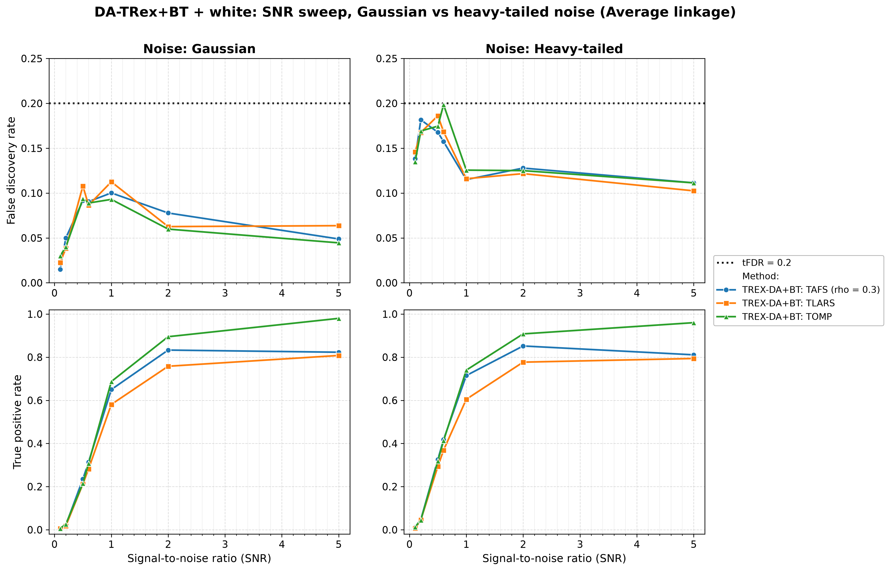
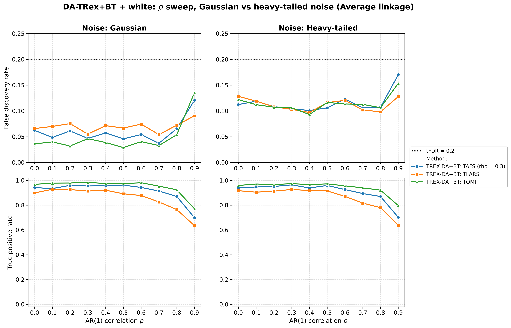
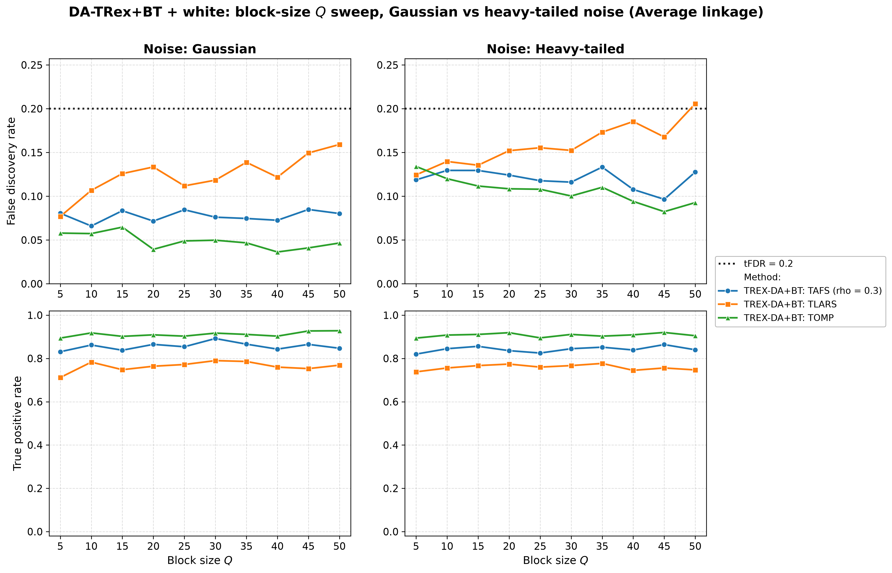
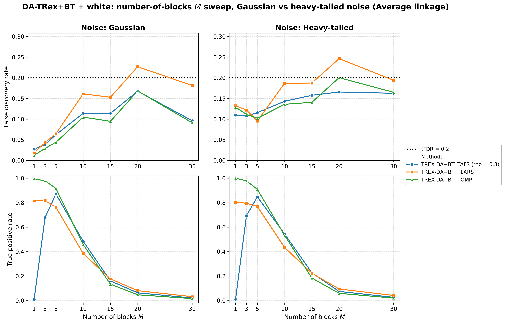
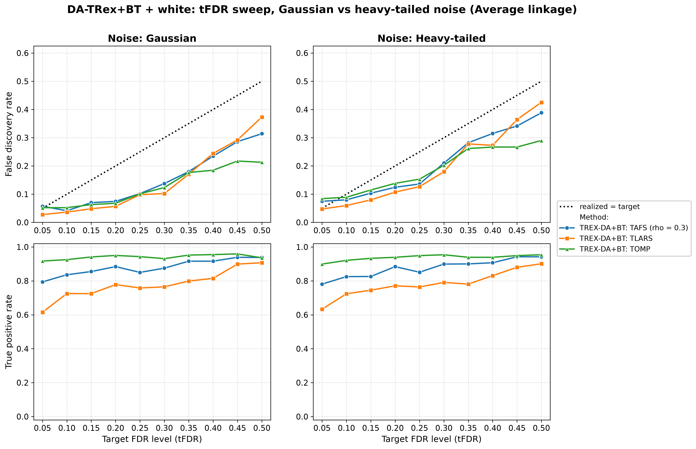

# Demo 05: DA-TRex+BT (Binary-Tree Dependency-Aware T-Rex) on Heavy-Tailed Block + White-Noise Data

Monte-Carlo results for **DA-TRex+BT** — the Binary-Tree Dependency-Aware T-Rex selector
(`DAMethod::BT`) — on the "combined effects" design: heavy-tailed (multivariate $t_{\nu}$)
AR(1)-Toeplitz blocks embedded in a larger design padded with i.i.d. Student-$t$ white-noise
columns. It merges Demo 02's white-noise dilution with Demo 04's heavy-tailed robustness study,
sweeping SNR, $\rho$, block size $Q$, number of blocks $M$, and the target level tFDR — each across
two noise scenarios (Gaussian vs. heavy-tailed response noise) and the three HAC linkage methods.
Common setup: $n=150$, $p_{\text{total}}=500$, amplitude $1.0$, $\nu=3$, $\mathrm{tFDR}=0.2$ (except
the tFDR sweep), $K=20$ random experiments, $\mathrm{MC}=200$ per grid point; solvers TLARS / TAFS /
TOMP.
Corresponds to R reference `demo_trex_da_08_bt_heavy_tailed_plus_white_block_sweeps.R` (numbered
"08" in the R suite but "05" in this C++ folder — a naming lineage quirk, not a bug).

The greedy solvers use *exchangeable tie-breaking* (`exch_tie_alpha = 0.25` for TAFS/TOMP, `0` for
TLARS); see `Exchangeable_Tie_Breaking_DA_TRex.md` in the TRex_Research documentation.
TAFS additionally runs with its AFS correlation parameter `rho_afs = 0.3` (`0` for TLARS/TOMP), which
is why the figures label it `TAFS (rho = 0.3)`.

---

## Setup — the DA-TRex+BT selector

The selector deflates each variable's ordinary relative occurrence $\Phi_{T,L}(j)$ by the penalty
$\Psi^{\mathrm{BT}}_{T,L}(j) \in [1/2, 1]$ built from its most similar competitor within its
variable group, with the groups obtained from a **binary tree**: HAC clustering on the dissimilarity
$1 - |\mathrm{corr}(\boldsymbol{x}_j, \boldsymbol{x}_{j'})|$, dendrogram cut into disjoint groups
(see [Demo 02](../demo_trex_da_02_mc_sim_ar1_blocks_plus_white/README.md) for the full penalty
formula). Every sweep runs across the three HAC **linkage methods** (Single / Complete / Average);
for heavy-tailed data the *sample* correlations feeding the clustering are themselves noisier, so
linkage robustness is part of what this demo probes.

## Setup — data generating process (`dgp_ht_block_white`)

The design concatenates $M$ statistically independent **heavy-tailed** blocks of size $Q$ with a
white-noise block. Each block starts from the $Q \times Q$ AR(1) Toeplitz correlation

$$
\left[\boldsymbol{\Sigma}_{m}(\rho)\right]_{j,k} = \rho^{|j-k|},
\qquad m = 1, \ldots, M,
$$

and transforms the Gaussian draw into a **multivariate $t_{\nu}$** vector,

$$
\boldsymbol{X}_{i}^{(m)} = \frac{\boldsymbol{Z}_{i}^{(m)}}{\sqrt{U_{i}^{(m)} / \nu}},
\qquad
\boldsymbol{Z}^{(m)}_{i} \sim \mathcal{N}(\boldsymbol{0}, \boldsymbol{\Sigma}_{m}(\rho)),
\quad U_{i}^{(m)} \sim \chi^2_{\nu},
$$

with all $\boldsymbol{Z}_{i}^{(m)}, U_{i}^{(m')}$ independent across blocks.
**Heavy-tail behavior:** when a block draws $U_i^{(m)}$ near zero, *all* $Q$ variables of that block
explode simultaneously (within-block tail dependence), while the other blocks are unaffected —
extreme events are block-local. The remaining $p_{\text{white}} = p_{\text{total}} - M \cdot Q$
columns are i.i.d. $t_{\nu}$ white noise, so the full design is heavy-tailed but only the blocks are
correlated.

**Noise scenarios.** The response is $y = X\beta + \varepsilon$ with

- `s1_Gauss`: $\varepsilon_i \stackrel{\text{iid}}{\sim} \mathcal{N}(0, \sigma^2)$ — heavy-tailed
  design, Gaussian noise;
- `s2_Heavy`: $\varepsilon_i \stackrel{\text{iid}}{\sim} t_{\nu}$ (scaled) — heavy tails in *both*
  design and noise;

and $\sigma^2 = \widehat{\mathrm{Var}}(X\beta)/\mathrm{SNR}$ in both cases.

**Support (`OnePerBlock`).** One representative per heavy-tailed block, $s = M$, all actives in the
block part (amplitude $1.0$).

**Base parameters** (each sweep varies one dimension, ceteris paribus): $M=5$, $Q=5$
($p_{\text{ar}}=25$, $p_{\text{white}}=475$, $s=5$), $\rho=0.8$, $\nu=3$, $\mathrm{SNR}=2.0$,
seed $2026$.

---

## Running the Demo

```bash
./build/release/bin/trex_selector_methods/trex_da/demo_trex_da_05_mc_sim_ht_blocks_plus_white/demo_trex_da_05_mc_sim_ht_blocks_plus_white
```

Afterwards, regenerate the figures from the CSVs with [`generate_plots.sh`](generate_plots.sh).

---

## Output Files

Data tables are written to `simulation_results/data/` (60 files = 30 scenario stems, one
`.txt`+`.csv` pair each):
`da_trex_mc_da_ht_blocks_plus_white_{snr,rho,Q,M,tFDR}_{s1_Gauss,s2_Heavy}_{Single,Complete,Average}.txt` / `.csv`.

Figures go to `simulation_results/plots/`: one FDR/TPR overview (PNG/PDF + interactive Plotly HTML)
per sweep × scenario × linkage, one linkage-comparison grid per sweep × scenario, and one
**Gaussian-vs-heavy scenario grid** per sweep (at Average linkage) — the five scenario grids, this
demo's core exhibits, are embedded below.

---

## Part 1 — SNR sweep ($\mathrm{SNR} \in \{0.1, 0.2, 0.5, 0.6, 1, 2, 5\}$)

- **Gaussian noise: controlled.** FDR peaks at $0.15$ (TOMP, high SNR) — under the
  $\mathrm{tFDR}=0.2$ target everywhere.
- **Heavy-tailed noise: marginal violations at high SNR** — up to $0.22$ (TOMP) / $0.21$ (TAFS) /
  $0.205$ (TLARS) under Complete/Average linkage; Single stays $\leq 0.19$. Heavy noise costs
  essentially no power but pushes realized FDR to (and slightly over) the target.
- TPR is nearly scenario-independent: TOMP $0.92$–$0.98$ from $\mathrm{SNR}=2$, TAFS
  $\approx 0.82$–$0.86$, TLARS $\approx 0.76$–$0.81$.



---

## Part 2 — $\rho$ sweep ($\rho \in \{0.0, 0.1, \ldots, 0.9\}$)

- FDR rises with $\rho$ in both scenarios; the Gaussian scenario stays controlled (max $0.174$)
  while the heavy scenario grazes/touches the target at high $\rho$ (up to $0.21$, TAFS/TOMP under
  Complete/Average).
- TPR holds up well to $\rho = 0.8$ (TOMP $\approx 0.94$–$0.95$) and drops at $\rho = 0.9$
  (TOMP $\approx 0.84$–$0.85$, TAFS $\approx 0.76$–$0.77$, TLARS $\approx 0.64$) — the usual
  strong-correlation power cost, essentially identical across noise scenarios.



---

## Part 3 — Block-size $Q$ sweep ($Q \in \{5, 10, \ldots, 50\}$; $p_{\text{ar}} = 5Q$, $p_{\text{white}} = 500 - 5Q$)

- TPR is remarkably flat in $Q$ (TOMP $0.92$–$0.95$, TAFS $0.84$–$0.89$, TLARS $0.72$–$0.77$ at
  Average linkage) — growing the correlated blocks inside a fixed $p_{\text{total}}$ barely affects
  power here.
- FDR: Gaussian scenario controlled (max $0.165$, TLARS); heavy scenario produces mild TLARS
  excursions to $\approx 0.21$–$0.22$ under Complete/Average at large $Q$.



---

## Part 4 — Number-of-blocks $M$ sweep ($M \in \{1, 3, 5, 10, 15, 20, 30\}$; $s = M$)

- The power collapse hits **earlier and harder than in the Gaussian demos 02/03**: TPR is already
  down to $\leq 0.10$ at $M=20$ and $\leq 0.04$ at $M=30$ (vs. $\approx 0.2$ at $M=20$ in Demo 03) —
  spreading a fixed signal budget over many *heavy-tailed* blocks at $n=150$ is the hardest setting
  in this suite.
- During the collapse the realized FDR drifts over target in the heavy scenario (up to $0.265$,
  TOMP under Complete linkage) — with almost nothing selected, a single false discovery dominates
  the FDP ratio, so these cells are high-variance.
- The $M=1$ corner separates the solvers sharply: TOMP finds the lone signal essentially always
  (TPR $\approx 1.0$), TLARS $\approx 0.8$, TAFS almost never ($\approx 0.01$) — the same TAFS
  single-signal failure seen in Demo 03.



---

## Part 5 — tFDR sweep ($\mathrm{tFDR} \in \{0.05, 0.10, \ldots, 0.50\}$)

- Realized FDR **tracks at or below the target across the whole range** (the identity line is the
  reference in these panels): the only excess is a tiny $+0.02$/$+0.03$ overshoot at the strictest
  target ($\mathrm{tFDR}=0.05$) under heavy-tailed noise.
- The selector grows increasingly *conservative* as the target loosens — at $\mathrm{tFDR}=0.5$
  TOMP realizes $0.21$–$0.29$ below target — while TPR saturates around $0.9$+ from
  $\mathrm{tFDR}\approx 0.2$ on, so loosening the target beyond that buys little power.



---

## Interpretation

- Read as the "combined effects" check against **Demo 03** (Gaussian, no white noise), **Demo 02**
  (Gaussian, with white noise), and **Demo 04** (heavy-tailed, no white noise): the white-noise
  padding again *helps* FDR control (this demo sits well below Demo 04's levels in the Gaussian
  scenario), while heavy-tailed *response* noise is what pushes cells to the target — the two
  effects partially offset.
- Heavy tails cost almost no power; their price is paid in FDR (marginal violations concentrated in
  the `s2_Heavy` scenario at high SNR / high $\rho$ / the $M$-collapse).
- Solver ranking matches the block-design pattern: **TOMP strongest** (highest TPR, usually lowest
  FDR — except its heavy-scenario excursions at loose constraints), TLARS weakest in power, TAFS in
  between but unusable in the single-signal corner.

---

**Last updated**: 2026-07-16
