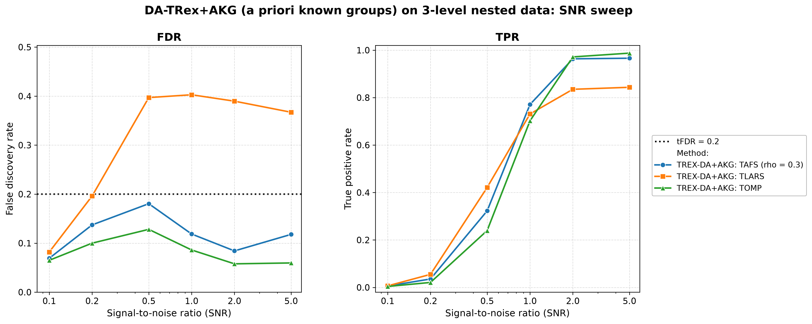

# Demo 06: DA-TRex+AKG (A Priori Known Groups) on Multi-Level Nested Data

Monte-Carlo results for **DA-TRex+AKG** — the dependency-aware T-Rex selector with **a priori known
groups**: the true group structure is supplied to the selector as a hard **constraint** on its
dependency tree (constrained sub-clustering), instead of letting hierarchical agglomerative
clustering (HAC) discover the structure from scratch.
The data-generating process is a three-level nested latent-factor model with a non-exchangeable
Toeplitz leaf layer.
Common setup: $n=300$, $p=1000$, $s=10$, `Random` support, $\mathrm{tFDR}=0.2$, $K=20$ random
experiments, $\mathrm{MC}=200$ per grid point; solvers TLARS / TAFS / TOMP; SNR sweep
$\mathrm{SNR} \in \{0.1, 0.2, 0.5, 1, 2, 5\}$.
The greedy solvers use *exchangeable tie-breaking* (`exch_tie_alpha = 0.25` for TAFS/TOMP, `0` for
TLARS); see `Exchangeable_Tie_Breaking_DA_TRex.md` in the TRex_Research documentation.
TAFS additionally runs with its AFS correlation parameter `rho_afs = 0.3` (`0` for TLARS/TOMP), which
is why the figures label it `TAFS (rho = 0.3)`.

---

## Setup — the DA-TRex+AKG selector (constrained sub-clustering)

The known three-level hierarchy is passed via `da_ctrl.prior_groups`. Since 2026-07-17 the
`PRIOR_GROUPS` method treats these labels as **merge constraints**, not as deflation
neighbourhoods:

1. the **finest common refinement** of the supplied levels (here: the groups of 10) partitions the
   variables — two variables can only ever share a deflation neighbourhood if they share a group
   on every level;
2. **HAC runs within each constraint group** (`hc_linkage`, correlation distance) — merges across
   group boundaries are structurally impossible;
3. the calibration **rho grid is data-driven**: the pooled within-group dendrogram heights are
   subsampled to `hc_grid_length` (default $\min(20, p) = 20$) grid points, terminated by the
   conservative $\rho = 1$ singleton anchor (every neighbourhood empty $\Rightarrow$ the paper's
   maximal penalty $\Psi = 1/2$ everywhere);
4. the BT-style occurrence deflation and 3D $(T, v, \rho)$ calibration (see
   [Demo 02](../demo_trex_da_02_mc_sim_ar1_blocks_plus_white/README.md) for the penalty formula)
   run unchanged on these tight within-group neighbourhoods.

**Why not use the raw groups as neighbourhoods?** That was the pre-2026-07-17 behaviour, and it
fails by design: the nearest-partner penalty
$\Psi_j = 1/(2 - \min_{j' \in \mathrm{Gr}(j)} |\Phi_j - \Phi_{j'}|)$ presumes tight, near-
exchangeable neighbourhoods; inside a 10/50/250-member group nearly every variable has *some*
member with an almost identical occurrence, so $\delta \to 2$ uniformly and the shadow/active
ranking is left invariant. The full analysis, including the archived results of the old behaviour,
is in `TRex_Research/documentation/Prior_Groups_Deflation_Mismatch_DA_TRex.md` (§1–§8 the
mismatch, §9 this resolution).

**Relation to BT.** The method is now exactly "BT, tightened by prior knowledge": same machinery,
but the tree can never merge across known group boundaries, so actives are never deflated against
unrelated variables. A BT reference run on this DGP (TLARS, $\mathrm{SNR}=2$) shows the same FDR
behaviour (0.355 vs. 0.380) but markedly *lower* power (TPR 0.701 vs. 0.844) — the constraints buy
power, not a different failure mode. The figures label the method `TREX-DA+AKG: <solver>`.

## Setup — data generating process (`dgp_groups_toeplitz_leaf`)

Each predictor is a sum of nested latent factors plus a correlated leaf term,

$$
X_{i,j} = \sum_{x=1}^{L-1} \sqrt{\rho_x - \rho_{x+1}}\; f_{g_x(j)}
        + \sqrt{\rho_0 - \rho_1}\; u_{g_0(j),\,j}
        + \sqrt{1-\rho_0}\;\eta_{i,j},
$$

where the coarser levels $x \geq 1$ use one standard-normal latent factor per group, and the finest
level ($x = 0$) uses a **Toeplitz-correlated leaf block** — within each finest group the leaf
variables $u_r$ satisfy $\mathrm{Cov}(u_r, u_s) = \phi^{|r-s|}$ with $\phi_{\text{leaf}} = 0.5$ —
so even the members of a finest-level group are *not* exchangeable.

- **Three nested grouping levels** over $p = 1000$: level 1 = groups of $10$ ($100$ groups),
  level 2 = groups of $50$ ($20$ groups), level 3 = groups of $250$ ($4$ groups).
- **Cumulative correlation masses** (fine → coarse): $\rho = \{0.55, 0.25, 0.10\}$ — a variable
  shares $55\%$ of its variance with its group of 10, $25\%$ with its group of 50, $10\%$ with its
  group of 250.
- Support: $s = 10$ active variables drawn by the `Random` policy per trial, amplitude from the
  shared `SimConfig` defaults; $y = X\beta + \varepsilon$ with
  $\sigma^2 = \widehat{\mathrm{Var}}(X\beta)/\mathrm{SNR}$.

---

## Running the Demo

```bash
./build/release/bin/trex_selector_methods/trex_da/demo_trex_da_06_mc_sim_groups/demo_trex_da_06_mc_sim_groups
```

Afterwards, regenerate the figure from the CSV with [`generate_plots.sh`](generate_plots.sh).

---

## Output Files

Data tables are written to `simulation_results/data/`:

- `da_trex_mc_da_groups_toeplitz_leaf.txt` / `.csv`

The figure (PNG/PDF + interactive Plotly HTML) goes to `simulation_results/plots/`.

---

## Results — SNR sweep

- **The greedy solvers are controlled everywhere and win on power**: TOMP's maximum FDR is $0.128$
  (dropping to $\approx 0.06$ at high SNR) with TPR up to $0.988$; TAFS — which violated at
  $\mathrm{SNR}=0.5$ under the old raw-group deflation ($0.211$) — is now controlled at every grid
  point (max $0.181$) with TPR up to $0.966$.
- **TLARS remains the outlier of the suite**: FDR $\approx 0.37$–$0.40$ from $\mathrm{SNR}=0.5$ on
  (vs. the $\mathrm{tFDR}=0.2$ target), with TPR $\approx 0.84$. Both axes moved *up* relative to
  the old raw-group deflation (FDR $0.33$–$0.35$, TPR capped at $0.80$): the tight neighbourhoods
  deflate actives less, which buys power but also stops masking part of the LARS shadow leak.
- The BT reference run (see Setup) shows the same TLARS FDR on this DGP with *less* power — the
  residual violation is a property of the shared BT deflation machinery under LARS-type occurrence
  profiles, not of the prior-groups path.



---

## Interpretation — why does TLARS still fail although the groups are known?

With the constrained sub-clustering, the deflation operates on tight, data-driven neighbourhoods
inside the true groups — the structure the nearest-partner penalty

$$
\Psi_j = \frac{1}{2 - \min_{j' \in \mathrm{Gr}(j)} |\Phi_j - \Phi_{j'}|}
$$

was designed for. What it *cannot* repair is the penalty's **pairwise symmetry**: it deflates a
shadow and its nearest neighbour (typically the true active) by the same factor, leaving their
*ranking* invariant. Whether the ranking is decided correctly is therefore up to the solver's
occurrence profile:

- **Greedy solvers thrive** at moderate within-group correlation ($\rho_1 = 0.55$, far from
  Demo 01's near-collinear $0.9$): winner-take-all in-group competition reliably crowns the *true*
  active once the signal is clear; shadows finish with $\Phi \approx 0$ and never reach the voting
  threshold.
- **The LARS path distributes credit**: after an active enters, its group siblings still carry
  residual correlation with $y$ and collect *intermediate* occurrences — distinct from both the
  active's high $\Phi$ and the bulk at $\approx 0$, exactly the profile a symmetric pairwise
  penalty cannot separate. The dummy-calibrated $\widehat{\mathrm{FDP}}$ cannot see them either
  (dummies are uncorrelated with $X$), so they are selected. The FDR plateau, *flat in SNR*,
  confirms the leak is structural: shadows inherit signal through the shared group factors and rise
  together with the actives.
- Together with Demo 01 this brackets the design space: *mutual deflation* handles the
  near-collinear regime (where LARS naturally produces ties — and the greedy solvers needed the
  `exch_tie_alpha` fix), while *winner-take-all* handles the moderate-correlation regime (where
  LARS's graded credit-sharing defeats the deflation). TLARS on moderate multi-level correlation
  falls into the gap between the two mechanisms — with or without prior knowledge.

**Follow-ups worth running**: (a) an *asymmetric* penalty (gap-to-leader instead of
nearest-partner) — the one §7 candidate the constrained sub-clustering does not subsume;
(b) sweep $\rho_1$ toward $0.9$ — TLARS should *recover* as the fine groups approach
exchangeability and mutual deflation kicks in; (c) log per-trial occurrence histograms per solver
to verify the "intermediate shadow occurrence" picture directly.

---

**Last updated**: 2026-07-17
