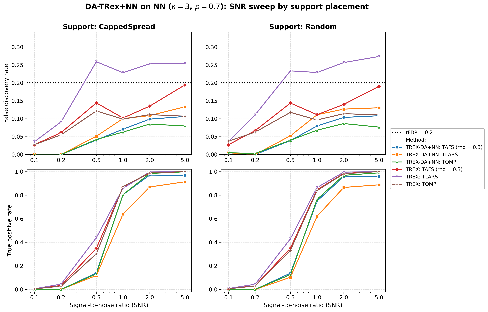
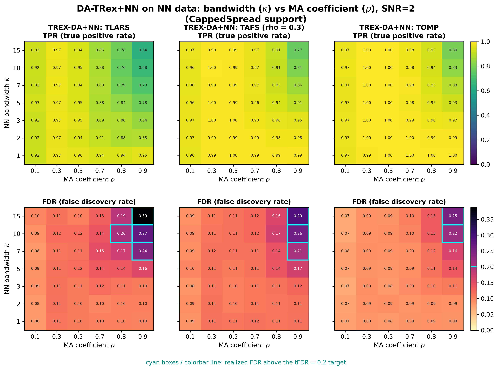
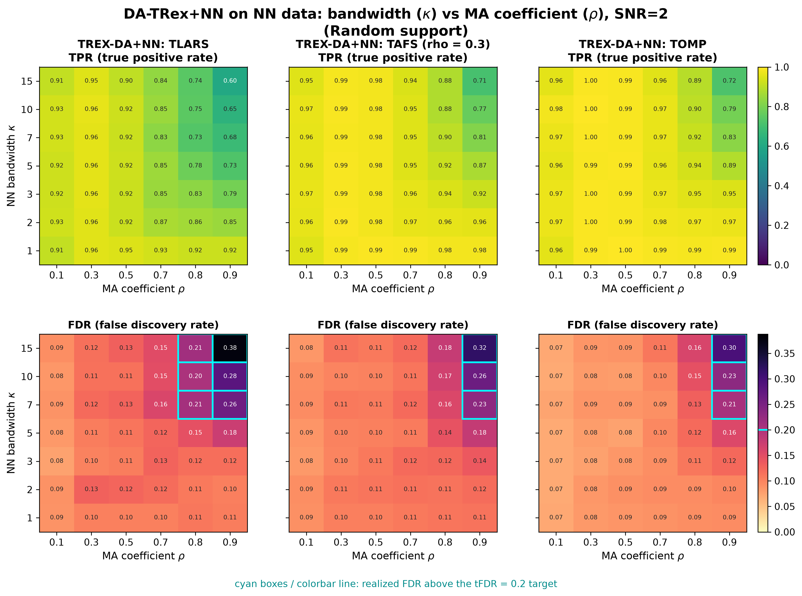
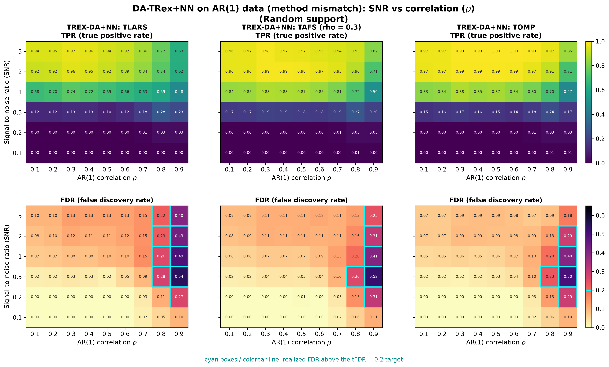

# Demo 07: DA-TRex+NN (Nearest-Neighbor Dependency-Aware T-Rex) on Banded Data + AR(1) Method-Mismatch Study

Monte-Carlo results for **DA-TRex+NN** — the Nearest-Neighbor Dependency-Aware T-Rex selector
(`DAMethod::NN`) — on banded MA($\kappa$) data — the correctly-specified case — plus a
**method-mismatch stress test** applying the same NN correction to AR(1) data.
Common setup: $n=300$, $p=1000$, $s=10$, amplitude $3.0$, $\mathrm{tFDR}=0.2$, $K=20$ random experiments,
$\mathrm{MC}=200$ per grid point; solvers TLARS / TAFS / TOMP (Part 1 additionally runs the classical no-DA
T-Rex baseline).

The greedy solvers use *exchangeable tie-breaking* (`exch_tie_alpha = 0.25` for TAFS/TOMP, `0` for TLARS);
see `Exchangeable_Tie_Breaking_DA_TRex.md` in the TRex_Research documentation.
TAFS additionally runs with its AFS correlation parameter `rho_afs = 0.3` (`0` for TLARS/TOMP), which
is why the figures label it `TAFS (rho = 0.3)`.

---

## Setup — the DA-TRex+NN selector

The DA-TRex+NN selector deflates each variable's ordinary relative occurrence $\Phi_{T,L}(j)$ by a penalty
built from its most similar competitor within a group of correlated variables,

$$
\Phi^{\mathrm{NN}}_{T,L}(j, \rho_{\text{thr}}) := \Psi^{\mathrm{NN}}_{T,L}(j, \rho_{\text{thr}}) \cdot \Phi_{T,L}(j),
\qquad
\Psi^{\mathrm{NN}}_{T,L}(j, \rho_{\text{thr}}) :=
\begin{cases}
\displaystyle \frac{1}{2 - \underset{j' \in \mathrm{Gr}(j, \rho_{\text{thr}})}{\min}
  \left| \Phi_{T,L}(j) - \Phi_{T,L}(j') \right|}\,,
& \mathrm{Gr}(j, \rho_{\text{thr}}) \neq \emptyset \\[10pt]
\displaystyle 1/2, & \mathrm{Gr}(j, \rho_{\text{thr}}) = \emptyset
\end{cases}
$$

with the **NN group design**: every variable correlated with $j$ beyond a threshold joins its group,

$$
\mathrm{Gr}(j, \rho_{\text{thr}}) := \left\{ j' \in \{1, \ldots, p\} \setminus \{j\} :
\left|\mathrm{corr}(\boldsymbol{x}_j, \boldsymbol{x}_{j'})\right| \geq \rho_{\text{thr}} \right\}.
$$

Unlike the `BT` (binary-tree) design, these groups may overlap arbitrarily. A true active whose group members
all carry clearly *lower* occurrences keeps $\Psi \approx 1$ (no penalty); a collinear shadow whose occurrence
resembles its group's leader is deflated toward $1/2$. Selection then thresholds
$\widehat{\mathcal{A}} = \{ j : \Phi^{\mathrm{NN}}_{T,L}(j, \rho_{\text{thr}}) > v \}$ as usual.

## Setup — data generating processes

**NN / MA($\kappa$) model (Parts 1–2, `dgp_nn`).** The $j$-th predictor is a causal convolution of i.i.d.
standard-normal innovations $\eta$ across columns (a finite-impulse-response filter of length $\kappa+1$),

$$
X_{i,j} = \sum_{l=0}^{\kappa} \theta_l\, \eta_{i,j+l},
\qquad
\theta_l = c\,\rho^{\,l},
\qquad
c = \Bigl(\textstyle\sum_{m=0}^{\kappa} \rho^{2m}\Bigr)^{-1/2},
$$

i.e. the coefficients follow a geometric path with common ratio $\rho$ and are normalized to unit variance.
The resulting covariance is **banded Toeplitz**: for column distance $d = |j-k| \leq \kappa$,

$$
\Sigma_{jk} = c^2 \rho^{d} \sum_{l=0}^{\kappa-d} \rho^{2l},
\qquad
\Sigma_{jk} = 0 \;\text{ for } |j-k| > \kappa,
$$

so correlation decays roughly geometrically *inside* the band and **cuts off exactly at bandwidth $\kappa$** —
the hallmark difference to AR(1), whose correlation never truly vanishes. (Note: "nearest-neighbor" classically
refers to a banded *precision* matrix; the MA($\kappa$) model instead has a banded *covariance* and a dense
precision. $\rho$ here is the common ratio of the filter, not the lag-1 autocorrelation, although for
$\kappa \gg 1$ the correlation at distance $d$ approaches $\rho^d$.)

**AR(1) model (Part 3, `dgp_ar1` — same DGP as Demo 01).**

$$
X_{i,j} = \rho\, X_{i,j-1} + \sqrt{1-\rho^2}\; \eta_{i,j},
\qquad
\Sigma_{jk} = \rho^{|j-k|},
$$

geometrically decaying but *unbanded* correlation — deliberately mismatched to the NN correction's finite-range
group design.

**Linear model and SNR control.** Each trial draws $y = X\beta + \varepsilon$ with
$\varepsilon_i \stackrel{\text{iid}}{\sim} \mathcal{N}(0, \sigma^2)$ and
$\sigma^2 = \widehat{\mathrm{Var}}(X\beta)/\mathrm{SNR}$. The $s=10$ active coefficients (amplitude $3.0$) are
placed by two support policies:

- **CappedSpread**: deterministic even spacing, $\text{gap} = \min(\lfloor p/s \rfloor, \text{max\_gap}=20)$,
  i.e. support $\{1, 21, 41, \ldots, 181\}$ — fixed across trials;
- **Random**: drawn uniformly without replacement, redrawn each trial.

---

## Running the Demo

```bash
./build/release/bin/trex_selector_methods/trex_da/demo_trex_da_07_mc_sim_nn/demo_trex_da_07_mc_sim_nn
```

Afterwards, regenerate the figures from the CSVs with [`generate_plots.sh`](generate_plots.sh).

---

## Output Files

Data tables are written to `simulation_results/data/` (`.txt` pretty-printed, `.csv` tidy long format):

- `da_trex_mc_da_nn_snr_capped.txt` / `.csv`, `da_trex_mc_da_nn_snr_random.txt` / `.csv` (Part 1)
- `da_trex_mc_da_nn_kappa_rho.txt` / `.csv` (Part 2, two-support 2D schema)
- `da_trex_mc_da_nn_ar_snr_rho.txt` / `.csv` (Part 3, two-support 2D schema)

Figures (PNG/PDF, plus interactive Plotly `.html` for the per-CSV overviews) go to `simulation_results/plots/`;
the 2D CSVs are rendered by the plotter's `sweep2d` mode.

---

## Part 1 — SNR sweep on NN data ($\kappa = 3$, $\rho = 0.7$)

DA-TRex+NN vs. base T-Rex over $\mathrm{SNR} \in \{0.1, 0.2, 0.5, 1, 2, 5\}$, CappedSpread vs. Random support:

- All three DA solvers stay below $\mathrm{tFDR}=0.2$ at every SNR (worst cell $\approx 0.13$); base T-Rex TLARS
  violates from $\mathrm{SNR}=0.5$ on (FDR $\approx 0.23$–$0.27$), and base TAFS grazes the target at
  $\mathrm{SNR}=5$.
- The DA TPR cost is modest and concentrates in DA-TLARS (e.g. $0.87$ vs. base $1.00$ at $\mathrm{SNR}=2$);
  DA-TAFS/TOMP reach $\approx 0.96$–$1.00$.
- The two support placements behave nearly identically — with a hard correlation cutoff at $\kappa=3$ and a
  minimum spacing of 20, even the deterministic support keeps all actives far outside each other's bands.



---

## Part 2 — 2D $\kappa \times \rho$ sweep on NN data ($\mathrm{SNR} = 2$)

Per-solver TPR/FDR heatmaps over $\kappa \in \{1,2,3,5,7,10,15\}$ (band width) $\times$
$\rho \in \{0.1, 0.3, 0.5, 0.7, 0.8, 0.9\}$ (filter common ratio); FDR cells above the target are outlined in cyan.

- **FDR control holds almost everywhere**: violations appear only in the top-right corner ($\rho \geq 0.8$ *and*
  $\kappa \geq 7$), where the effective correlation neighborhood is both wide and strong. TLARS is hit hardest
  ($0.39$ at $\kappa=15$, $\rho=0.9$, CappedSpread), TOMP mildest ($\leq 0.25$, violating only at $\rho = 0.9$).
- Once $\kappa \geq 7$ implied spacing safety margin, group sizes grow with $\kappa$ and residual shadow
  discoveries accumulate — the NN analogue of Demo 01's gap-vs-window story, but entering through the band width
  rather than the support spacing.
- **TPR degrades gracefully** toward the same corner (TLARS $0.64$–$0.68$; TAFS/TOMP stay $\geq 0.77$) and is
  essentially flat elsewhere.





---

## Part 3 — 2D SNR $\times$ $\rho$ sweep on AR(1) data (method mismatch)

The same DA-TRex+NN selector applied to AR(1) data over $\mathrm{SNR} \in \{0.1, \ldots, 5\}$ $\times$
$\rho \in \{0.1, \ldots, 0.9\}$:

- **Up to $\rho \approx 0.7$ the mismatch is benign**: FDR stays at or below target for all solvers and SNRs —
  the NN groups capture enough of the (rapidly decaying) AR(1) neighborhood to deflate the nearby shadows.
- **At $\rho = 0.8$–$0.9$ control breaks down sharply** (up to $0.65$ for TLARS at $\mathrm{SNR}=0.5$,
  $\rho=0.9$): AR(1) correlation beyond the effective NN window leaks through as false discoveries, exactly the
  failure mode the finite-range group design cannot see. TOMP is again the most robust but still violates at
  $\rho \geq 0.8$.
- Read this against **Demo 01** (same AR(1) data, correctly-specified `AR1` correction, FDR-controlled over the
  full $\rho$ grid): the gap between the two quantifies the price of the wrong dependency model — negligible at
  moderate correlation, large in the strong-correlation regime.





---

**Last updated:** 2026-07-16
