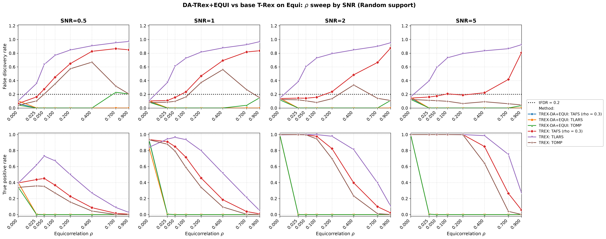

# Demo 08: DA-TRex+EQUI on Equicorrelated (EQUI) Data — 2D SNR × ρ Sweep

Monte-Carlo results for **DA-TRex+EQUI** vs. the **classical (no-DA) T-Rex selector**
on equicorrelated data. One 2D sweep: for each SNR column in $\{0.5, 1, 2, 5\}$, a full
$\rho$ sweep over $\{0, 0.025, 0.05, 0.1, 0.2, 0.4, 0.7, 0.9\}$ — dense near $0$ to locate the DA
suppression cliff. Common configuration: $n=300$, $p=1000$, $s=10$, amplitude $3.0$,
$\mathrm{tFDR}=0.2$, $K=20$ random experiments, $\mathrm{MC}=200$ per grid point, `Random` support
with a full redraw per trial; solvers TLARS / TAFS / TOMP with *exchangeable tie-breaking*
(`exch_tie_alpha = 0.25` for the greedy solvers TAFS/TOMP, `0` for the path solver TLARS), each
with its base (no-DA) T-Rex comparison row — 6 method rows per grid point. TAFS additionally runs
with its AFS correlation parameter `rho_afs = 0.3` (`0` for TLARS/TOMP), which is why the figures
label it `TAFS (rho = 0.3)`.

Corresponds to the R reference `demo_trex_da_02_equi.R` (legacy CRAN runs used $n=150$, $p=500$,
$s=5$; this demo runs at the common $n=300$, $p=1000$, $s=10$ scale of the C++ suite).

> **Purpose**: Equicorrelation is the stress case of the `trex_da` framework — every column loads
> on one shared factor, so there is no "distance" to exploit the way AR(1) has, and **individual
> variable selection is structurally infeasible for any method**. The 2D layout shows the three
> facts that make this demo worth keeping: (1) the DA suppression cliff sits at very small $\rho$,
> (2) it is SNR-independent — signal strength never rescues it, and (3) at $\rho = 0$ everything
> works, anchoring the comparison. DA-EQUI fails *safe* (selects nothing), base T-Rex fails
> *unsafe* (FDR far above target).
>
> **Scope note**: earlier revisions of this demo also carried BT (hierarchical-block) SNR and
> linkage sweeps on block-equicorrelated data. They were dropped as redundant — the BT method is
> exercised on better-suited block designs throughout Demos 02–05 (legacy reference:
> `Results_trex_da_03_bt_equi_blocks.md`).

---

## Setup — data generating process

### Sparse linear model and SNR control

Each Monte-Carlo trial draws

$$
\boldsymbol{y} = \boldsymbol{X} \boldsymbol{\beta} + \boldsymbol{\varepsilon},
\qquad \boldsymbol{\varepsilon} \sim \mathcal{N}(0,\,\sigma^2 \boldsymbol{I}_n),
\quad \boldsymbol{\varepsilon} \perp \boldsymbol{X},
$$

with a **sparse coefficient vector** $\boldsymbol{\beta} \in \mathbb{R}^p$ whose support and
sparsity level are

$$
\mathcal{S} = \operatorname{supp}(\boldsymbol{\beta}) = \{j : \beta_j \neq 0\},
\qquad s = |\mathcal{S}| = 10 \ll p,
$$

all active coefficients set to amplitude $3.0$, support placed by the `Random` policy with a full
redraw per trial. The noise variance is calibrated to the target signal-to-noise ratio,

$$
\mathrm{SNR} = \frac{\operatorname{Var}(\boldsymbol{X} \boldsymbol{\beta})}{\sigma^{2}},
\qquad \sigma^2 = \widehat{\operatorname{Var}}(\boldsymbol{X}\boldsymbol{\beta}) / \mathrm{SNR}.
$$

### Equicorrelation (`dgp_equi`)

$n$ observations on $p$ predictors are generated through a **single latent factor model**:

$$
X_{i,j} = \sqrt{\rho}\, f_i + \sqrt{1-\rho}\, \eta_{i,j},
\qquad f_i \overset{\text{i.i.d.}}{\sim} \mathcal{N}(0,1),
\quad \eta_{i,j} \overset{\text{i.i.d.}}{\sim} \mathcal{N}(0,1),
$$

with all variables mutually independent. Each row
$\boldsymbol{x}_i = (X_{i,1},\ldots,X_{i,p})^\top$ is then an i.i.d. draw from a zero-mean
Gaussian with **compound symmetry** covariance

$$
\boldsymbol{\Sigma}_{\text{equi}} =
(1 - \rho) \, \boldsymbol{I}_p + \rho \, \mathbf{1}_p \mathbf{1}_p^{\top},
\qquad [\boldsymbol{\Sigma}_{\text{equi}}]_{jj} = 1 \;\forall j,
$$

valid for $\rho \in \left(-\tfrac{1}{p-1},\, 1\right)$ (the demo uses $\rho \in [0, 0.9]$). The
eigenstructure is fully explicit:

$$
\begin{align*}
\lambda_1 &= 1 + (p-1)\rho && \text{multiplicity 1 (eigenvector } \mathbf{1}_p/\sqrt{p}) \\
\lambda_2 &= 1 - \rho && \text{multiplicity } p-1
\end{align*}
$$

When $\rho \leq \rho_{\text{thr\_DA}}$ the single factor is negligible. As $\rho \to 1$ the $p-1$
minor eigenvalues collapse to zero, the predictor matrix becomes rank-1, and the regression is
unidentifiable — unlike AR(1), the correlation is *uniform* across all variable pairs, so there is
no isolation of actives by index distance: the shared factor puts every variable inside every
other variable's DA correction set, and the correction deflates all candidates at once.

### Sweep design

- **Outer loop (SNR columns)**: $\mathrm{SNR} \in \{0.5, 1, 2, 5\}$, one output file pair per
  column, disjoint seed blocks per column (statistically independent columns).
- **Inner sweep ($\rho$)**: $\rho \in \{0, 0.025, 0.05, 0.1, 0.2, 0.4, 0.7, 0.9\}$ — front-loaded
  at small $\rho$, where the suppression cliff is expected (the legacy 1D sweeps bracket it only
  as "somewhere in $(0, 0.1]$").

---

## Reference behavior (previous runs)

- **Legacy R CRAN** (`Results_trex_da_02_equi.md`, $n=150$, $p=500$, $s=5$): total suppression at
  every grid point except $\rho = 0$ — TPP $=$ FDP $= 0$ across all SNRs at $\rho = 0.25$, and
  power only at $\rho = 0.0$ in the $\rho$ sweep (TPP $\approx 1.0$, FDP $\approx 0.13$).
- **C++ 1D sweeps (2026-07-15, superseded by this 2D sweep)**: reproduced the legacy behavior
  exactly at $n=300$, $p=1000$ — at $\rho = 0$ all six methods controlled
  (FDR $\approx 0.12$–$0.14$, TPR $\approx 1$); from $\rho = 0.1$ on, DA in total suppression
  (TLARS consuming all $T = 150$ dummies without votes) while base TLARS jumped to
  FDR $0.73$ and climbed to $0.96$ at $\rho = 0.9$.

---

## Running the Demo

```bash
./build/release/bin/trex_selector_methods/trex_da/demo_trex_da_08_mc_sim_equi_and_bt/demo_trex_da_08_mc_sim_equi_and_bt
```

Afterwards, regenerate the figures from the CSVs with [`generate_plots.sh`](generate_plots.sh).

---

## Output Files

Data tables are written to `simulation_results/data/` (`.txt` pretty-printed, `.csv` tidy long
format), one pair per SNR column:

- `da_trex_mc_da_equi_rho_snr0p5.txt` / `.csv`
- `da_trex_mc_da_equi_rho_snr1.txt` / `.csv`
- `da_trex_mc_da_equi_rho_snr2.txt` / `.csv`
- `da_trex_mc_da_equi_rho_snr5.txt` / `.csv`

The single figure goes to `simulation_results/plots/`:

- `da_trex_mc_da_equi_rho_snr_grid.png` / `.pdf` — 2×4 grid: rows = FDR/TPR, columns = SNR,
  x-axis = $\rho$ on a square-root scale so the dense low-$\rho$ cliff region stays readable.
  (One-off per-CSV overviews can still be produced on demand via
  `./generate_plots.sh <csv>`.)

---

## Results (MC=200, run of 2026-07-16)



- **The DA suppression cliff sits at the first nonzero grid point, $\rho = 0.025$, in every SNR
  column.** At $\rho = 0$ all three DA solvers are controlled (FDR $0.04$–$0.16$) with the power
  the SNR allows (TPR $\approx 0.35$–$0.40$ at SNR $0.5$, $\approx 0.9$ at SNR $1$, $1.0$ at
  SNR $2$/$5$). At $\rho = 0.025$ they are already dead (TPR $\le 0.005$, TLARS consuming all
  $T = 150$ dummies), and from $\rho = 0.05$ on the zeros are exact. **Signal strength never moves
  the cliff** — it only changes how much power is lost at it. DA-EQUI works only where no
  correction is needed.
- **Base T-Rex TLARS fails unsafe from the same grid point**: FDR $0.36$–$0.40$ at
  $\rho = 0.025$, climbing monotonically to $0.92$–$0.97$ at $\rho = 0.9$ in every column — at
  SNR $5$, $\rho = 0.4$ it finds essentially all actives (TPR $0.99$) buried in garbage
  (FDR $0.84$).
- **High-SNR nuance on the greedy base side**: at SNR $= 5$, base TOMP is FDR-controlled at
  *every* $\rho$ (FDR $\le 0.13$) with full power through $\rho = 0.2$ (TPR $1.0$; $0.64$ at
  $\rho = 0.4$), and base TAFS is at/near the limit up to $\rho \approx 0.2$–$0.4$
  (FDR $\approx 0.19$–$0.22$). At SNR $\le 1$ both violate from $\rho = 0.05$ on. So for
  moderate equicorrelation and strong signal, plain greedy T-Rex (TOMP) is the only usable
  selector — the DA-EQUI correction never is.
- **DA-TOMP lone-survivor FPs at high $\rho$** (e.g. $0.23$/$0.21$ at SNR $0.5$,
  $\rho = 0.7$/$0.9$, TPR $\approx 0.001$, binary per-trial FDP): investigated 2026-07-16 with a
  one-off probe (MC $=1000$, fresh seeds; removed after the investigation closed).
  **Mechanism confirmed, not a bug**: every such selection is a singleton, and $628$ of $629$
  selected variables are exactly the rank-1 column of the marginal $|\mathrm{corr}(x_j, y)|$
  ordering — the extreme order statistic of $1000$ factor-loaded real columns beating the
  i.i.d. dummies through the DA deflation, then certified by TOMP's greedy winner-take-all
  (the equi analogue of the AR(1) shadow-FP mechanism; TLARS/TAFS spread or threshold it away).
  Rates at MC $=1000$: $(\mathrm{SNR}\,0.5, \rho\,0.7) = 0.176$ — the demo's $0.23$ was MC noise
  on a controlled cell; $(\mathrm{SNR}\,1, \rho\,0.9) = 0.177$; only
  $(\mathrm{SNR}\,0.5, \rho\,0.9) = 0.227 \pm 0.013$ sits marginally above target — the
  mechanism hovers *at* the tFDR boundary in the zero-power regime, where FDR $\approx$
  P(select anything at all).

**Bottom line**: equicorrelation defeats individual variable selection for the DA framework —
DA-EQUI fails *safe* (selects nothing for any $\rho \ge 0.025$, regardless of SNR), base T-Rex
TLARS fails *unsafe* (FDR up to $0.97$). The demo's value is documenting this boundary of the
method precisely.

---

**Last updated**: 2026-07-16
