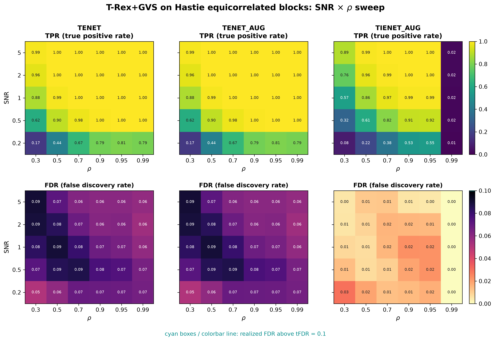
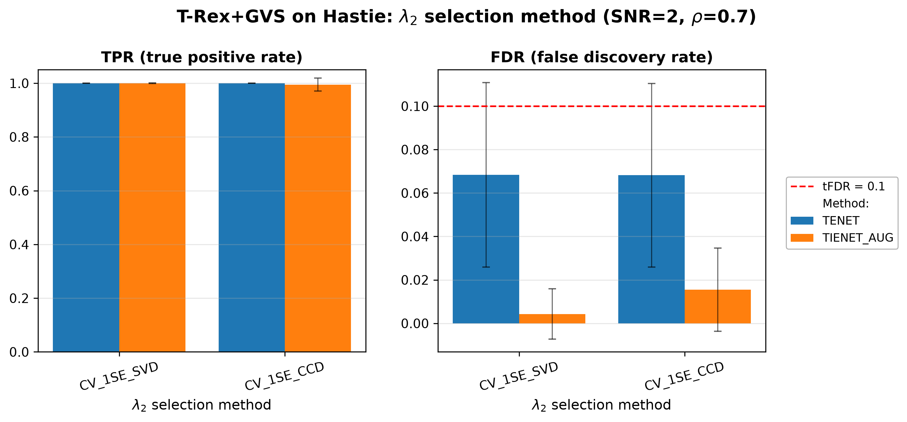
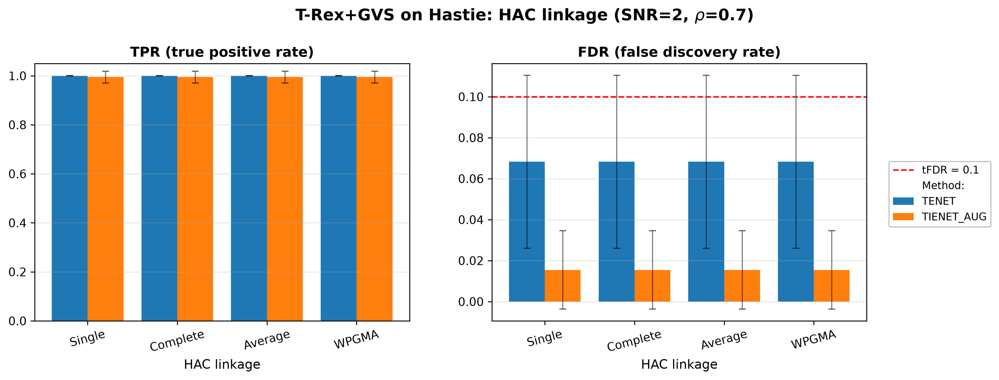

# Demo 01: T-Rex+GVS on Hastie's Equicorrelated Blocks

## Purpose

The following demo presents the T-Rex+GVS selector according to [[1]](#references) and [[2]](#references).
We evaluate grouped-signal recovery under strong equicorrelation, using the classical three-group design of
 Zou & Hastie (2005) [[3]](#references).
 In our demos all variables within an active group are themselves active, so the task is recovering all
 of them, but on an individual-variable basis, rather than using a group-level selection method.
 See [What is actually measured](../README.md#what-is-actually-measured-in-these-demos).
 For details on grouped variable selection and FDR control see [[4]](#references).

---

## Data Generation Parameters (`make_hastie_dgp`)

We consider the linear model:

$$
\boldsymbol{y} = \boldsymbol{X}\boldsymbol{\beta} + \boldsymbol{\epsilon},
\qquad \boldsymbol{\epsilon} \sim \mathcal{N}(\boldsymbol{0}, \sigma_{\varepsilon}^2 \boldsymbol{I}_n)
$$

- $\boldsymbol{y} \in \mathbb{R}^n$ is the response vector.
- $\boldsymbol{X} \in \mathbb{R}^{n \times p}$ is the design matrix.
- $\boldsymbol{\beta} \in \mathbb{R}^p$ is the coefficient vector, with $s$ nonzero entries.
- $\boldsymbol{\epsilon}$ is the noise vector, i.i.d. standard normal.
- $\sigma_{\varepsilon}^2$ is the noise variance, calibrated to achieve a target linear signal-to-noise ratio (SNR).
- $n = 200$, $p = 500$, $s = 150$.
  
The design matrix $\boldsymbol{X}$ is generated from a latent-factor model with three active groups:
$$
X_{ij} = Z_{i,\,g(j)} + \sigma_x\, \xi_{ij}, \qquad \xi_{ij} \sim \mathcal{N}(0,1).
$$

- Three latent factors $Z_{\cdot,k} \sim \mathcal{N}(0,1)$ for $k \in \{0,1,2\}$.
- **Group 0** (columns 0–49), **Group 1** (columns 50–99), **Group 2** (columns 100–149) — all active, $\beta_j = 3$.
- **Background** (columns 150–499): i.i.d. $\mathcal{N}(0,1)$, each a singleton group.
- Within-group correlation $\rho = 1/(1+\sigma_x^2)$; the default $\sigma_x = \sqrt{0.01}$ gives $\rho \approx 0.99$.
- SNR calibrated via $\sigma_{\varepsilon}^2 = \mathrm{Var}(\boldsymbol{X}\beta)/\mathrm{SNR}$.

---

## Control Parameters

```text
K = 20                       # Random experiments per T-loop iteration
tFDR = 0.1                   # Target FDR
corr_max = 0.98              # HAC auto-clustering correlation threshold
hc_linkage = Single          # Single-linkage HAC
lambda2_method = CV_1SE_CCD  # Elastic-net penalty selection
MC = 200                     # Monte Carlo repetitions per grid point
```

---

## Methods Compared

Three T-Rex+GVS solver variants:

- **TENET** — terminating elastic net pathwise solver (`GVSType::EN`, `ENSolverType::TENET`) derived on the idea of a
  pathwise solver introduced in [[3]](#references).
- **TENET_AUG** — terminating elastic net solver based on row-augmented data to solve via a terminating lasso
   (`GVSType::EN`, `ENSolverType::TENET_AUG`) as proposed in [[1]](#references).
- **TIENET_AUG** — terminating elastic net solver based on row-augmented data to solve via a terminating lasso
   the informed elastic net (`GVSType::IEN`) proposed in [[2]](#references).

---

## Three Parts

1. **2-D SNR $\times$ $\rho$ sweep** — TENET / TENET_AUG / TIENET_AUG over
   $\mathrm{SNR} \in \{0.2, 0.5, 1, 2, 5\}$ and
   $\rho \in \{0.30, 0.50, 0.70, 0.90, 0.95, 0.99\}$ (derived via
   $\sigma_x = \sqrt{(1-\rho)/\rho}$), 200 MC trials per cell.
2. **$\lambda_2$-method comparison** — `CV_1SE_SVD` vs. `CV_1SE_CCD` penalty selection at the
   fixed operating point $\mathrm{SNR}=2$, $\rho=0.7$ (TENET and TIENET_AUG).
3. **HAC linkage comparison** — Single / Complete / Average / WPGMA linkage at the same fixed
   operating point (TENET and TIENET_AUG).

Parts 2–3 are supplementary robustness checks over the $\lambda_2$-selection and linkage implementation choices.

---

## Output Files

Written to `simulation_results/data/`:

- `gvs_Hastie_2d.txt` / `.csv` — 2-D SNR $\times$ $\rho$ grid (Part 1).
- `gvs_Hastie_lambda2_method.txt` / `.csv` — $\lambda_2$-selection comparison (Part 2).
- `gvs_Hastie_hc_linkage.txt` / `.csv` — HAC-linkage comparison (Part 3).

Figures (PNG + PDF) go to `simulation_results/plots/`, produced by `./generate_plots.sh`.

---

## Running the Demo

```bash
./build/release/bin/trex_selector_methods/trex_gvs/demo_trex_gvs_01_mc_sim_hastie_en_blocks/demo_trex_gvs_01_mc_sim_hastie_en_blocks
./generate_plots.sh   # render the figures below from the saved CSVs
```

---

## Simulation Results

### Part 1 — 2-D SNR $\times$ $\rho$ sweep

- FDR stays at or below the $\mathrm{tFDR} = 0.1$ target everywhere (no cyan violation outlines),
  and **TENET** and **TENET_AUG** reach $\mathrm{TPR} \approx 1$ once $\mathrm{SNR} \gtrsim 1$.
- **TIENET_AUG** is more conservative (very low FDR, low TPR that grows only slowly with SNR) and
  its power collapses in the extreme $\rho = 0.99$ column, where the within-group columns become
  nearly collinear. This conservatism is not specific to this design — the same pattern recurs
  across the other block demos in this folder.
- Along the $\rho$ axis, performance is stable across most within-group correlation levels, since
  all three methods use HAC-based grouping to aggregate evidence across strongly correlated
  columns; only the extreme $\rho = 0.99$ column stresses TIENET_AUG.

TPR (top) and FDR (bottom) heatmaps, one column per solver; FDR cells above the
$\mathrm{tFDR} = 0.1$ target would be outlined in cyan.



---

### Part 2 — $\lambda_2$ selection method

- `CV_1SE_SVD` and `CV_1SE_CCD` give essentially the same FDR/TPR, confirming the pipeline is
  insensitive to the penalty-selection backend.

Grouped bar charts at the fixed operating point $\mathrm{SNR} = 2$, $\rho = 0.7$; error bars show
$\pm 1$ Monte Carlo standard deviation.



---

### Part 3 — HAC linkage

- Single / Complete / Average / WPGMA linkage are interchangeable here — the strongly
  equicorrelated groups are recovered identically regardless of the linkage rule.
- Taken together, Parts 2 and 3 confirm that the Part 1 conclusions are not sensitive to the
  $\lambda_2$-selection backend or the linkage rule for this data scenario.

Grouped bar charts at the same fixed operating point as Part 2; error bars show $\pm 1$ Monte
Carlo standard deviation.



---

## References

1. Machkour, J., Muma, M., & Palomar, D. P., "False Discovery Rate Control for Grouped Variable Selection
   in High-Dimensional Linear Models using the T-Knock Filter.", European Signal Processing Conference (EUSIPCO), 2022,
    pp. 892–896, EURASIP.
    [DOI-Link](https://doi.org/10.23919/EUSIPCO55093.2022.9909883)
2. Machkour, J., Muma, M., & Palomar, D. P., "The Informed Elastic Net for Fast Grouped Variable Selection and
   FDR Control in Genomics Research.", Workshop on Computational Advances in Multi-Sensor Adaptive Processing (CAMSAP),
    2023, pp. 466–470, IEEE.
    [DOI-Link](https://doi.org/10.1109/CAMSAP58249.2023.10403489)
3. Zou, H., & Hastie, T. (2005). "Regularization and variable selection via the elastic net." *Journal of the Royal
   Statistical Society: Series B (Statistical Methodology)*, 67(2), pp. 301–320.
   [DOI-Link](https://doi.org/10.1111/j.1467-9868.2005.00503.x)
4. Dai, R., & Barber, R. F., "The knockoff filter for FDR control in group-sparse and multitask regression."
   Proceedings of the 33rd International Conference on Machine Learning (ICML), vol. 48, pp. 1851–1859, 2016.
   [DOI-Link](http://proceedings.mlr.press/v48/daia16.pdf)

---

**Last updated**: 2026-07-19
