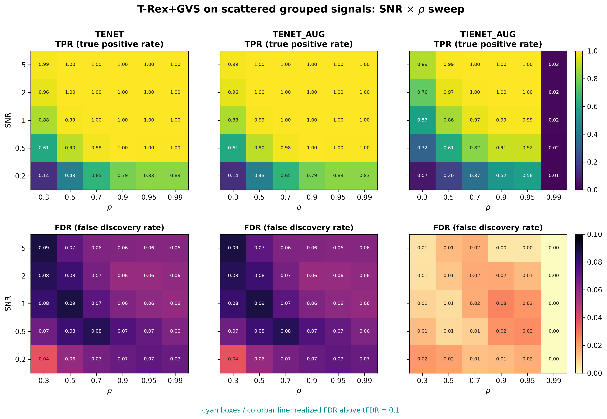

# Demo 02: T-Rex+GVS on Scattered Blocks

## Purpose

Test whether spatially **scattering** the members of a correlated group across the design matrix — rather than
 keeping them contiguous — affects T-Rex+GVS group recovery.
 This isolates the effect of column layout from the effect of correlation strength, since the underlying group
  structure is otherwise identical to Demo 01.
 Selection and evaluation are per variable (see
 [What is actually measured](../README.md#what-is-actually-measured-in-these-demos)).

---

## Data Generation Parameters (`make_scattered_grouped_dgp`)

We consider again the linear model:

$$
\boldsymbol{y} = \boldsymbol{X}\boldsymbol{\beta} + \boldsymbol{\epsilon},
\qquad \boldsymbol{\epsilon} \sim \mathcal{N}(\boldsymbol{0}, \sigma_{\varepsilon}^2 \boldsymbol{I}_n)
$$

- $\boldsymbol{y} \in \mathbb{R}^n$ is the response vector.
- $\boldsymbol{X} \in \mathbb{R}^{n \times p}$ is the design matrix.
- $\boldsymbol{\beta} \in \mathbb{R}^p$ is the coefficient vector, with $s$ nonzero entries.
- $\boldsymbol{\epsilon}$ is the noise vector, i.i.d. standard normal.
- $\sigma_{\varepsilon}^2$ is the noise variance, calibrated to achieve a target linear signal-to-noise ratio (SNR).
- $n = 200$, $p = 500$, $s = 150$.

The design matrix $\boldsymbol{X}$ is generated from a latent-factor model with three active groups:

$$
X_{ij} = Z_{i,\,g(j)} + \sigma_x\, \xi_{ij}, \qquad \xi_{ij} \sim \mathcal{N}(0,1),
$$

- `n_groups` correlated groups of `group_size` variables each; here 3 groups of 50 variables,
   matching Demo 01's Hastie design.
- Group membership is assigned via a **random column permutation** instead of contiguous
   blocks — group members can be spread arbitrarily across the $p$ columns.
- All grouped variables are active, $\beta_j = 3$; background columns are i.i.d.
   $\mathcal{N}(0,1)$, $\beta_j = 0$.
- Within-group correlation $\rho = 1/(1 + \sigma_x^2)$, same convention as Demo 01.

---

## Control Parameters

```text
K = 20                          # Random experiments per T-loop iteration
tFDR = 0.1                      # Target FDR
corr_max = 0.98                 # HAC auto-clustering correlation threshold
hc_linkage = Single             # Single-linkage HAC
lambda2_method = CV_1SE_CCD     # Elastic-net penalty selection
MC = 200                        # Monte Carlo repetitions per grid point
```

---

## Methods Compared

Three T-Rex+GVS solver variants: **TENET** (elastic net) [[3]](#references),
**TENET_AUG** (row-augmented elastic net) [[1]](#references), and **TIENET_AUG** (informed
elastic net) [[2]](#references). All use single-linkage HAC grouping
and `CV_1SE_CCD` for the $\lambda_2$ selection.

---

## The Sweep

A single **2-D SNR $\times$ $\rho$ grid**, over
$\mathrm{SNR} \in \{0.2, 0.5, 1, 2, 5\}$ and
$\rho \in \{0.30, 0.50, 0.70, 0.90, 0.95, 0.99\}$
(with $\sigma_x = \sqrt{(1-\rho)/\rho}$), 200 MC trials per cell.

---

## Output Files

Written to `simulation_results/data/`:

- `gvs_scattered_grouped_2d.txt` / `.csv` — mean FDP/TPP over the SNR $\times$ $\rho$ grid.

Figures (PNG + PDF) go to `simulation_results/plots/`, produced by `./generate_plots.sh`.

---

## Running the Demo

```bash
./build/release/bin/trex_selector_methods/trex_gvs/demo_trex_gvs_02_mc_sim_scattered_blocks/demo_trex_gvs_02_mc_sim_scattered_blocks
./generate_plots.sh   # render the figure below from the saved CSV
```

---

## Simulation Results

- **TENET** and **TENET_AUG** track each other closely and keep FDR below the $\mathrm{tFDR} = 0.1$ target
   everywhere; **TIENET_AUG** is markedly more conservative (lower FDR), and its power collapses in the extreme
   $\rho = 0.99$ column where the within-group columns become nearly collinear.
- Because HAC-based grouping clusters columns by **correlation**, not by column adjacency, scattering group members
   across the design leaves the FDR/TPR pattern very close to Demo 01's contiguous-block results — the clustering
   step is insensitive to column order by construction.
- Best read side-by-side with Demo 01: matching results confirm that group *discovery* depends on correlation
   structure rather than spatial layout, while a noticeable divergence would point to a layout-sensitive bug or
   clustering limitation.

TPR (top) and FDR (bottom) heatmaps over the SNR $\times$ $\rho$ grid, one column per solver;
FDR cells above the $\mathrm{tFDR} = 0.1$ target would be outlined in cyan.



---

## References

1. Machkour, J., Muma, M., & Palomar, D. P., "False Discovery Rate Control for Grouped Variable Selection
   in High-Dimensional Linear Models using the T-Knock Filter.", European Signal Processing Conference (EUSIPCO), 2022,
    pp. 892–896, EURASIP.
    [DOI-Link](https://doi.org/10.23919/EUSIPCO55093.2022.9909883)
2. Machkour, J., Muma, M., & Palomar, D. P., "The Informed Elastic Net for Fast Grouped Variable Selection and
   FDR Control in Genomics Research.", Workshop on Computational Advances in Multi-Sensor Adaptive Processing (CAMSAP),
    2023, pp. 466–470, IEEE.
    [DOI-Link](https://doi.org/10.1109/CAMSAP58249.2023.10403489)
3. Zou, H., & Hastie, T. (2005). "Regularization and variable selection via the elastic net." *Journal of the Royal
   Statistical Society: Series B (Statistical Methodology)*, 67(2), pp. 301–320.
   [DOI-Link](https://doi.org/10.1111/j.1467-9868.2005.00503.x)

---

**Last updated**: 2026-07-19
