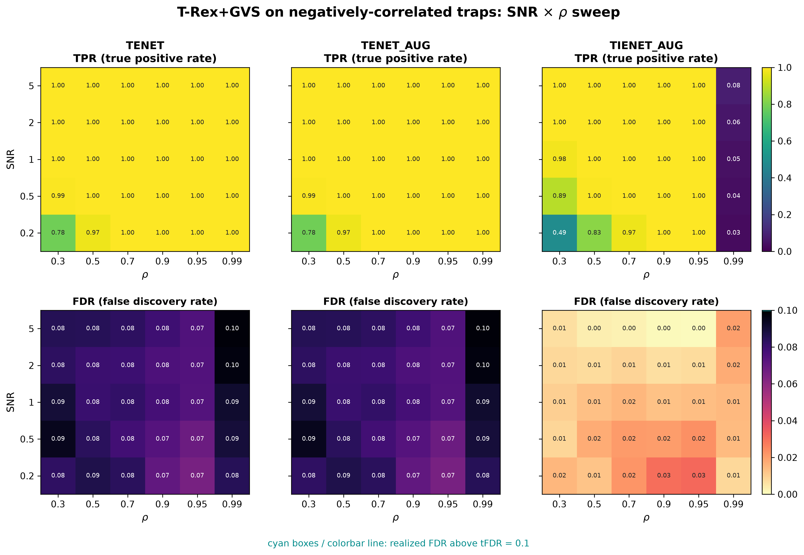

# Demo 04: T-Rex+GVS on Negative-Correlation Traps

## Purpose

Test whether T-Rex+GVS can correctly recover an **active group with negative within-group correlation structure**
 while **excluding two spatially separated inactive trap groups** that share the same sign-flipped correlation
 pattern.
 This stresses the grouping logic's ability to distinguish signal from confounding correlation geometry, rather
 than just correlation strength.
 Selection and evaluation are per variable (see
 [What is actually measured](../README.md#what-is-actually-measured-in-these-demos)).

---

## Data Generation Parameters (`make_neg_traps_dgp`)

We consider again the linear model:

$$
\boldsymbol{y} = \boldsymbol{X}\boldsymbol{\beta} + \boldsymbol{\epsilon},
\qquad \boldsymbol{\epsilon} \sim \mathcal{N}(\boldsymbol{0}, \sigma_{\varepsilon}^2 \boldsymbol{I}_n)
$$

- $\boldsymbol{y} \in \mathbb{R}^n$ is the response vector.
- $\boldsymbol{X} \in \mathbb{R}^{n \times p}$ is the design matrix.
- $\boldsymbol{\beta} \in \mathbb{R}^p$ is the coefficient vector, with $s$ nonzero entries.
- $\boldsymbol{\epsilon}$ is the noise vector, i.i.d. standard normal.
- $\sigma_{\varepsilon}^2$ is the noise variance, calibrated to achieve a target linear signal-to-noise ratio (SNR).
- $n = 200$, $p = 500$, $s = 100$.

Each correlated group is built from a shared latent factor, with one half of the group loading **positively** and
 the other half loading **negatively** on it:

$$
X_{ij} = \pm Z_{i,\,g(j)} + \sigma_x\, \xi_{ij}, \qquad \xi_{ij} \sim \mathcal{N}(0,1),
$$

- **Active group $G_1$** (columns 0–99): positive half (0–49) with $\beta_j = +3$; negative half (50–99), loading
   $-Z_1$, with $\beta_j = -3$.
- **Trap 1** (columns 100–199): the same sign-flipped structure as $G_1$, but $\beta_j = 0$ (inactive).
- **Noise 1** (columns 200–299): i.i.d. $\mathcal{N}(0,1)$ background.
- **Trap 2** (columns 300–359): a second, smaller (60-column) sign-flipped trap, $\beta_j = 0$.
- **Noise 2** (columns 360–499): i.i.d. background.
- Within-group correlation $\rho = 1/(1 + \sigma_x^2)$, same convention as Demo 01 — in magnitude, since half the
   loadings are sign-flipped.

---

## Control Parameters

```text
K = 20                          # Random experiments per T-loop iteration
tFDR = 0.1                      # Target FDR
corr_max = 0.98                 # HAC auto-clustering correlation threshold
hc_linkage = Single             # Single-linkage HAC
lambda2_method = CV_1SE_CCD     # Elastic-net penalty selection
MC = 200                        # Monte Carlo repetitions per grid point
```

---

## Methods Compared

Three T-Rex+GVS solver variants: **TENET** (elastic net) [[3]](#references),
**TENET_AUG** (row-augmented elastic net) [[1]](#references), and **TIENET_AUG** (informed
elastic net) [[2]](#references). All use single-linkage HAC grouping
and `CV_1SE_CCD` for the $\lambda_2$ selection.

---

## The Sweep

A single **2-D SNR $\times$ $\rho$ grid**, over
$\mathrm{SNR} \in \{0.2, 0.5, 1, 2, 5\}$ and
$\rho \in \{0.30, 0.50, 0.70, 0.90, 0.95, 0.99\}$
(with $\sigma_x = \sqrt{(1-\rho)/\rho}$), 200 MC trials per cell.

---

## Output Files

Written to `simulation_results/data/`:

- `gvs_Neg-Traps_2d.txt` / `.csv` — mean FDP/TPP over the SNR $\times$ $\rho$ grid.

Figures (PNG + PDF) go to `simulation_results/plots/`, produced by `./generate_plots.sh`.

---

## Running the Demo

```bash
./build/release/bin/trex_selector_methods/trex_gvs/demo_trex_gvs_04_mc_sim_neg_traps/demo_trex_gvs_04_mc_sim_neg_traps
./generate_plots.sh   # render the figure below from the saved CSV
```

---

## Simulation Results

- **TENET** and **TENET_AUG** are essentially identical: both recover the active sign-flipped group almost
   completely (TPR $\approx 1$ except at the lowest SNR $= 0.2$) while holding FDR at or just below target — the
   two inactive traps are excluded rather than falsely selected.
- The mechanism behind that recovery is that HAC clusters on **unsigned** correlation, so the sign-flipped active
   group is identified as a *single* group rather than split into its positive and negative halves.
- **TIENET_AUG** is far more conservative (FDR $\le 0.03$ everywhere) and its TPR collapses to near zero in the
   extreme $\rho = 0.99$ column; otherwise it behaves as in the uniformly-positive-correlation scenarios of
   Demos 01–03 — the sign-flipped halves do not by themselves trigger different informed-EN behavior.
- The two spatially separated traps are a stronger test of false-group exclusion than a single trap: watch whether
   FDR creeps up with SNR, which would indicate one of the traps starting to be (partially) selected.

TPR (top) and FDR (bottom) heatmaps over the SNR $\times$ $\rho$ grid, one column per solver;
FDR cells above the $\mathrm{tFDR} = 0.1$ target are outlined in cyan.



---

## References

1. Machkour, J., Muma, M., & Palomar, D. P., "False Discovery Rate Control for Grouped Variable Selection
   in High-Dimensional Linear Models using the T-Knock Filter.", European Signal Processing Conference (EUSIPCO), 2022,
    pp. 892–896, EURASIP.
    [DOI-Link](https://doi.org/10.23919/EUSIPCO55093.2022.9909883)
2. Machkour, J., Muma, M., & Palomar, D. P., "The Informed Elastic Net for Fast Grouped Variable Selection and
   FDR Control in Genomics Research.", Workshop on Computational Advances in Multi-Sensor Adaptive Processing (CAMSAP),
    2023, pp. 466–470, IEEE.
    [DOI-Link](https://doi.org/10.1109/CAMSAP58249.2023.10403489)
3. Zou, H., & Hastie, T. (2005). "Regularization and variable selection via the elastic net." *Journal of the Royal
   Statistical Society: Series B (Statistical Methodology)*, 67(2), pp. 301–320.
   [DOI-Link](https://doi.org/10.1111/j.1467-9868.2005.00503.x)

---

**Last updated**: 2026-07-19
