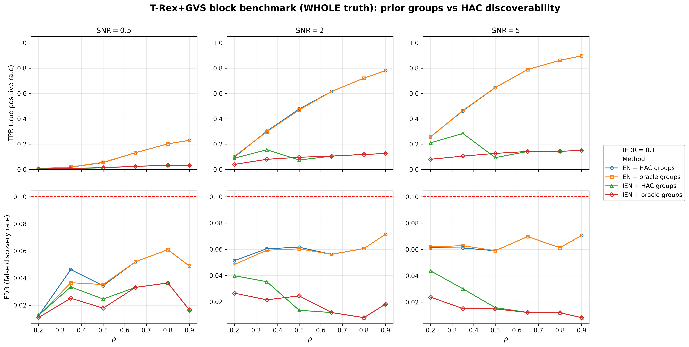
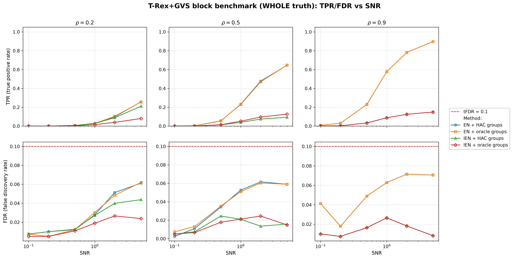
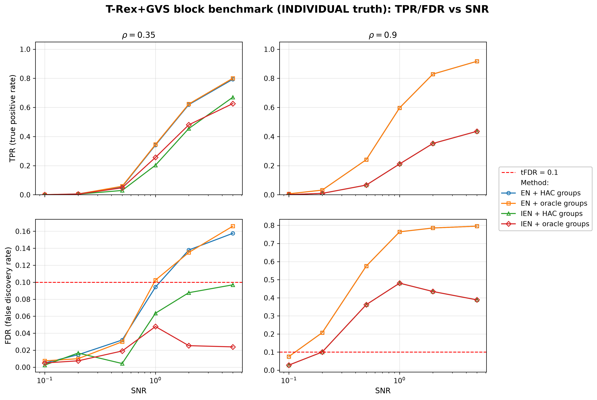

# Demo 08: T-Rex+GVS Block Benchmark — Value of Prior Group Information

## Purpose

Quantify what **prior group knowledge is actually worth** to T-Rex+GVS, as a function of how easily the groups
 could have been discovered from the data anyway.
 Four method variants factorize the question: elastic net (EN) vs. informed elastic net (IEN), each run once with
 HAC-discovered groups and once with the true ("oracle") groups from the data-generating process.
 The headline sweep moves the within-block correlation $\rho$ across the HAC discoverability boundary set by
 `corr_max = 0.5`: below it the clustered methods see near-singletons and the oracle prior is the only source of
 group structure; above it HAC rediscovers the blocks and the prior becomes redundant.
 Selection and evaluation are per variable (see
 [What is actually measured](../README.md#what-is-actually-measured-in-these-demos)).

---

## Data Generation Parameters (`make_block_equicorr_dgp`)

We consider again the linear model:

$$
\boldsymbol{y} = \boldsymbol{X}\boldsymbol{\beta} + \boldsymbol{\epsilon},
\qquad \boldsymbol{\epsilon} \sim \mathcal{N}(\boldsymbol{0}, \sigma_{\varepsilon}^2 \boldsymbol{I}_n)
$$

- $\boldsymbol{y} \in \mathbb{R}^n$ is the response vector.
- $\boldsymbol{X} \in \mathbb{R}^{n \times p}$ is the design matrix.
- $\boldsymbol{\beta} \in \mathbb{R}^p$ is the coefficient vector, with $s$ nonzero entries.
- $\boldsymbol{\epsilon}$ is the noise vector, i.i.d. standard normal.
- $\sigma_{\varepsilon}^2$ is the noise variance, calibrated to achieve a target linear signal-to-noise ratio (SNR).
- $n = 200$, $p = 500$; $s$ depends on the truth scenario below.

The design matrix consists of $G = 100$ equal-size blocks of `block_size` $= 5$ variables each, drawn from the
 unit-variance equicorrelated latent-factor model:

$$
X_{ij} = \sqrt{\rho}\, Z_{i,g(j)} + \sqrt{1-\rho}\, \xi_{ij},
\qquad Z_{\cdot,k},\ \xi_{ij} \sim \mathcal{N}(0,1).
$$

- `n_active_blocks` $= 10$ blocks are chosen at random per trial; each receives a random-sign coefficient
   $\beta = \pm 3$.
- The DGP exports `prior_groups[j] = j / 5` — the exact generating block of every column — which the oracle
   variants pass to `TRexGVSControlParameter::prior_groups`.

### Truth scenarios

- **WHOLE** (headline): all 5 variables of each active block are active, $s = 50$. This matches the grouped-selection
   premise of the T-Rex+GVS papers — active groups are fully active — so coordinate-level FDR/TPR are the right
   metrics.
- **INDIVIDUAL** (cautionary appendix): exactly 1 of the 5 variables per active block is active, $s = 10$. The four
   null siblings of each active variable are exchangeable with it up to the $(1-\rho)$ idiosyncratic component, so
   no selector that aggregates evidence across correlated variables can control the coordinate-level FDR here —
   this scenario is included to show that failure mode explicitly, not as a benchmark to win.

---

## Four Methods Compared

| Method | `GVSType` | Groups |
| --- | --- | --- |
| **M1 (EN + HAC)** | EN [[1]](#references) | discovered per trial via single-linkage HAC at `corr_max` |
| **M2 (EN + oracle)** | EN [[1]](#references) | true `prior_groups` from the DGP |
| **M3 (IEN + HAC)** | IEN [[2]](#references) | discovered per trial via single-linkage HAC at `corr_max` |
| **M4 (IEN + oracle)** | IEN [[2]](#references) | true `prior_groups` from the DGP |

The group information enters the two solvers differently: the EN variants use it **only** to draw
 group-correlated dummy (random-experiment) columns, while IEN additionally ties the group members together
 through its group-indicator row augmentation — and those indicator rows are tiled across the dummy layers as
 well, so every variable's group-aligned dummies share its group geometry. The oracle prior can therefore
 matter more — in either direction — for IEN than for EN. Note also that $\lambda_2$ is cross-validated on the
 original $(\boldsymbol{X}, \boldsymbol{y})$ only, so the chosen penalty is identical for the clustered and
 oracle variants and never adapts to the supplied group structure.

---

## Control Parameters

```text
K = 20                # Random experiments per T-loop iteration
tFDR = 0.1            # Target FDR
corr_max = 0.5        # HAC discoverability boundary (cut height 1 - corr_max)
hc_linkage = Single   # Single-linkage HAC
b = 3.0               # Nonzero coefficient magnitude (random sign per block)
MC = 200              # Monte Carlo repetitions per grid cell
```

Seeds are staggered per grid cell (`cell_base_seed = base_seed + cell_index * num_MC`, with
`cell_index = i_rho * n_snr + i_snr` over the scenario's own $\rho$ grid), so each $(\rho, \mathrm{SNR})$ cell
draws from a distinct seed band, and all four methods see identical data within a trial.

---

## The Sweep

- **WHOLE**: a 2-D $\rho \times \mathrm{SNR}$ grid over $\rho \in \{0.2, 0.35, 0.5, 0.65, 0.8, 0.9\}$ and
  $\mathrm{SNR} \in \{0.1, 0.2, 0.5, 1, 2, 5\}$, 200 MC trials per cell. The $\rho$ grid deliberately brackets
  `corr_max` $= 0.5$: single-linkage merges within-block pairs at distance $\approx 1 - \rho$, so for
  $\rho \le 0.35$ every merge lies above the fixed cut height $1 - $ `corr_max` $= 0.5$ and no group survives
  the cut (purity $0$, $M \approx 500$ singletons); $\rho = 0.5$ sits on the boundary
  (purity $\approx 0.57$, $M \approx 180$); $\rho \ge 0.65$ is fully discovered (purity $1.0$, $M = 100$).
  Holding `corr_max` fixed while $\rho$ varies models a **mis-specified discovery threshold** — the practical
  situation where the true correlation level is unknown — not a limitation of the clustering itself, which
  recovers these blocks whenever the cut is set below the within-block correlation.
- **INDIVIDUAL**: the same SNR grid at the low/high pair $\rho \in \{0.35, 0.9\}$.

---

## Metrics Reported

The primary metrics are the usual **coordinate-level FDR/TPR** — the quantities the T-Rex selector actually
 controls and targets. The saved tables additionally report block-level and grouping diagnostics:

- **`blk_hit`** — share of active blocks with at least one selected variable (a block-level TPR), or
  **`full_blk`** — share of active blocks recovered in their entirety (WHOLE tables).
- **`block_FDR`** — share of hit blocks that are truly null.
- **`purity`** — share of true blocks whose members all land in one discovered group ($1.0$ by construction for
  oracle runs); **`T_stop`**, **`M_found`** — selector diagnostics.

> The block-level numbers are **descriptive diagnostics only**. The selector provides no guarantee for them —
> FDR control applies to the coordinate level, and a block-level error rate is a different quantity with its own
> definition of a false discovery (cf. [the group-FDR discussion](../README.md#what-is-actually-measured-in-these-demos)).

---

## Output Files

Written to `simulation_results/data/`, one pair per truth scenario:

- `gvs_block_bench_whole.txt` / `.csv`
- `gvs_block_bench_individual.txt` / `.csv`

Each `.txt` reproduces the console grid tables; each `.csv` is a tidy long-format table with all four methods'
aggregates per $(\rho, \mathrm{SNR})$ cell. Figures (PNG + PDF) go to `simulation_results/plots/`, produced by
`./generate_plots.sh`.

---

## Running the Demo

```bash
./build/release/bin/trex_selector_methods/trex_gvs/demo_trex_gvs_08_mc_sim_block_bench/demo_trex_gvs_08_mc_sim_block_bench
./generate_plots.sh   # render the figures below from the saved CSVs
```

Both scenarios run in the same invocation and print one grid table per scenario, per $\rho$ value.

---

## Simulation Results

### WHOLE truth — value of the prior vs. $\rho$ (headline)

- **FDR is controlled everywhere**: the realized coordinate-level FDR never exceeds $0.071$ against the
   $\mathrm{tFDR} = 0.1$ target, for all four methods across the entire grid.
- **For the EN variants the prior is inert**: M1 and M2 differ by at most $0.007$ TPR at every grid point. Since
   EN consumes the group information only through the dummy correlation structure, knowing the true groups
   neither helps nor hurts it here.
- **For IEN the value of the prior is non-monotone in $\rho$.** Below the discoverability boundary the oracle
   prior *costs* power: at $\rho = 0.35$, $\mathrm{SNR} = 5$, clustered IEN reaches TPR $0.28$ vs. $0.11$ for
   oracle IEN (and $0.21$ vs. $0.08$ at $\rho = 0.2$). This is **not** HAC outperforming the truth — at these
   $\rho$ the `corr_max` $= 0.5$ cut sits above the within-block correlation, so no merge survives it
   (purity $0$, $M \approx 500$) and clustered IEN degenerates to per-variable ridge rows. It is the oracle's
   genuine 5-member ties that hurt: the shared group-indicator
   rows couple each active with its group-aligned dummies, and with weak within-group correlation the data block
   barely separates them, so dummies enter the solver path almost as early as actives, the FDP estimate stays
   high, and the T-loop terminates early ($\overline{T}_{\mathrm{stop}} = 6.6$ vs. $12.4$ for clustered at
   $\rho = 0.35$, $\mathrm{SNR} = 5$, at the *same* CV-chosen $\lambda_2$). Only around the boundary
   ($\rho = 0.5$) does the oracle pay off mildly ($0.127$ vs. $0.094$), and from $\rho \ge 0.65$ both IEN
   variants are numerically identical because HAC recovers exactly the true blocks.
- **IEN is much more conservative than EN throughout** (TPR $\le 0.15$ for $\rho \ge 0.5$ vs. up to $0.90$ for
   EN) — the same conservatism seen across Demos 01–07.

TPR (top) and FDR (bottom) vs. $\rho$, one panel per SNR $\in \{0.5, 2, 5\}$, one line per method; the dashed
red line marks the $\mathrm{tFDR} = 0.1$ target.



- The supplementary vs.-SNR view below shows the same data at three discoverability regimes
   ($\rho = 0.2$ undiscoverable, $0.5$ partial, $0.9$ fully discovered): the EN pair overlaps in every panel,
   and recovery grows with both SNR and $\rho$ (stronger within-block correlation concentrates the signal on
   fewer effective directions, which helps whole-block recovery).



### INDIVIDUAL truth — cautionary appendix

- **Coordinate-level FDR control collapses by construction once siblings correlate strongly.** At $\rho = 0.9$
   the EN methods realize FDR $\approx 0.78$–$0.80$ (target $0.1$) while selecting the active variable's whole
   block; IEN sits at $0.39$–$0.44$. Oracle and clustered variants are identical here — no amount of correct
   group knowledge identifies *which* exchangeable member is active.
- At the weaker $\rho = 0.35$ the violation is mild for EN (FDR up to $\approx 0.17$ at high SNR) and, notably,
   the oracle prior *does* rescue IEN's error control (FDR $\le 0.05$ vs. $\approx 0.10$ clustered) — the group
   ties concentrate the selection on one representative per block.
- The block-level diagnostics in the saved tables stay near the target ($\mathrm{block\_FDR} \approx 0.12$ at
   $\rho = 0.9$ for EN), which is exactly the point: the method still finds the right *blocks*, but no guarantee
   attaches to that number.

TPR (top) and FDR (bottom) vs. SNR (log axis), one panel per $\rho \in \{0.35, 0.9\}$; note the different FDR
axis scales.



---

## References

1. Machkour, J., Muma, M., & Palomar, D. P., "False Discovery Rate Control for Grouped Variable Selection
   in High-Dimensional Linear Models using the T-Knock Filter.", European Signal Processing Conference (EUSIPCO), 2022,
    pp. 892–896, EURASIP.
    [DOI-Link](https://doi.org/10.23919/EUSIPCO55093.2022.9909883)
2. Machkour, J., Muma, M., & Palomar, D. P., "The Informed Elastic Net for Fast Grouped Variable Selection and
   FDR Control in Genomics Research.", Workshop on Computational Advances in Multi-Sensor Adaptive Processing (CAMSAP),
    2023, pp. 466–470, IEEE.
    [DOI-Link](https://doi.org/10.1109/CAMSAP58249.2023.10403489)

---

**Last updated**: 2026-07-19
