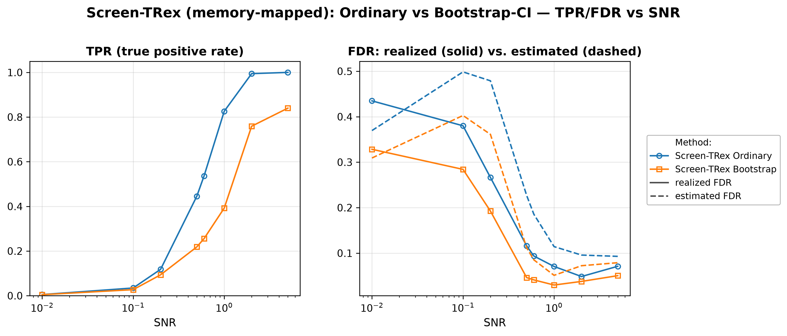

# Demo 02: Screen-TRex with Memory-Mapped Dummy Matrices

## Purpose

Show that the **memory-mapped Screen-TRex workflow** reproduces the in-memory baseline while keeping the
 dummy (D) matrices on disk instead of in RAM.
 The study is the same experiment as [Demo 01](../demo_trex_scr_01_mc_sim_screen_trex/README.md) — same
 i.i.d. Gaussian design, same SNR sweep, same two thresholding rules (**Ordinary** and **Bootstrap-CI**) —
 with the single change `TRexControlParameter::use_memory_mapping = true`.
 The point of this demo is therefore *equivalence at a lower memory footprint*, not a different statistical
 regime: memory mapping is what makes very large $p$ feasible on machines that cannot hold the dummy
 matrices in RAM.
 Screening returns a *candidate set*, and FDR/TPR are evaluated on the individual selected variables
 (see [What is actually measured](../README.md#what-is-actually-measured-in-these-demos)).

---

## Data Generation Parameters (`make_iid_dgp`)

We consider the linear model:

$$
\boldsymbol{y} = \boldsymbol{X}\boldsymbol{\beta} + \boldsymbol{\epsilon},
\qquad \boldsymbol{\epsilon} \sim \mathcal{N}(\boldsymbol{0}, \sigma_{\varepsilon}^2 \boldsymbol{I}_n)
$$

- $\boldsymbol{y} \in \mathbb{R}^n$ is the response vector.
- $\boldsymbol{X} \in \mathbb{R}^{n \times p}$ is the design matrix.
- $\boldsymbol{\beta} \in \mathbb{R}^p$ is the coefficient vector, with $s$ nonzero entries.
- $\boldsymbol{\epsilon}$ is the noise vector, i.i.d. standard normal.
- $\sigma_{\varepsilon}^2$ is the noise variance, calibrated to achieve a target linear signal-to-noise ratio (SNR).
- $n = 300$, $p = 1000$, $s = 10$ (high-dimensional, $p > n$).

The design matrix has **no correlation structure**:

$$
X_{ij} \sim \mathcal{N}(0,1) \quad \text{i.i.d.}
$$

- The active support is drawn uniformly at random *per Monte Carlo trial*, so the results are not tied to
   one support pattern.
- All active coefficients are $\beta_j = 1$; the support-selection and coefficient RNGs are offset from the
   trial seed so they stay independent of the design and noise draws.

---

## Control Parameters

```text
K = 20                       # Random experiments per T-loop iteration
use_memory_mapping = true    # Dummy (D) matrices backed by on-disk files, not RAM
R_boot = 1000                # Bootstrap replicates (Bootstrap-CI rule only)
ci_grid_step = 0.001         # Bootstrap-CI threshold grid granularity
solver = TLARS               # T-Rex solver backend
MC = 200                     # Monte Carlo repetitions per grid point
```

Note that Screen-TRex has **no target-FDR parameter**: unlike the classical T-Rex selector, screening
 thresholds the voting statistic instead of calibrating to a user-specified level.

---

## Methods Compared

Two Screen-TRex thresholding rules [[1]](#references), both using `ScreenTRexMethod::TREX`:

- **Screen-TRex Ordinary** — selects $\{ j : \Phi_j > 0.5 \}$, a simple majority vote of the random
   experiments.
- **Screen-TRex Bootstrap** — builds a bootstrap confidence band around the estimated FDR curve
   (`R_boot = 1000` replicates) and picks its threshold from that band.

Both report an **estimated FDR** alongside the realized FDR/TPR — the procedure's own internal assessment
 of how many of its selections are false. Comparing the two is a central purpose of this suite.

---

## The Sweep

A single **SNR sweep** over $\mathrm{SNR} \in \{0.01, 0.1, 0.2, 0.5, 0.6, 1, 2, 5\}$, 200 MC trials per
point, with a fresh design, support, and noise draw in every trial — identical to Demo 01 apart from the
memory-mapped dummy storage.

---

## Output Files

Written to `simulation_results/data/`:

- `scr_screen_trex_mmap_snr_n300_p1000.txt` / `.csv` — FDR, TPR, and estimated FDR per method and SNR level.

Figures (PNG + PDF) go to `simulation_results/plots/`, produced by `./generate_plots.sh`.

---

## Running the Demo

```bash
./build/release/bin/trex_selector_methods/trex_screening/demo_trex_scr_02_mc_sim_screen_trex_mmap/demo_trex_scr_02_mc_sim_screen_trex_mmap
./generate_plots.sh   # render the figure below from the saved CSV
```

---

## Simulation Results

- **Memory mapping changes the memory footprint, not the statistical behaviour.** Across the sweep the
   memory-mapped curves track the in-memory Demo 01 curves closely: for $\mathrm{SNR} \ge 0.5$ the largest
   TPR difference is about $0.03$ (Bootstrap at $\mathrm{SNR} = 5$: $0.840$ here vs. $0.865$ in Demo 01) and
   the largest FDR difference about $0.01$. It is the same procedure on the same statistics — only the D
   matrices live on disk.
- **Exact equality is not expected.** Both demos use nondeterministic selector seeds (the library resolves
   `seed = -1` via `std::random_device`), so the two runs draw different random experiments. The residual
   gaps are Monte Carlo noise, not a discrepancy in the memory-mapped path.
- **The baseline conclusions carry over unchanged.** Screening is not FDR-controlling at low SNR — at
   $\mathrm{SNR} \le 0.2$ the realized FDR runs between $0.19$ and $0.44$ with TPR $\le 0.12$ — and both
   rules become reliable from $\mathrm{SNR} \ge 0.5$, where the Ordinary rule's FDR falls to $0.116$ and
   settles around $0.05$–$0.07$ while its TPR climbs $0.446 \to 1.000$.
- **Bootstrap-CI remains the conservative rule: lower FDR, clearly less power.** Its FDR stays at or below
   $0.050$ for $\mathrm{SNR} \ge 0.5$, roughly half the Ordinary rule's, paid for with TPR $0.840$ vs.
   $1.000$ at $\mathrm{SNR} = 5$ and a wide mid-sweep gap ($0.393$ vs. $0.826$ at $\mathrm{SNR} = 1$).
- **The internal FDR estimate errs on the safe side here.** For $\mathrm{SNR} \ge 0.5$ it sits *above* the
   realized FDR for both rules (e.g. $0.114$ vs. $0.071$ for Ordinary at $\mathrm{SNR} = 1$), over-stating
   the error rate rather than hiding it. At the lowest SNR points it becomes unreliable in both directions.

TPR (left) and FDR (right) vs. SNR (log axis), one line per thresholding rule; on the FDR panel the solid
line is the realized FDR and the dashed line the procedure's own estimated FDR.



---

## References

1. Machkour, J., Muma, M., & Palomar, D. P., "False Discovery Rate Control for Fast Screening of
   Large-Scale Genomics Biobanks.", IEEE Statistical Signal Processing Workshop (SSP), 2023,
    pp. 666–670, IEEE.
    [DOI-Link](https://doi.org/10.1109/SSP53291.2023.10207957)

---

**Last updated**: 2026-07-20
