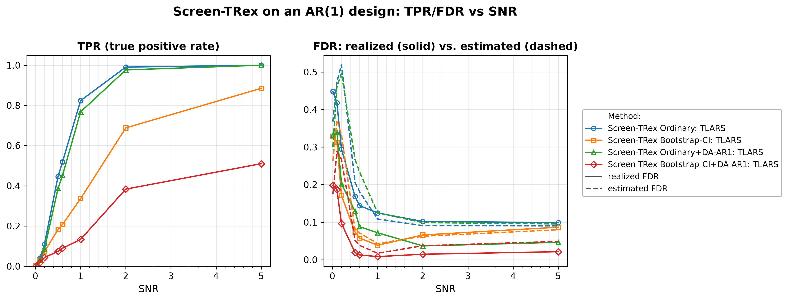
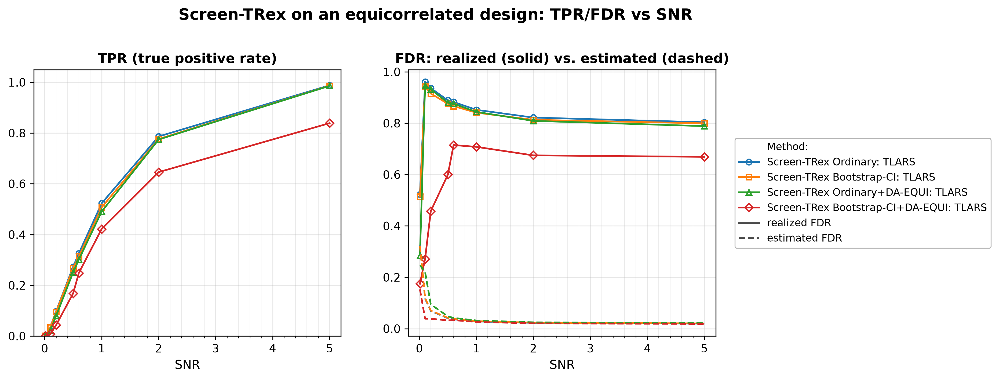
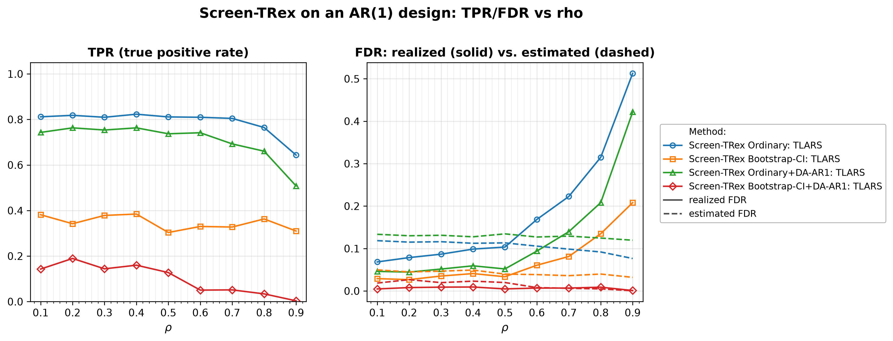
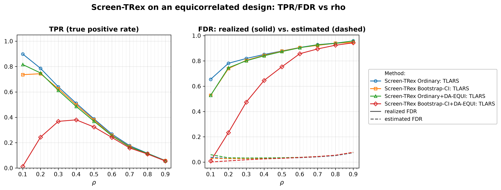
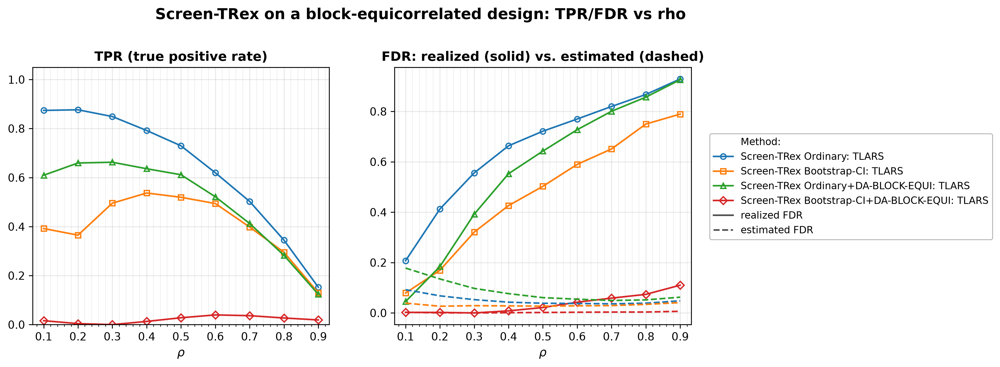

# Demo 03: Screen-TRex under Correlated Designs

## Purpose

Measure what **predictor correlation does to Screen-TRex**, and whether the **dependency-aware (DA)**
 variants repair the damage.
 Three correlation structures are put in front of the screener — AR(1), equicorrelated, and
 block-equicorrelated — and in each case the plain Ordinary and Bootstrap-CI rules are compared against
 their DA counterparts, which pre-group correlated variables before the votes are counted.
 Demo 01 established the i.i.d. baseline; everything reported here is the cost of leaving it.
 Screening returns a *candidate set*, and FDR/TPR are evaluated on the individual selected variables
 (see [What is actually measured](../README.md#what-is-actually-measured-in-these-demos)).

---

## Data Generation Parameters (`make_ar1_dgp`, `make_equi_dgp`, `make_block_equi_dgp`)

We consider the linear model:

$$
\boldsymbol{y} = \boldsymbol{X}\boldsymbol{\beta} + \boldsymbol{\epsilon},
\qquad \boldsymbol{\epsilon} \sim \mathcal{N}(\boldsymbol{0}, \sigma_{\varepsilon}^2 \boldsymbol{I}_n)
$$

- $\boldsymbol{y} \in \mathbb{R}^n$ is the response vector.
- $\boldsymbol{X} \in \mathbb{R}^{n \times p}$ is the design matrix.
- $\boldsymbol{\beta} \in \mathbb{R}^p$ is the coefficient vector, with $s$ nonzero entries.
- $\boldsymbol{\epsilon}$ is the noise vector, i.i.d. standard normal.
- $\sigma_{\varepsilon}^2$ is the noise variance, calibrated to achieve a target linear signal-to-noise ratio (SNR).
- $n = 300$, $p = 1000$, $s = 10$ (high-dimensional, $p > n$).

Three correlation structures are used. **AR(1)**, a decaying-correlation chain:

$$
x_j = \rho\, x_{j-1} + \sqrt{1 - \rho^2}\, w_j
\qquad \Longrightarrow \qquad
\mathrm{corr}(x_j, x_{j'}) = \rho^{|j - j'|}
$$

**Equicorrelated**, one shared latent factor $z$ driving every column, so *all* pairs correlate equally:

$$
x_j = \sqrt{\rho}\, z + \sqrt{1 - \rho}\, w_j
\qquad \Longrightarrow \qquad
\mathrm{corr}(x_j, x_{j'}) = \rho \quad \forall\, j \neq j'
$$

**Block-equicorrelated**, the same construction but with one latent factor $z_k$ per block: columns
 correlate at $\rho$ *within* a block and are independent across blocks. Five contiguous blocks of 200
 columns each are used.

- All columns are **standardised to zero mean and unit variance** after generation, so $\rho$ is the
   realized column correlation rather than a nominal parameter.
- $\boldsymbol{\beta}$ has $p_1 = 10$ **evenly spaced** active entries, all of equal magnitude; the
   design and the noise are drawn afresh in every Monte Carlo trial.

---

## Control Parameters

```text
K = 20                       # Random experiments per T-loop iteration
rho_thr_DA = 0.02            # Correlation threshold for dependency-aware grouping
n_blocks = 5                 # Blocks assumed by the DA-BLOCK-EQUI variant (Part 5)
R_boot = 1000                # Bootstrap replicates (Bootstrap-CI rule only)
ci_grid_step = 0.001         # Bootstrap-CI threshold grid granularity
solver = TLARS               # T-Rex solver backend
MC = 200                     # Monte Carlo repetitions per grid point
```

Note that Screen-TRex has **no target-FDR parameter**: unlike the classical T-Rex selector, screening
 thresholds the voting statistic instead of calibrating to a user-specified level.

---

## Methods Compared

Every part compares four methods — the two thresholding rules of Demo 01, plain and dependency-aware
 [[1]](#references):

- **Screen-TRex Ordinary** — majority vote $\{ j : \Phi_j > 0.5 \}$, no correlation handling
   (`ScreenTRexMethod::TREX`).
- **Screen-TRex Bootstrap-CI** — bootstrap confidence band around the estimated FDR curve
   (`R_boot = 1000` replicates), no correlation handling.
- **Screen-TRex + DA** — the same two rules on top of a **dependency-aware** method
   (`TREX_DA_AR1`, `TREX_DA_EQUI`, or `TREX_DA_BLOCK_EQUI`), which groups variables whose correlation
   exceeds `rho_thr_DA = 0.02` *before* the votes are aggregated, so a cluster of near-duplicate
   predictors cannot inflate the selection count on its own.

The DA variant is always matched to the design that generated the data — this demo therefore reports the
 **best case for DA**, not a misspecification study. All methods also report an **estimated FDR**
 alongside the realized FDR/TPR; under correlation the gap between the two becomes the main story.

---

## The Five Parts

| Part | Design | Fixed | Sweep | DA variant |
| :--- | :----- | :---- | :---- | :--------- |
| 1 | AR(1) | $\rho = 0.5$ | SNR $\in \{0.01, 0.1, 0.2, 0.5, 0.6, 1, 2, 5\}$ | DA-AR1 |
| 2 | Equicorrelated | $\rho = 0.4$ | same SNR grid | DA-EQUI |
| 3 | AR(1) | SNR $= 1$ | $\rho \in \{0.1, \dots, 0.9\}$ | DA-AR1 |
| 4 | Equicorrelated | SNR $= 1$ | $\rho \in \{0.1, \dots, 0.9\}$ | DA-EQUI |
| 5 | Block-equicorrelated (5 blocks) | SNR $= 1$ | $\rho \in \{0.1, \dots, 0.9\}$ | DA-BLOCK-EQUI |

Parts 1–2 ask *how much signal is needed at a fixed correlation level*; Parts 3–5 ask *how much
 correlation the screener survives at a fixed signal level*. 200 MC trials per grid point throughout.

---

## Output Files

Written to `simulation_results/data/`, each as `.txt` (human-readable table) and `.csv` (tidy long):

- `scr_ar1_snr_n300_p1000_rho0.50` — Part 1: AR(1), SNR sweep.
- `scr_equi_snr_n300_p1000_rho0.40` — Part 2: equicorrelated, SNR sweep.
- `scr_ar1_rho_n300_p1000_snr1.00` — Part 3: AR(1), $\rho$ sweep.
- `scr_equi_rho_n300_p1000_snr1.00` — Part 4: equicorrelated, $\rho$ sweep.
- `scr_block_equi_rho_n300_p1000_blocks5_snr1.00` — Part 5: block-equicorrelated, $\rho$ sweep.

Each file holds FDR, TPR, and estimated FDR per method and grid point. Figures (PNG + PDF) go to
`simulation_results/plots/`, produced by `./generate_plots.sh`.

---

## Running the Demo

```bash
./build/release/bin/trex_selector_methods/trex_screening/demo_trex_scr_03_mc_sim_correlated/demo_trex_scr_03_mc_sim_correlated
./generate_plots.sh   # render the figures below from the saved CSVs
```

---

## Simulation Results

### Part 1 — AR(1) Design, SNR Sweep ($\rho = 0.5$)

- **AR(1) correlation is survivable.** At $\rho = 0.5$ the Ordinary rule behaves much as in Demo 01: FDR
   falls $0.45 \to 0.10$ across the sweep while TPR climbs $0.002 \to 1.00$, recovering all ten active
   variables at $\mathrm{SNR} = 5$. Local, decaying dependence does not break the screener.
- **DA lowers the error rate at a modest power cost.** Ordinary+DA-AR1 roughly *halves* the plain
   Ordinary FDR for $\mathrm{SNR} \ge 1$ ($0.072$ vs. $0.125$ at $\mathrm{SNR} = 1$; $0.037$ vs. $0.102$
   at $\mathrm{SNR} = 2$) while giving up only a few points of TPR ($0.767$ vs. $0.824$).
- **Bootstrap-CI+DA-AR1 is extremely conservative.** Its FDR never exceeds $0.021$ once
   $\mathrm{SNR} \ge 0.5$, but its TPR tops out at $0.510$ at $\mathrm{SNR} = 5$ — it buys near-zero
   false discoveries by leaving half the true signal on the table.
- **The internal estimate is still well-behaved here.** For $\mathrm{SNR} \ge 0.5$ it brackets the
   realized FDR closely and often exceeds it (Ordinary+DA-AR1: $0.125$ estimated vs. $0.072$ realized at
   $\mathrm{SNR} = 1$). This is the last part where that holds.

TPR (left) and FDR (right) vs. SNR, one line per method; on the FDR panel the solid line is
the realized FDR and the dashed line the procedure's own estimated FDR.



### Part 2 — Equicorrelated Design, SNR Sweep ($\rho = 0.4$)

- **Equicorrelation breaks screening outright.** Even at a moderate $\rho = 0.4$, the Ordinary rule's FDR
   sits between $0.80$ and $0.96$ for every $\mathrm{SNR} \ge 0.1$ — four out of five selections are
   false — and it is still $0.804$ at $\mathrm{SNR} = 5$, where TPR has reached $0.988$. More signal
   recovers the true variables but does *not* clean up the candidate set.
- **DA-EQUI does not rescue the Ordinary rule.** Ordinary DA-EQUI tracks plain Ordinary almost exactly
   ($0.844$ vs. $0.852$ at $\mathrm{SNR} = 1$). Matching the DA variant to the true design structure is
   not enough when every column shares one latent factor.
- **Bootstrap-CI+DA-EQUI helps partially, and pays for it.** It is the one method that bends the curve
   ($0.708$ vs. $0.841$ at $\mathrm{SNR} = 1$), but $0.67$–$0.72$ FDR is still unusable, and its TPR
   trails the others throughout ($0.839$ vs. $0.988$ at $\mathrm{SNR} = 5$).
- **A non-monotone artifact at the bottom of the sweep.** The realized Ordinary FDR is *lower* at
   $\mathrm{SNR} = 0.01$ ($0.523$) than at $\mathrm{SNR} = 0.1$ ($0.962$). This is not a sweet spot: at
   $\mathrm{SNR} = 0.01$ the rule selects almost nothing (TPR $= 0.002$), so there are barely any
   discoveries left to be false. Low-SNR FDR numbers must be read alongside the TPR column.
- **The FDR estimate has already come apart.** It reports $0.020$–$0.120$ across the sweep while the
   realized FDR is $0.80$–$0.96$ — off by more than an order of magnitude, in the optimistic direction.

TPR (left) and FDR (right) vs. SNR, one line per method; solid = realized FDR, dashed =
estimated FDR.



### Part 3 — AR(1) Design, $\rho$ Sweep (SNR $= 1$)

- **Degradation is gradual and only bites at high $\rho$.** The Ordinary rule holds FDR near
   $0.07$–$0.10$ up to $\rho = 0.5$, then deteriorates to $0.169$, $0.223$, $0.315$, and finally $0.513$
   at $\rho = 0.9$. TPR is remarkably stable ($\approx 0.81$) until $\rho = 0.8$ and drops to $0.643$
   only at $\rho = 0.9$.
- **DA-AR1 buys roughly one step of the $\rho$ grid.** Ordinary+DA-AR1 lowers FDR at every $\rho$
   ($0.422$ vs. $0.513$ at $\rho = 0.9$; $0.208$ vs. $0.315$ at $\rho = 0.8$) at a cost of a few to
   fourteen points of TPR. It is a real improvement, but it delays the failure rather than preventing it.
- **Bootstrap-CI+DA-AR1 controls the FDR by declining to select.** Its FDR stays within $0.001$–$0.009$
   across the *entire* $\rho$ range — nominally the best result in this demo — but its TPR falls from
   $0.143$ at $\rho = 0.1$ to $0.051$ at $\rho = 0.6$ and $0.004$ at $\rho = 0.9$. At high correlation it
   returns essentially an empty set. This is a bias/variance trade, not a free fix, and a near-zero FDR
   is only meaningful when read next to its TPR.
- **The estimate degrades in step with the method.** At $\rho = 0.9$ Ordinary reports $0.077$ against a
   realized $0.513$ — the estimate is least trustworthy exactly where the user most needs a warning.

TPR (left) and FDR (right) vs. $\rho$, one line per method; solid = realized FDR, dashed = estimated FDR.



### Part 4 — Equicorrelated Design, $\rho$ Sweep (SNR $= 1$)

- **Failure from the very first grid point.** Ordinary FDR starts at $0.655$ for $\rho = 0.1$ and rises
   monotonically to $0.958$ at $\rho = 0.9$, while TPR collapses $0.899 \to 0.059$. Unlike AR(1), there
   is no usable region of the sweep.
- **No DA variant rescues it.** Ordinary DA-EQUI ends at $0.959$ and Bootstrap at $0.947$ —
   indistinguishable from plain Ordinary. Bootstrap-CI+DA-EQUI is again the only one that differs at low
   $\rho$ ($0.008$ FDR at $\rho = 0.1$), and again only because it selects almost nothing there
   (TPR $= 0.013$); by $\rho = 0.5$ it has converged to the others at $0.754$.
- **This is the demo's central caution: the FDR estimate is wildly optimistic exactly where the method
   fails.** Across the whole sweep the estimate reports $0.028$–$0.077$ while the realized FDR is
   $0.65$–$0.96$ — a gap of a factor of twenty or more, and it is *smallest* at the mildest correlation.
   Under equicorrelation the procedure's self-assessment cannot be trusted at all. Contrast this with
   Demo 01, where the same estimate sat *above* the realized FDR and erred on the safe side.

TPR (left) and FDR (right) vs. $\rho$, one line per method; solid = realized FDR, dashed = estimated FDR.



### Part 5 — Block-Equicorrelated Design, $\rho$ Sweep (SNR $= 1$, 5 blocks)

- **Block structure sits between the two extremes — but closer to the bad one.** Ordinary FDR grows
   $0.207 \to 0.929$ over the sweep. It is far better than the fully equicorrelated case at low $\rho$
   ($0.207$ vs. $0.655$ at $\rho = 0.1$), because independence *across* blocks survives, but by
   $\rho = 0.9$ the two designs are equally hopeless.
- **DA-BLOCK-EQUI helps meaningfully at low correlation only.** Ordinary+DA-BLOCK-EQUI cuts FDR from $0.207$
   to $0.045$ at $\rho = 0.1$ and from $0.412$ to $0.184$ at $\rho = 0.2$ — the clearest DA win anywhere
   in this demo — but the advantage has eroded by $\rho = 0.5$ ($0.643$ vs. $0.721$) and is gone at
   $\rho = 0.9$ ($0.926$ vs. $0.929$). The TPR cost is real throughout ($0.610$ vs. $0.874$ at
   $\rho = 0.1$).
- **Bootstrap-CI+DA-BLOCK-EQUI is degenerate here.** Its FDR never exceeds $0.110$, but its TPR never exceeds
   $0.040$ and is exactly $0.000$ at $\rho = 0.3$. The method returns empty or near-empty sets across the
   sweep; its FDR column carries no usable information.
- **The estimate is again too optimistic, though less catastrophically.** Ordinary reports
   $0.036$–$0.092$ against a realized $0.21$–$0.93$. As in Part 4, it gives no signal that anything has
   gone wrong.

TPR (left) and FDR (right) vs. $\rho$, one line per method; solid = realized FDR, dashed = estimated FDR.



---

## References

1. Machkour, J., Muma, M., & Palomar, D. P., "False Discovery Rate Control for Fast Screening of
   Large-Scale Genomics Biobanks.", IEEE Statistical Signal Processing Workshop (SSP), 2023,
    pp. 666–670, IEEE.
    [DOI-Link](https://doi.org/10.1109/SSP53291.2023.10207957)

---

**Last updated**: 2026-07-20
