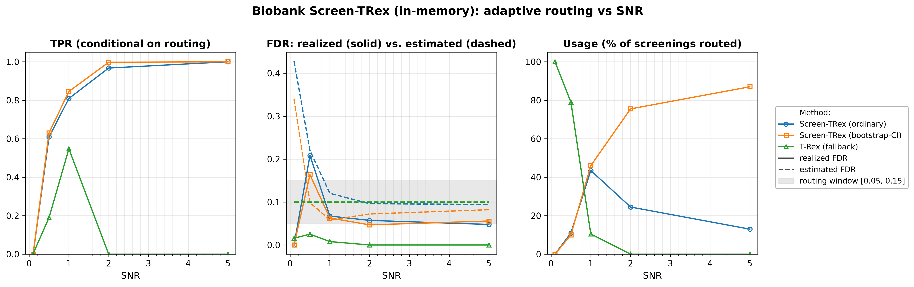
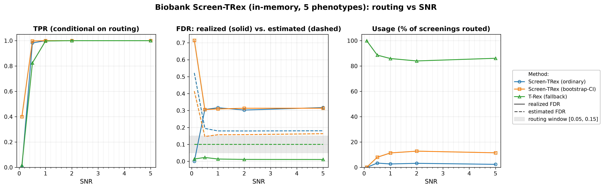

# Demo 04: Biobank Screen-TRex (Algorithm 1) — In-Memory

## Purpose

Demonstrate the **Biobank Screen-TRex workflow** ("Algorithm 1"), which screens *many phenotypes* against a
 single shared design matrix $\boldsymbol{X}$.
 Per phenotype the algorithm tries **Screen-TRex Ordinary** first; if the estimated FDR falls outside the
 acceptable window $[0.05, 0.15]$ it retries with **Screen-TRex Bootstrap-CI**; if that also lands outside
 the window it falls back to the **classical T-Rex selector** at a target FDR of $0.10$.
 The interesting quantity is therefore not a single error rate but the *routing behaviour*: which method
 handles which phenotype, and how well each performs on the subset it was given.
 This demo keeps the dummy matrices **in memory** (`use_memory_mapping = false`); demo 05 runs the identical
 study with memory-mapped, disk-backed dummy matrices.
 Screening returns a *candidate set*, and FDR/TPR are evaluated on the individual selected variables
 (see [What is actually measured](../README.md#what-is-actually-measured-in-these-demos)).

---

## Data Generation Parameters (`make_iid_dgp`)

We consider the linear model:

$$
\boldsymbol{y} = \boldsymbol{X}\boldsymbol{\beta} + \boldsymbol{\epsilon},
\qquad \boldsymbol{\epsilon} \sim \mathcal{N}(\boldsymbol{0}, \sigma_{\varepsilon}^2 \boldsymbol{I}_n)
$$

- $\boldsymbol{y} \in \mathbb{R}^n$ is the response vector.
- $\boldsymbol{X} \in \mathbb{R}^{n \times p}$ is the design matrix.
- $\boldsymbol{\beta} \in \mathbb{R}^p$ is the coefficient vector, with $s$ nonzero entries.
- $\boldsymbol{\epsilon}$ is the noise vector, i.i.d. standard normal.
- $\sigma_{\varepsilon}^2$ is the noise variance, calibrated to achieve a target linear signal-to-noise ratio (SNR).
- $n = 300$, $p = 1000$, with $s = 10$ in Part 1 and $s = 5$ in Part 2 (high-dimensional, $p > n$).

The design matrix has **no correlation structure**:

$$
X_{ij} \sim \mathcal{N}(0,1) \quad \text{i.i.d.}
$$

- The active support is drawn uniformly at random *per Monte Carlo trial*, so the results are not tied to
   one support pattern.
- All active coefficients are $\beta_j = 1$; the support-selection and coefficient RNGs are offset from the
   trial seed so they stay independent of the design and noise draws.
- In Part 2 all $q = 5$ phenotypes of a trial share **one design matrix** $\boldsymbol{X}$ (a fixed
   `X_seed` per trial), while each phenotype receives its **own random support** and its own noise draw —
   the biobank setting, where a single genotype matrix is screened against many traits.

---

## Control Parameters

```text
K = 20                       # Random experiments per T-loop iteration
lower_bound_FDR = 0.05       # Lower edge of the acceptable estimated-FDR window
upper_bound_FDR = 0.15       # Upper edge of the acceptable estimated-FDR window
target_FDR_trex = 0.10       # Target FDR of the classical T-Rex fallback
R_boot = 1000                # Bootstrap replicates (Bootstrap-CI rule only)
ci_grid_step = 0.001         # Bootstrap-CI threshold grid granularity
solver = TLARS               # T-Rex solver backend
use_memory_mapping = false   # Dummy matrices held in memory
MC = 200                     # Monte Carlo repetitions per grid point
```

The window $[0.05, 0.15]$ is the routing criterion: a screening result is *accepted* only if the
 procedure's own estimated FDR lands inside it.

---

## Methods Compared

The three routing outcomes of Algorithm 1 [[1]](#references), all using `ScreenTRexMethod::TREX`:

- **Screen-TRex Ordinary** — the majority-vote rule ($\Phi_j > 0.5$); tried first for every phenotype.
- **Screen-TRex Bootstrap-CI** — the bootstrap confidence-band rule (`R_boot = 1000` replicates); tried
   only when the Ordinary estimate falls outside the window.
- **T-Rex (fallback)** — the classical T-Rex selector at `target_FDR_trex = 0.10`, used when neither
   screening rule produces an acceptable estimate.

All reported FDR and TPR values are **conditional on routing**: they average only over the phenotypes that
 were actually handled by the respective method. The additional **Usage %** row is unconditional and states
 what fraction of all screenings each method took. A metric row for a method with $0\%$ usage is therefore
 an average over an empty set, not a performance statement.

---

## The Two Parts

- **Part 1 — single phenotype.** One response per trial, $s = 10$ active variables, SNR sweep over
   $\{0.1, 0.5, 1, 2, 5\}$, 200 MC trials per grid point.
- **Part 2 — $q = 5$ phenotypes sharing one $\boldsymbol{X}$.** $s = 5$ active variables per phenotype, the
   same SNR grid and 200 MC trials, hence $5 \times 200 = 1000$ phenotype screenings per SNR level.

---

## Output Files

Written to `simulation_results/data/`:

- `scr_biobank_snr_n300_p1000_s10.txt` / `.csv` — Part 1: Usage %, FDR, TPR, and estimated FDR
   per method and SNR level.
- `scr_biobank_multi_n300_p1000_q5_s5.txt` / `.csv` — Part 2: the same metrics for the
   multi-phenotype study.

Figures (PNG + PDF) go to `simulation_results/plots/`, produced by `./generate_plots.sh`.

---

## Running the Demo

```bash
./build/release/bin/trex_selector_methods/trex_screening/demo_trex_scr_04_mc_sim_biobank/demo_trex_scr_04_mc_sim_biobank
./generate_plots.sh   # render the figures below from the saved CSVs
```

---

## Simulation Results

### Part 1 — Single Phenotype ($s = 10$)

- **The routing does what it is designed to do.** At $\mathrm{SNR} = 0.1$ essentially every phenotype
   ($100.0\%$) ends up at the classical T-Rex fallback — with no recoverable signal both screening rules
   estimate an FDR far above the window ($0.428$ Ordinary, $0.339$ Bootstrap-CI). As SNR grows the traffic
   shifts to the screening routes: at $\mathrm{SNR} = 1$ the split is $43.5\%$ Ordinary / $46.0\%$
   Bootstrap-CI / $10.5\%$ fallback, and at $\mathrm{SNR} = 5$ Bootstrap-CI handles $87.0\%$ of all
   screenings while the fallback is never invoked.
- **Conditional error control on the screening routes is good once signal is present.** From
   $\mathrm{SNR} \ge 1$ the realized FDR runs $0.067 \to 0.048$ for Ordinary and $0.063 \to 0.056$ for
   Bootstrap-CI — around $0.05$–$0.06$ — while TPR reaches $1.000$ for both at $\mathrm{SNR} = 5$. The one
   badly behaved point is $\mathrm{SNR} = 0.5$, where the few phenotypes that do pass the window still
   realize an FDR of $0.209$ (Ordinary) and $0.164$ (Bootstrap-CI).
- **The fallback's TPR of $0.000$ at $\mathrm{SNR} = 2$ and $5$ is not a failure.** Its usage is $0.0\%$ at
   those points — nothing is routed to it, so the conditional average is taken over an empty set and prints
   as zero. Where the fallback *is* used it behaves as expected: at $\mathrm{SNR} = 1$ it realizes an FDR of
   $0.008$ against its target of $0.10$ with a TPR of $0.548$, i.e. it is the conservative option that
   trades away power for safety.
- **The estimates track the realized rates reasonably here.** Bootstrap-CI's estimate falls from $0.339$ to
   $0.058$–$0.082$ across the sweep and sits close to (mostly above) the realized $0.047$–$0.063$;
   Ordinary's estimate settles near $0.094$–$0.120$ against a realized $0.048$–$0.067$, again erring on the
   safe side.

TPR (conditional on routing), FDR (solid = realized, dashed = the procedure's own estimate, with the
$[0.05, 0.15]$ routing window shaded), and per-method Usage % vs. SNR.



### Part 2 — Five Phenotypes Sharing One Design ($q = 5$, $s = 5$)

- **The fallback dominates.** Across the whole sweep the classical T-Rex selector handles $84.0\%$–$99.9\%$
   of all screenings ($99.9\%$ at $\mathrm{SNR} = 0.1$, $86.1\%$ at $\mathrm{SNR} = 5$). The screening rules
   take only a few percent each (Ordinary $2.4\%$–$3.4\%$, Bootstrap-CI $8.0\%$–$12.8\%$ for
   $\mathrm{SNR} \ge 0.5$). Unlike Part 1, more signal does **not** shift the traffic to the screening
   routes.
- **Where the screening routes are used, they are poorly calibrated.** For $\mathrm{SNR} \ge 0.5$ the
   realized FDR of the accepted screening results is $0.303$–$0.318$ (Ordinary) and $0.306$–$0.314$
   (Bootstrap-CI) — roughly twice the upper edge of the routing window — while the corresponding estimates
   are only $0.179$–$0.194$ and $0.146$–$0.163$. The estimate does not track the truth in this regime.
- **This is a sparsity effect, and the cautionary result of the pair.** With only $s = 5$ active variables
   per phenotype, a single false selection moves the FDP by a large increment, so the realized FDR is coarse
   and high even when every true variable is found (TPR is $1.000$ for both screening rules from
   $\mathrm{SNR} = 1$ onward). Screening admits the phenotype on an estimate that is systematically too
   optimistic.
- **The fallback stays well behaved on the bulk of the traffic.** Its realized FDR is $0.011$–$0.023$
   against a target of $0.10$, with TPR rising $0.017 \to 1.000$ over the sweep. In this configuration the
   conservative route is both the most-used and the most reliable one.

TPR (conditional on routing), FDR (solid = realized, dashed = the procedure's own estimate, with the
$[0.05, 0.15]$ routing window shaded), and per-method Usage % vs. SNR.



---

## References

1. Machkour, J., Muma, M., & Palomar, D. P., "False Discovery Rate Control for Fast Screening of
   Large-Scale Genomics Biobanks.", IEEE Statistical Signal Processing Workshop (SSP), 2023,
    pp. 666–670, IEEE.
    [DOI-Link](https://doi.org/10.1109/SSP53291.2023.10207957)

---

**Last updated**: 2026-07-20
