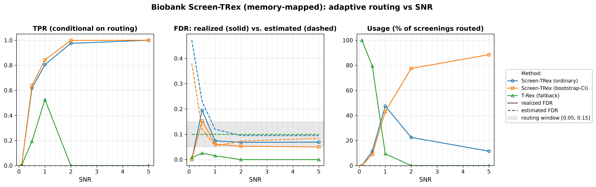
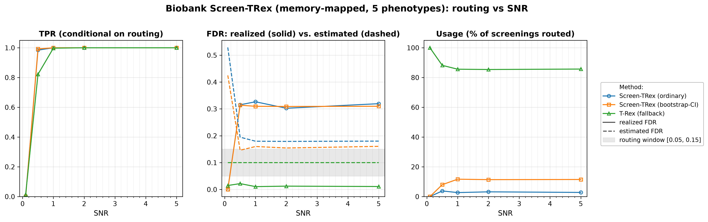

# Demo 05: Biobank Screen-TRex (Algorithm 1) — Memory-Mapped

## Purpose

Repeat the **Biobank Screen-TRex workflow** ("Algorithm 1") of demo 04 with **memory-mapped dummy matrices**
 (`use_memory_mapping = true`), the storage mode intended for biobank-scale problems where holding the
 dummy matrices in RAM is infeasible.
 The algorithm is unchanged: per phenotype it tries **Screen-TRex Ordinary** first; if the estimated FDR
 falls outside the acceptable window $[0.05, 0.15]$ it retries with **Screen-TRex Bootstrap-CI**; if that
 also lands outside the window it falls back to the **classical T-Rex selector** at a target FDR of $0.10$.
 Demo 04 is the in-memory reference for every number reported here — the point of this demo is to show
 that moving the dummy matrices to disk changes the memory footprint and not the statistics.
 Screening returns a *candidate set*, and FDR/TPR are evaluated on the individual selected variables
 (see [What is actually measured](../README.md#what-is-actually-measured-in-these-demos)).

---

## Data Generation Parameters (`make_iid_dgp`)

We consider the linear model:

$$
\boldsymbol{y} = \boldsymbol{X}\boldsymbol{\beta} + \boldsymbol{\epsilon},
\qquad \boldsymbol{\epsilon} \sim \mathcal{N}(\boldsymbol{0}, \sigma_{\varepsilon}^2 \boldsymbol{I}_n)
$$

- $\boldsymbol{y} \in \mathbb{R}^n$ is the response vector.
- $\boldsymbol{X} \in \mathbb{R}^{n \times p}$ is the design matrix.
- $\boldsymbol{\beta} \in \mathbb{R}^p$ is the coefficient vector, with $s$ nonzero entries.
- $\boldsymbol{\epsilon}$ is the noise vector, i.i.d. standard normal.
- $\sigma_{\varepsilon}^2$ is the noise variance, calibrated to achieve a target linear signal-to-noise ratio (SNR).
- $n = 300$, $p = 1000$, with $s = 10$ in Part 1 and $s = 5$ in Part 2 (high-dimensional, $p > n$).

The design matrix has **no correlation structure**:

$$
X_{ij} \sim \mathcal{N}(0,1) \quad \text{i.i.d.}
$$

- The active support is drawn uniformly at random *per Monte Carlo trial*, so the results are not tied to
   one support pattern.
- All active coefficients are $\beta_j = 1$; the support-selection and coefficient RNGs are offset from the
   trial seed so they stay independent of the design and noise draws.
- In Part 2 all $q = 5$ phenotypes of a trial share **one design matrix** $\boldsymbol{X}$ (a fixed
   `X_seed` per trial), while each phenotype receives its **own random support** and its own noise draw —
   the biobank setting, where a single genotype matrix is screened against many traits.

---

## Control Parameters

```text
K = 20                       # Random experiments per T-loop iteration
lower_bound_FDR = 0.05       # Lower edge of the acceptable estimated-FDR window
upper_bound_FDR = 0.15       # Upper edge of the acceptable estimated-FDR window
target_FDR_trex = 0.10       # Target FDR of the classical T-Rex fallback
R_boot = 1000                # Bootstrap replicates (Bootstrap-CI rule only)
ci_grid_step = 0.001         # Bootstrap-CI threshold grid granularity
solver = TLARS               # T-Rex solver backend
use_memory_mapping = true    # Dummy matrices stored on disk (Boost memory-mapped files)
MC = 200                     # Monte Carlo repetitions per grid point
```

The only difference from demo 04 is `use_memory_mapping = true`. The window $[0.05, 0.15]$ is the routing
 criterion: a screening result is *accepted* only if the procedure's own estimated FDR lands inside it.

---

## Methods Compared

The three routing outcomes of Algorithm 1 [[1]](#references), all using `ScreenTRexMethod::TREX`:

- **Screen-TRex Ordinary** — the majority-vote rule ($\Phi_j > 0.5$); tried first for every phenotype.
- **Screen-TRex Bootstrap-CI** — the bootstrap confidence-band rule (`R_boot = 1000` replicates); tried
   only when the Ordinary estimate falls outside the window.
- **T-Rex (fallback)** — the classical T-Rex selector at `target_FDR_trex = 0.10`, used when neither
   screening rule produces an acceptable estimate.

All reported FDR and TPR values are **conditional on routing**: they average only over the phenotypes that
 were actually handled by the respective method. The additional **Usage %** row is unconditional and states
 what fraction of all screenings each method took. A metric row for a method with $0\%$ usage is therefore
 an average over an empty set, not a performance statement.

---

## The Two Parts

- **Part 1 — single phenotype.** One response per trial, $s = 10$ active variables, SNR sweep over
   $\{0.1, 0.5, 1, 2, 5\}$, 200 MC trials per grid point.
- **Part 2 — $q = 5$ phenotypes sharing one $\boldsymbol{X}$.** $s = 5$ active variables per phenotype, the
   same SNR grid and 200 MC trials, hence $5 \times 200 = 1000$ phenotype screenings per SNR level.

---

## Output Files

Written to `simulation_results/data/`:

- `scr_biobank_mmap_snr_n300_p1000_s10.txt` / `.csv` — Part 1: Usage %, FDR, TPR, and estimated FDR
   per method and SNR level.
- `scr_biobank_mmap_multi_n300_p1000_q5_s5.txt` / `.csv` — Part 2: the same metrics for the
   multi-phenotype study.

Figures (PNG + PDF) go to `simulation_results/plots/`, produced by `./generate_plots.sh`.

---

## Running the Demo

```bash
./build/release/bin/trex_selector_methods/trex_screening/demo_trex_scr_05_mc_sim_biobank_mmap/demo_trex_scr_05_mc_sim_biobank_mmap
./generate_plots.sh   # render the figures below from the saved CSVs
```

---

## Simulation Results

### Part 1 — Single Phenotype ($s = 10$)

- **Routing behaves exactly as in the in-memory run.** At $\mathrm{SNR} = 0.1$ all phenotypes ($100.0\%$)
   go to the classical T-Rex fallback, both screening estimates being far above the window ($0.473$
   Ordinary, $0.379$ Bootstrap-CI). At $\mathrm{SNR} = 1$ the split is $47.5\%$ Ordinary / $43.0\%$
   Bootstrap-CI / $9.5\%$ fallback, and at $\mathrm{SNR} = 5$ Bootstrap-CI handles $88.5\%$ of all
   screenings with the fallback never invoked.
- **Conditional error control on the screening routes is good once signal is present.** For
   $\mathrm{SNR} \ge 1$ the realized FDR is $0.074 \to 0.069$ for Ordinary and $0.061 \to 0.050$ for
   Bootstrap-CI, with TPR reaching $1.000$ for both at $\mathrm{SNR} = 5$. As in demo 04, $\mathrm{SNR} =
   0.5$ is the weak point: the accepted screenings realize an FDR of $0.196$ (Ordinary) and $0.153$
   (Bootstrap-CI).
- **The fallback's TPR of $0.000$ at $\mathrm{SNR} = 2$ and $5$ is not a failure.** Its usage is $0.0\%$ at
   those points — nothing is routed to it, so the conditional average is over an empty set and prints as
   zero. Where it is used it is the conservative option: at $\mathrm{SNR} = 1$ its realized FDR is $0.015$
   against a target of $0.10$, with a TPR of $0.526$.
- **The estimates err on the safe side.** Ordinary's estimate settles at $0.095$–$0.120$ against a realized
   $0.069$–$0.074$ for $\mathrm{SNR} \ge 1$, and Bootstrap-CI's at $0.054$–$0.084$ against a realized
   $0.050$–$0.061$.

TPR (conditional on routing), FDR (solid = realized, dashed = the procedure's own estimate, with the
$[0.05, 0.15]$ routing window shaded), and per-method Usage % vs. SNR.



### Part 2 — Five Phenotypes Sharing One Design ($q = 5$, $s = 5$)

- **The fallback dominates, and more signal does not change that.** The classical T-Rex selector handles
   $85.4\%$–$100.0\%$ of all screenings ($100.0\%$ at $\mathrm{SNR} = 0.1$, $85.7\%$ at $\mathrm{SNR} = 5$),
   with Ordinary at $2.7\%$–$3.8\%$ and Bootstrap-CI at $8.0\%$–$11.7\%$ for $\mathrm{SNR} \ge 0.5$.
- **The rarely-used screening routes are poorly calibrated.** For $\mathrm{SNR} \ge 0.5$ the realized FDR of
   the accepted screening results is $0.303$–$0.327$ (Ordinary) and $0.309$–$0.314$ (Bootstrap-CI), roughly
   twice the upper edge of the routing window, against estimates of only $0.179$–$0.195$ and
   $0.146$–$0.161$. With just $s = 5$ active variables per phenotype a single false selection moves the FDP
   a long way, and the estimate does not track it — even though TPR is $1.000$ for both rules from
   $\mathrm{SNR} = 1$ onward.
- **The fallback remains reliable on the bulk of the traffic.** Its realized FDR is $0.011$–$0.022$ against
   a target of $0.10$, with TPR rising $0.015 \to 1.000$ across the sweep.
- **Memory mapping changes the footprint, not the statistics.** The Part 2 Ordinary route here reads
   Usage $0.0/3.8/2.7/3.2/2.8\%$, FDR $0.000/0.315/0.326/0.302/0.319$ and estimate
   $0.529/0.195/0.180/0.179/0.180$, against demo 04's $0.0/3.4/2.7/3.2/2.4\%$,
   $0.000/0.306/0.317/0.303/0.318$ and $0.522/0.194/0.180/0.179/0.180$ — agreement within Monte Carlo
   noise. Exact equality is not expected: the selector is constructed with `seed = -1`, which the library
   resolves via `std::random_device`, so the two runs use different random experiments.

TPR (conditional on routing), FDR (solid = realized, dashed = the procedure's own estimate, with the
$[0.05, 0.15]$ routing window shaded), and per-method Usage % vs. SNR.



---

## References

1. Machkour, J., Muma, M., & Palomar, D. P., "False Discovery Rate Control for Fast Screening of
   Large-Scale Genomics Biobanks.", IEEE Statistical Signal Processing Workshop (SSP), 2023,
    pp. 666–670, IEEE.
    [DOI-Link](https://doi.org/10.1109/SSP53291.2023.10207957)

---

**Last updated**: 2026-07-20
