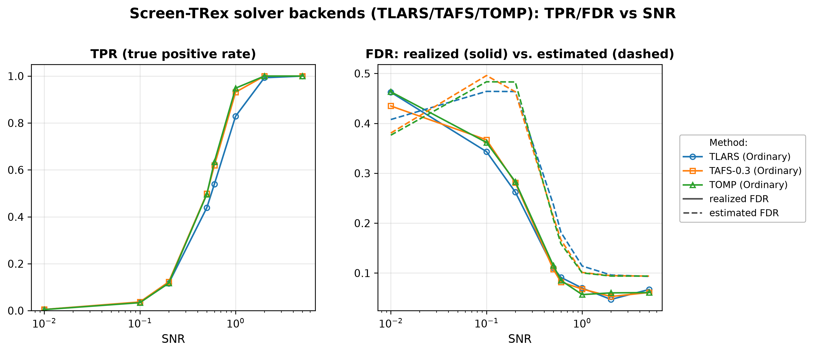
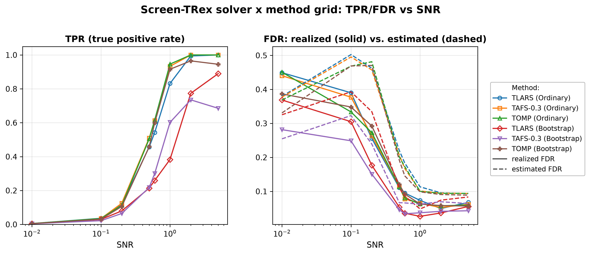

# Demo 06: Solver Backends for Screen-TRex — TLARS, TAFS, TOMP

## Purpose

Ask whether the **choice of T-Rex solver backend** changes screening performance, or whether it is merely a
 speed knob.
 The same i.i.d. Gaussian design as [Demo 01](../demo_trex_scr_01_mc_sim_screen_trex/README.md) is used, so
 the numbers here are directly comparable to the baseline established there.
 Three backends are swept over SNR — **TLARS** (terminating LARS), **TAFS** with $\rho = 0.3$ (terminating
 adaptive forward selection), and **TOMP** (terminating orthogonal matching pursuit) — first under the
 Ordinary thresholding rule alone, then crossed with the Bootstrap-CI rule.
 Screening returns a *candidate set*, and FDR/TPR are evaluated on the individual selected variables
 (see [What is actually measured](../README.md#what-is-actually-measured-in-these-demos)).

---

## Data Generation Parameters (`make_iid_dgp`)

We consider the linear model:

$$
\boldsymbol{y} = \boldsymbol{X}\boldsymbol{\beta} + \boldsymbol{\epsilon},
\qquad \boldsymbol{\epsilon} \sim \mathcal{N}(\boldsymbol{0}, \sigma_{\varepsilon}^2 \boldsymbol{I}_n)
$$

- $\boldsymbol{y} \in \mathbb{R}^n$ is the response vector.
- $\boldsymbol{X} \in \mathbb{R}^{n \times p}$ is the design matrix.
- $\boldsymbol{\beta} \in \mathbb{R}^p$ is the coefficient vector, with $s$ nonzero entries.
- $\boldsymbol{\epsilon}$ is the noise vector, i.i.d. standard normal.
- $\sigma_{\varepsilon}^2$ is the noise variance, calibrated to achieve a target linear signal-to-noise ratio (SNR).
- $n = 300$, $p = 1000$, $s = 10$ (high-dimensional, $p > n$).

The design matrix has **no correlation structure**:

$$
X_{ij} \sim \mathcal{N}(0,1) \quad \text{i.i.d.}
$$

- The active support is drawn uniformly at random *per Monte Carlo trial*, so the results are not tied to
   one support pattern.
- All active coefficients are $\beta_j = 1$; the support-selection and coefficient RNGs are offset from the
   trial seed so they stay independent of the design and noise draws.
- This is the **same DGP as Demo 01**, so the two demos are directly comparable — any difference in the
   curves below is attributable to the solver backend, not to the data.

---

## Control Parameters

```text
K = 20                       # Random experiments per T-loop iteration
R_boot = 1000                # Bootstrap replicates (Bootstrap-CI rule only)
ci_grid_step = 0.001         # Bootstrap-CI threshold grid granularity
solver = TLARS / TAFS / TOMP # T-Rex solver backends compared
rho_afs = 0.3                # AFS penalty parameter (TAFS only)
MC = 200                     # Monte Carlo repetitions per grid point
```

Note that Screen-TRex has **no target-FDR parameter**: unlike the classical T-Rex selector, screening
 thresholds the voting statistic instead of calibrating to a user-specified level.

---

## Methods Compared

Three T-Rex solver backends [[1]](#references), all driving `ScreenTRexMethod::TREX`:

- **TLARS** — terminating LARS, the default backend; follows the least-angle regression path until the
   dummy-based stopping criterion fires.
- **TAFS-0.3** — terminating adaptive forward selection with penalty $\rho = 0.3$; a greedy forward path
   with an adaptive penalty on the already-selected directions.
- **TOMP** — terminating orthogonal matching pursuit; the greediest of the three, taking the predictor most
   correlated with the current residual at each step.

Each backend is combined with the Screen-TRex thresholding rules:

- **Ordinary** — selects $\{ j : \Phi_j > 0.5 \}$, a simple majority vote of the random experiments.
- **Bootstrap** — builds a bootstrap confidence band around the estimated FDR curve (`R_boot = 1000`
   replicates) and picks its threshold from that band.

---

## The Two Parts

- **Part 1 — solvers under the Ordinary rule.** Three series (TLARS, TAFS-0.3, TOMP), Ordinary screening
   only, over $\mathrm{SNR} \in \{0.01, 0.1, 0.2, 0.5, 0.6, 1, 2, 5\}$ with 200 MC trials per grid point.
- **Part 2 — solvers crossed with both rules.** The same three backends under both Ordinary and
   Bootstrap-CI thresholding, giving six series over the same SNR grid and MC budget.

Every trial draws a fresh design, support, and noise realization.

---

## Output Files

Written to `simulation_results/data/`:

- `scr_solvers_snr_n300_p1000_s10.txt` / `.csv` — Part 1: FDR, TPR, and estimated FDR per solver and SNR
   level.
- `scr_solver_method_snr_n300_p1000_s10.txt` / `.csv` — Part 2: the same metrics for all six
   solver × rule combinations.

Figures (PNG + PDF) go to `simulation_results/plots/`, produced by `./generate_plots.sh`.

---

## Running the Demo

```bash
./build/release/bin/trex_selector_methods/trex_screening/demo_trex_scr_06_mc_sim_solvers/demo_trex_scr_06_mc_sim_solvers
./generate_plots.sh   # render the figures below from the saved CSVs
```

---

## Simulation Results

### Part 1 — Three Solvers, Ordinary Screening

- **The solver is not a pure speed knob.** At mid SNR the greedier backends are markedly more powerful than
   TLARS at comparable FDR: at $\mathrm{SNR} = 1$ the TPR is $0.931$ (TAFS-0.3) and $0.949$ (TOMP) against
   $0.829$ (TLARS), while the realized FDR is $0.068$, $0.057$, and $0.070$ respectively. The gap is already
   visible at $\mathrm{SNR} = 0.5$–$0.6$ ($0.498$/$0.496$ vs. $0.439$, and $0.619$/$0.634$ vs. $0.539$).
- **All three converge at high SNR.** By $\mathrm{SNR} = 2$ TAFS-0.3 and TOMP reach TPR $1.000$ and TLARS
   $0.993$; at $\mathrm{SNR} = 5$ all three recover every active variable at FDR $0.061$–$0.067$. The choice
   of backend therefore only matters where the signal is neither absent nor obvious.
- **At very low SNR the backends are indistinguishable — and all uncontrolled.** For $\mathrm{SNR} \le 0.2$
   the realized FDR runs $0.262$–$0.463$ for all three with TPR $\le 0.122$, reproducing the Demo 01 finding
   that screening is not FDR-controlling when there is no recoverable signal.
- **The internal FDR estimate behaves the same way for every backend.** It peaks around $0.46$–$0.50$ at
   $\mathrm{SNR} = 0.1$–$0.2$ and then settles at $0.093$–$0.094$ for all three at $\mathrm{SNR} = 5$,
   sitting *above* the realized FDR once signal is present.

TPR (left) and FDR (right) vs. SNR (log axis), one line per solver backend; on the FDR panel the solid line
is the realized FDR and the dashed line the procedure's own estimated FDR.



### Part 2 — Three Solvers × Two Thresholding Rules

- **Under Bootstrap-CI the backend matters far more than under the Ordinary rule.** At $\mathrm{SNR} = 1$
   the bootstrap TPR spans $0.383$ (TLARS), $0.602$ (TAFS-0.3), and $0.915$ (TOMP) — more than half the
   achievable power — against a spread of roughly $0.11$ for the same three backends under the Ordinary
   rule.
- **TLARS is by far the most conservative backend.** Its bootstrap FDR stays at or below $0.056$ from
   $\mathrm{SNR} = 0.5$ onwards, but its TPR reaches only $0.890$ at $\mathrm{SNR} = 5$. TOMP under
   Bootstrap-CI, in contrast, behaves almost like Ordinary screening: at $\mathrm{SNR} = 1$ its TPR is
   $0.915$ vs. $0.946$ ordinary, at FDR $0.063$ in both cases.
- **Two mild non-monotonicities at high SNR, reported as observed.** TAFS-0.3 under Bootstrap-CI peaks at
   TPR $0.735$ ($\mathrm{SNR} = 2$) and then *drops* to $0.685$ at $\mathrm{SNR} = 5$; TOMP shows the same
   pattern more weakly ($0.965 \to 0.945$). This is a non-monotonicity in the bootstrap threshold at high
   SNR; no mechanism for it has been verified here, so it is flagged rather than explained away.
- **The low-SNR regime is unaffected by either choice.** For $\mathrm{SNR} \le 0.2$ all six series have
   TPR $\le 0.124$ and FDR between $0.151$ and $0.450$; neither the backend nor the thresholding rule
   rescues screening when there is nothing to find.
- **Practical takeaway.** TLARS is the safe conservative default; TOMP and TAFS-0.3 buy substantial power at
   mid SNR at a comparable error rate. Under Bootstrap-CI the backend choice moves the operating point more
   than the thresholding rule does — pick the solver first, the rule second.

TPR (left) and FDR (right) vs. SNR (log axis), one line per solver × rule combination; on the FDR panel the
solid line is the realized FDR and the dashed line the procedure's own estimated FDR.



---

## References

1. Machkour, J., Muma, M., & Palomar, D. P., "False Discovery Rate Control for Fast Screening of
   Large-Scale Genomics Biobanks.", IEEE Statistical Signal Processing Workshop (SSP), 2023,
    pp. 666–670, IEEE.
    [DOI-Link](https://doi.org/10.1109/SSP53291.2023.10207957)

---

**Last updated**: 2026-07-20
