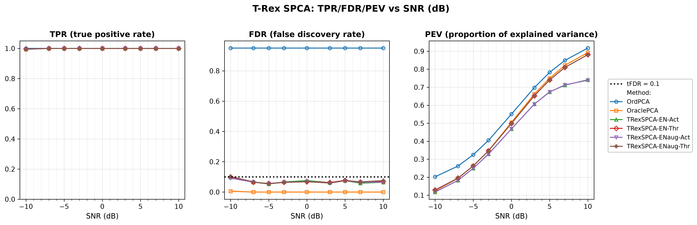

# Demo 01: T-Rex SPCA on a Sparse Factor Model

## Purpose

The demo compares **T-Rex SPCA** [[1]](#references) against two PCA baselines on a synthetic sparse
 three-factor model, over a signal-to-noise sweep in decibels.
 Four solver/mode combinations are run — the elastic-net solver `TENET` vs. `TENET_AUG`, each with the
 `ActiveSet` and `Thresholded` loading-assembly modes — against **ordinary PCA** (no sparsity) and
 **oracle-thresholded PCA** (told the true support size).
 The question is whether the T-Rex+GVS machinery controls the false discovery rate of the estimated loading
 support, and what that control costs in explained variance.
 FDR and TPR are evaluated on **PC1's loading support only**: ordinary PCA's orthogonality constraint mixes
 the supports of components 2 and 3 across the true factors, so there is no unambiguous per-component ground
 truth beyond PC1. PEV does not suffer that ambiguity and is cumulative over all $M$ components.

---

## Data Generation Parameters (`DataGenerator::generate_sparse_factor_model`)

We consider a sparse $M$-factor model:

$$
\boldsymbol{X} = \boldsymbol{Z}\boldsymbol{V}^\top + \boldsymbol{E}
$$

- $\boldsymbol{X} \in \mathbb{R}^{n \times p}$ is the observed data matrix.
- $\boldsymbol{Z} \in \mathbb{R}^{n \times M}$ holds the latent factor scores, column $m$ drawn
   $\mathcal{N}(0, \sigma_m^2)$ with $\sigma_m \in \{5, 3, 1\}$ — the factors are deliberately unequal in
   amplitude.
- $\boldsymbol{V} \in \mathbb{R}^{p \times M}$ is the sparse loading matrix: each column carries exactly
   $p_1$ nonzero entries of value $0.9$.
- $\boldsymbol{E}$ is i.i.d. Gaussian noise, scaled to hit the target SNR in dB.
- $n = 50$, $p = 100$, $p_1 = 5$, $M = 3$.
- The $p_1$ active indices of each factor are drawn without replacement from a **shared pool** of
   `overlap_pool_size` $= 30$ candidates, so factor supports may partially coincide.

All methods see the same **center-only** $\boldsymbol{X}$ — mean subtraction, no column scaling. That keeps
 ordinary PCA, oracle PCA and T-Rex SPCA on a common covariance-PCA footing. The column scales must *not* be
 normalized here: the factor amplitudes $\sigma_m$ live in the column variances, and z-scoring would destroy
 exactly the signal the factors are distinguished by.

---

## Control Parameters

```text
tFDR = 0.10           # Target FDR for the per-component selector
lambda_2 = -1         # < 0 selects the ridge penalty by k-fold CV (0 = none, > 0 = fixed)
scaling = L2          # Per-component selector scaling mode
MC = 200              # Monte Carlo repetitions per grid point
base_seed = 42        # Trial mc draws its data from base_seed + mc * 1000
```

Note that only the **data** is seeded deterministically. Each trial's dummies are drawn from hardware entropy
 (selector seed $-1$) by design, which is what makes the Monte Carlo FDR estimate valid — so a re-run
 reproduces the committed numbers only to within Monte Carlo noise ($\approx \pm 0.01$ at 200 trials), not
 exactly.

---

## Methods Compared

| Method | Sparsity mechanism | `SPCAMode` | `ENSolverType` |
| --- | --- | --- | --- |
| **OrdPCA** | none — all $p$ loadings retained | — | — |
| **OraclePCA** | top-$p_1$ by magnitude, true support size known | — | — |
| **TRexSPCA-EN-Act** | T-Rex+GVS selection [[2]](#references) | `ActiveSet` | `TENET` |
| **TRexSPCA-ENaug-Act** | T-Rex+GVS selection [[2]](#references) | `ActiveSet` | `TENET_AUG` |
| **TRexSPCA-EN-Thr** | T-Rex+GVS selection [[2]](#references) | `Thresholded` | `TENET` |
| **TRexSPCA-ENaug-Thr** | T-Rex+GVS selection [[2]](#references) | `Thresholded` | `TENET_AUG` |

The two modes differ in how the loadings are rebuilt once the support is chosen: `ActiveSet` keeps the
 selector's ridge coefficients, while `Thresholded` re-solves the ordinary PCA problem restricted to the
 selected support.

---

## The Sweep

A single **SNR sweep in decibels** over
$\mathrm{SNR} \in \{-10, -7, -5, -3, 0, 3, 5, 7, 10\}$ dB, 200 MC trials per point. The axis is plotted and
tabulated in dB throughout; it is never converted back to a linear ratio.

---

## Output Files

Written to `simulation_results/data/`:

- `demo_trex_spca_01_mc_sim.txt` / `.csv` — FDR, TPR and PEV per method and SNR level.

Figures (PNG + PDF) go to `simulation_results/plots/`, produced by `./generate_plots.sh`.

---

## Running the Demo

```bash
./build/release/bin/trex_selector_methods/trex_spca/demo_trex_spca_01_mc_sim/demo_trex_spca_01_mc_sim
./generate_plots.sh   # render the figure below from the saved CSV
```

---

## Simulation Results

- **All four T-Rex SPCA variants hold the FDR at or below the $\mathrm{tFDR} = 0.10$ target across the whole
   sweep**, with realized values between $0.05$ and $0.10$ — highest at the hardest point ($-10$ dB) and
   settling around $0.06$–$0.08$ from $-7$ dB upward. TPR is $1.000$ everywhere except $-10$ dB, where it is
   $0.994$–$0.996$.
- **OrdPCA's FDR of $0.95$ is not a defeat, it is arithmetic**: retaining all $p = 100$ loadings against a
   true support of $p_1 = 5$ makes 95 of every 100 selections false by construction. It is a non-sparse
   reference line, not a competitor.
- **OraclePCA is the ceiling**, with FDR $\approx 0$ and TPR $\approx 1$ — it is handed the true support
   size. The gap between it and the T-Rex variants is the price of *estimating* the support rather than
   knowing it, and on this design that price is small.
- **The PEV panel shows what the sparsity costs.** Ordinary PCA explains the most variance at every SNR
   ($0.20 \to 0.92$ across the grid) because it uses all loadings; the T-Rex variants trail it and converge
   toward the oracle, reaching $\approx 0.74$ at $+10$ dB. The `Thresholded` mode is consistently the better
   of the two modes here (e.g. $0.128$ vs. $0.117$ at $-10$ dB) because re-solving on the selected support
   recovers more variance than the active-set ridge coefficients.
- **`TENET` and `TENET_AUG` are the same estimator on this problem.** Given identical dummy seeds they
   produce bit-identical selections; the EN-vs-ENaug differences in the table are Monte Carlo dummy noise.
   The standard error of a 200-trial mean FDR is $\approx \pm 0.009$, an order of magnitude larger than the
   row-to-row differences — and the sign of those differences flips between modes and SNR points, which is
   what noise looks like.

TPR (left), FDR (middle, with the $\mathrm{tFDR} = 0.10$ target as a dashed line) and PEV (right) vs. SNR in
decibels, one line per method.



---

## References

1. Machkour, J., Breloy, A., Muma, M., Palomar, D. P., & Pascal, F., "Sparse PCA with False Discovery Rate Controlled
   Variable Selection.", IEEE International Conference on Acoustics, Speech and Signal Processing (ICASSP), 2024,
   pp. 9716–9720, IEEE.
   [DOI-Link](https://doi.org/10.1109/ICASSP48485.2024.10448237)
2. Machkour, J., Muma, M., & Palomar, D. P., "False Discovery Rate Control for Grouped Variable Selection
   in High-Dimensional Linear Models using the T-Knock Filter.", European Signal Processing Conference (EUSIPCO), 2022,
    pp. 892–896, EURASIP.
    [DOI-Link](https://doi.org/10.23919/EUSIPCO55093.2022.9909883)

---

**Last updated**: 2026-07-20
