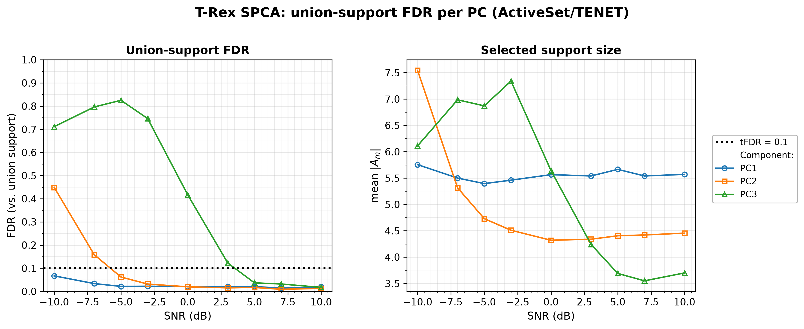
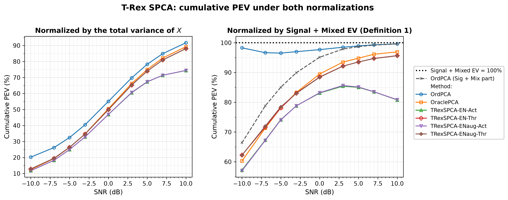

# Demo 01: T-Rex SPCA on a Sparse Factor Model

## Purpose

The demo compares **T-Rex SPCA** [[1]](#references) against two PCA baselines on a synthetic sparse
 three-factor model, over a signal-to-noise sweep in decibels.
 Four solver/mode combinations are run — the elastic-net solver `TENET` vs. `TENET_AUG`, each with the
 `ActiveSet` and `Thresholded` loading-assembly modes — against **ordinary PCA** (no sparsity) and
 **oracle-thresholded PCA** (told the true support size).
 The question is whether the T-Rex+GVS machinery controls the false discovery rate of the estimated loading
 support, and what that control costs in explained variance. This demo mirrors **Fig. 2** of
 [[1]](#references) and, like it, uses $p_1 = 5$; the companion
 [demo 02](../demo_trex_spca_02_mc_sim_pev/README.md) mirrors their Fig. 3 at $p_1 = 10$.
 FDR and TPR are evaluated on **PC1's loading support only**, and FDR *control* is assumed for PC1 only.
 The factor supports are drawn from a shared pool and overlap, and ordinary PCA's orthogonality constraint
 mixes the supports of components 2 and 3 across the true factors — the plug-in PC a later component's
 selector regresses on is already a blend of overlapping supports, so beyond PC1 there is no unambiguous
 per-component ground truth and hence no clean notion of a false discovery to control against. This mirrors
 the reference paper, whose Fig. 2 reports FDR and TPR "for the first PC". PEV does not suffer that
 ambiguity and is cumulative over all $M$ components.

One framing to keep in mind throughout: T-Rex SPCA supervises each component's selector with the *plug-in*
 ordinary PC $\boldsymbol{z}_m = \boldsymbol{X}\boldsymbol{v}_m$ — a one-shot construction, not the
 iterative refinement most sparse-PCA methods use. **The FDR guarantee is therefore conditional on the
 plug-in PC being a faithful proxy for its factor.** Where that proxy is good (PC1, factors above the noise
 floor) control is real; where it degrades, the selector still controls FDR *with respect to the regression
 it was handed*, which is not the same claim. The union-FDR section below measures exactly where the
 condition holds.

---

## Data Generation Parameters (`DataGenerator::generate_sparse_factor_model`)

We consider a sparse $M$-factor model:

$$
\boldsymbol{X} = \boldsymbol{Z}\boldsymbol{V}^\top + \boldsymbol{E}
$$

- $\boldsymbol{X} \in \mathbb{R}^{n \times p}$ is the observed data matrix.
- $\boldsymbol{Z} \in \mathbb{R}^{n \times M}$ holds the latent factor scores, column $m$ drawn
   $\mathcal{N}(0, \sigma_m^2)$ with $\sigma_m \in \{5, 3, 1\}$ — the factors are deliberately unequal in
   amplitude.
- $\boldsymbol{V} \in \mathbb{R}^{p \times M}$ is the sparse loading matrix: each column carries exactly
   $p_1$ nonzero entries of value $0.9$.
- $\boldsymbol{E}$ is i.i.d. Gaussian noise, scaled to hit the target SNR in dB.
- $n = 50$, $p = 100$, $p_1 = 5$, $M = 3$.
- The $p_1$ active indices of each factor are drawn without replacement from a **shared pool** of
   `overlap_pool_size` $= 30$ candidates, so factor supports may partially coincide.

All methods see the same **center-only** $\boldsymbol{X}$ — mean subtraction, no column scaling. That keeps
 ordinary PCA, oracle PCA and T-Rex SPCA on a common covariance-PCA footing. The column scales must *not* be
 normalized here: the factor amplitudes $\sigma_m$ live in the column variances, and z-scoring would destroy
 exactly the signal the factors are distinguished by.

---

## Control Parameters

```text
tFDR = 0.10           # Target FDR for the per-component selector
lambda_2 = -1         # < 0 selects the ridge penalty by k-fold CV (0 = none, > 0 = fixed)
scaling = L2          # Per-component selector scaling mode
MC = 200              # Monte Carlo repetitions per grid point
base_seed = 42        # Trial mc draws its data from base_seed + mc * 1000
```

Note that only the **data** is seeded deterministically. Each trial's dummies are drawn from hardware entropy
 (selector seed $-1$) by design, which is what makes the Monte Carlo FDR estimate valid — so a re-run
 reproduces the committed numbers only to within Monte Carlo noise ($\approx \pm 0.01$ at 200 trials), not
 exactly.

---

## Methods Compared

| Method | Sparsity mechanism | `SPCAMode` | `ENSolverType` |
| --- | --- | --- | --- |
| **OrdPCA** | none — all $p$ loadings retained | — | — |
| **OraclePCA** | top-$p_1$ by magnitude, true support size known | — | — |
| **TRexSPCA-EN-Act** | T-Rex+GVS selection [[2]](#references) | `ActiveSet` | `TENET` |
| **TRexSPCA-ENaug-Act** | T-Rex+GVS selection [[2]](#references) | `ActiveSet` | `TENET_AUG` |
| **TRexSPCA-EN-Thr** | T-Rex+GVS selection [[2]](#references) | `Thresholded` | `TENET` |
| **TRexSPCA-ENaug-Thr** | T-Rex+GVS selection [[2]](#references) | `Thresholded` | `TENET_AUG` |

The two modes differ in how the loadings are rebuilt once the support is chosen: `ActiveSet` keeps the
 selector's ridge coefficients, while `Thresholded` re-solves the ordinary PCA problem restricted to the
 selected support.

---

## Metrics

FDR and TPR are evaluated on PC1's loading support. With $\mathcal{S}_1$ the true active support of
 factor 1 and $\widehat{\mathcal{S}}_1$ the estimated (nonzero) support of the first sparse loading vector,

```math
\mathrm{FDR} = \mathbb{E}\left[\frac{|\widehat{\mathcal{S}}_1 \setminus \mathcal{S}_1|}
{\max\{1, |\widehat{\mathcal{S}}_1|\}}\right],
\qquad
\mathrm{TPR} = \mathbb{E}\left[\frac{|\mathcal{S}_1 \cap \widehat{\mathcal{S}}_1|}
{\max\{1, |\mathcal{S}_1|\}}\right],
```

with the expectations estimated as Monte Carlo means over the 200 trials. FDR *control* is claimed for PC1
 only (see [Purpose](#purpose)); the union-support variant for the later components is defined in the
 [dedicated results subsection](#union-support-fdr-beyond-pc1).

For the explained variance, the classical quantity is the EV of the estimated components,

```math
\mathrm{EV} = \mathrm{tr}\bigl(\widehat{\boldsymbol{Z}}^\top \widehat{\boldsymbol{Z}}\bigr)
            = \sum_{m=1}^{M} \lVert \widehat{\boldsymbol{z}}_m \rVert_2^2 .
```

Sparse PCA drops the orthogonality constraint, so correlated components double-count shared variance under
 this trace. Zou, Hastie & Tibshirani [[3]](#references) therefore correct it: with
 $\widehat{\boldsymbol{Z}} = \boldsymbol{Q}\boldsymbol{R}$ the QR decomposition of the estimated score
 matrix, the **adjusted EV** keeps only each component's incremental contribution,

```math
\mathrm{EV}_{\mathrm{adj}} = \sum_{m=1}^{M} r_{mm}^2 .
```

The **TRex-SPCA** paper [[1]](#references) adopts this corrected EV and builds its **Definition 1** on top of
 it, asking *where* the variance comes from: variance on the true active variables (Signal + Mixed EV) is
 worth explaining, variance on null variables (Null EV) is not — and that split is exactly what separates
 the non-sparse baseline from the FDR-controlled methods. Accordingly, the demo reports:

- The share of the **total** variance, bounded by 1:
  $\mathrm{PEV} = \mathrm{EV}_{\mathrm{adj}} / \mathrm{Var}(\boldsymbol{X})$
- **Definition 1** of [[1]](#references):
  $\mathrm{PEV}_{\mathrm{sig}} = \mathrm{EV}_{\mathrm{adj}} / \bigl(\lVert \boldsymbol{X}_{\mathcal{A}}
   \rVert_F^2 / (n-1)\bigr)$, where the denominator is the **Signal + Mixed EV of the data** — the variance
   carried by the true active variables ($\mathcal{A}$ = union of the factor supports), fixed per dataset
   and shared by all methods. Methods that additionally capture null-variable variance push past $100\%$,
   so this ratio is **not** capped at 1 — exceeding $100\%$ is the failure the metric is designed to
   expose. (Denominator convention validated against the published Fig. 3 by the legacy R reference,
   `demo_trex_spca_03_fig3.R`, mode `"active"`.)
- $\mathrm{PEV}_{\mathrm{sigmix}}$ — the method's *own* Signal + Mixed part over the same shared
   denominator; read for OrdPCA it is the paper's "Ordinary PCA (Sig + Mix)" reference curve.

For the simulations the two normalizations are deliberately presented against each other, as the second
 figure below does: the total-variance panel prices the sparsity, the Definition-1 panel shows where the
 non-sparse advantage actually comes from.

---

## The Sweep

A single **SNR sweep in decibels** over
$\mathrm{SNR} \in \{-10, -7, -5, -3, 0, 3, 5, 7, 10\}$ dB, 200 MC trials per point. The axis is plotted and
tabulated in dB throughout; it is never converted back to a linear ratio.

Section 2 reruns the same grid for the **union-support FDR per PC** (`ActiveSet`/`TENET` only) — see the
[dedicated results subsection](#union-support-fdr-beyond-pc1) for what it measures and why the union of the
factor supports is the only well-posed per-PC truth beyond PC1.

---

## Output Files

Written to `simulation_results/data/`:

- `demo_trex_spca_01_mc_sim.txt` / `.csv` — FDR, TPR and the PEV readings per method and SNR level. The CSV
   tags them `PEV` (total-variance normalization), `PEVsig` (Definition 1) and `PEVsigmix` (the method's
   Sig + Mix part).
- `demo_trex_spca_01_mc_sim_union_fdr.csv` — Section 2: union-support FDR and mean support size per PC
   (`pc,metric,snr_db,value`, metrics `FDRunion` / `k`).

Figures (PNG + PDF) go to `simulation_results/plots/`, produced by `./generate_plots.sh`:

- `demo_trex_spca_01_mc_sim.png` — TPR and FDR over the sweep (support recovery only).
- `demo_trex_spca_01_mc_sim_union_fdr.png` — Section 2: union-support FDR per PC.
- `demo_trex_spca_01_mc_sim_pev.png` — the two PEV normalizations side by side (the explained-variance
   story lives entirely in this figure).

---

## Running the Demo

```bash
./build/release/bin/trex_selector_methods/trex_spca/demo_trex_spca_01_mc_sim/demo_trex_spca_01_mc_sim
./generate_plots.sh   # render the figure below from the saved CSV
```

`TREX_SPCA_NUM_MC=<k>` overrides the Monte Carlo count for quick pilot runs (e.g. `TREX_SPCA_NUM_MC=10`),
and `TREX_SPCA_PARTS` selects the sections (default `12`; `1` = method comparison, `2` = union-FDR sweep).

---

## Simulation Results

- **All four T-Rex SPCA variants hold the FDR at the $\mathrm{tFDR} = 0.10$ target across the whole sweep**,
   with realized values between $0.052$ and $0.101$ — highest at the hardest point ($-10$ dB) and settling
   around $0.06$–$0.08$ from $-7$ dB upward. The single reading fractionally above target
   (`TRexSPCA-EN-Thr`, $0.1007$ at $-10$ dB) is inside Monte Carlo noise: the standard error of a
   200-trial mean FDR is $\approx \pm 0.009$, so it is not evidence of a breach. TPR is $1.000$ everywhere
   except $-10$ dB, where it is $0.995$–$0.997$.
- **OrdPCA's FDR of $0.95$ is not a defeat, it is arithmetic**: retaining all $p = 100$ loadings against a
   true support of $p_1 = 5$ makes 95 of every 100 selections false by construction. It is a non-sparse
   reference line, not a competitor.
- **OraclePCA is the ceiling**, with FDR $\approx 0$ and TPR $\approx 1$ — it is handed the true support
   size. The gap between it and the T-Rex variants is the price of *estimating* the support rather than
   knowing it, and on this design that price is small.
- **`TENET` and `TENET_AUG` are the same estimator on this problem.** Given identical dummy seeds they
   produce bit-identical selections; the EN-vs-ENaug differences in the table are Monte Carlo dummy noise.
   The $\approx \pm 0.009$ standard error is an order of magnitude larger than the row-to-row differences —
   and the sign of those differences flips between modes and SNR points, which is what noise looks like.

TPR (left) and FDR (right, with the $\mathrm{tFDR} = 0.10$ target as a dotted line) vs. SNR in decibels, one
line per method.

**Both panels read on PC1's loading support only — FDR control is claimed for the first PC
and nothing beyond it.** The overlapping factor supports leave the later components without an unambiguous
per-component ground truth (see [Purpose](#purpose)), so a per-PC FDR is not evaluable there.


### Union-support FDR beyond PC1

What can be said about the later components?
A per-factor FDR cannot be controlled!
It would brand legitimately selected leaked variables as false discoveries and measure the ambiguity of
 the truth rather than the selector.
The **union of the factor supports** is well-posed for every component: a variable outside
 the union is null for *every* factor, so selecting it is a false discovery no matter how the components
 mix.
Section 2 of the demo (`TREX_SPCA_PARTS=2`) therefore scores each PC's selected support
 (`ActiveSet`/`TENET`, the selector's own active sets) against that union — answering the one question the
 overlap leaves answerable: *does the selector start harvesting pure-noise variables on the later PCs?*

Formally, with $\mathcal{S}_{\cup} = \bigcup_{k=1}^{M} \mathcal{S}_k$ the union of the true factor supports
 and $\widehat{\mathcal{A}}_m$ the selector's active set for component $m$,

```math
\mathrm{FDR}_{\cup}(m) = \mathbb{E}\left[\frac{|\widehat{\mathcal{A}}_m \setminus \mathcal{S}_{\cup}|}
{\max\{1, |\widehat{\mathcal{A}}_m|\}}\right],
```

again as a Monte Carlo mean; the right panel of the figure reports the companion support size
 $\mathbb{E}\bigl[|\widehat{\mathcal{A}}_m|\bigr]$. For $m = 1$ this differs from the FDR above only in the
 more lenient truth ($\mathcal{S}_1 \subseteq \mathcal{S}_{\cup}$), which is why PC1's union-FDR sits
 slightly below its per-factor FDR.

- **PC1 is controlled everywhere** (union-FDR $0.014$–$0.067$, the union is a more lenient truth than factor 1's own support).
- **PC2 and PC3 are controlled exactly where their factors are alive, and break where they drown.** The
   factors have amplitudes $\sigma = (5, 3, 1)$, so relative to factor 1 the second factor sits
   $\approx 4$ dB and the third $\approx 14$ dB lower in effective SNR. That offset is precisely what the
   curves show: PC2 holds the target from $-5$ dB up ($\leq 0.06$) and breaks below it ($0.16$ at $-7$ dB,
   $0.45$ at $-10$ dB); PC3 holds only from $+5$ dB up ($\leq 0.04$) and collapses below ($0.42$ at
   $0$ dB, $0.71$–$0.83$ at $\leq -3$ dB). Once a factor is buried, its plug-in PC is essentially a noise
   direction, and the selector — asked to explain a noise response — dutifully selects noise variables.
   The support-size panel corroborates it: PC3's selection is inflated ($6$–$7.3$ variables) exactly in
   its broken regime and drops to $\approx 3.7$ once the factor emerges.

**Consequences**: the FDR guarantee is **conditional on the plug-in PC being a faithful proxy for its
factor**. Where a factor is buried, the selector still controls the FDR of the noise regression it was
handed — the nominal guarantee holds and is vacuous. Per-component control is therefore only as good as
the component's effective SNR: a caveat inherited from the one-shot plug-in construction, not from the
selector.



### The two PEV normalizations

The same cumulative explained variance, divided by two different denominators, tells two different stories.
 What the two panels plot is exactly the pair defined in [Metrics](#metrics):

```math
\text{left:}\quad
\mathrm{PEV} = \frac{\mathrm{EV}_{\mathrm{adj}}}{\mathrm{Var}(\boldsymbol{X})} \; \leq \; 1,
\qquad\qquad
\text{right:}\quad
\mathrm{PEV}_{\mathrm{sig}} = \frac{\mathrm{EV}_{\mathrm{adj}}}
{\lVert \boldsymbol{X}_{\mathcal{A}} \rVert_F^2 \,/\, (n-1)}
\;\; \text{(uncapped)},
```

with the dashed reference in the right panel showing OrdPCA's own Signal + Mixed part
 $\mathrm{PEV}_{\mathrm{sigmix}}$ over the same denominator.

- **Under the total-variance normalization (left panel), ordinary PCA wins at every SNR**
   ($20.2\% \to 91.7$\% across the grid), because it keeps all $p$ loadings. The T-Rex variants trail it, and
   `Thresholded` is consistently the better of the two modes ($88.1$\% vs. $74.4$\% at $+10$ dB) because
   re-solving on the selected support recovers more variance than the active-set ridge coefficients do.
   Reading alone, this panel says sparsity is a pure cost.
- **Under Definition 1 (right panel) the picture reverses: ordinary PCA's lead is mostly Null EV.** All
   curves now *rise* with SNR, exactly as in the reference paper's Fig. 3(b): the denominator is the
   variance the true active variables carry, and at low SNR most of that is noise no 3-component method can
   capture. Ordinary PCA hugs the $100\%$ line ($96.5$–$99.6\%$) — but the dashed reference curve shows how:
   at $-10$ dB only $66.4\%$ of its $98.3\%$ points are Signal + Mixed EV, the rest is variance harvested from
   null variables. The sparse methods carry almost no Null EV (their solid and Sig + Mix readings nearly
   coincide), with `Thresholded` reaching $95.7\%$ and OraclePCA $96.9\%$ at $+10$ dB. (With only $M = 3$
   extracted PCs the ordinary-PCA overshoot past $100\%$ stays latent; demo 02's PC-count sweep is where it
   erupts to $163\%$.)
- **The two panels together are the actual result.** Ordinary PCA's lead in the left panel is bought with
   exactly the variance the dashed decomposition in the right panel exposes as null. The FDR-controlled
   variants pay a modest, quantified price in captured variance and in exchange claim almost nothing that
   is not theirs.



For the full Fig.-3-style treatment of [[1]](#references) of this metric — swept over the PC count, the number of true
 active loadings and the target FDR as well — see [demo 02](../demo_trex_spca_02_mc_sim_pev/README.md).

---

## References

1. Machkour, J., Breloy, A., Muma, M., Palomar, D. P., & Pascal, F., "Sparse PCA with False Discovery Rate Controlled
   Variable Selection.", IEEE International Conference on Acoustics, Speech and Signal Processing (ICASSP), 2024,
   pp. 9716–9720, IEEE.
   [DOI-Link](https://doi.org/10.1109/ICASSP48485.2024.10448237)
2. Machkour, J., Muma, M., & Palomar, D. P., "False Discovery Rate Control for Grouped Variable Selection
   in High-Dimensional Linear Models using the T-Knock Filter.", European Signal Processing Conference (EUSIPCO), 2022,
    pp. 892–896, EURASIP.
    [DOI-Link](https://doi.org/10.23919/EUSIPCO55093.2022.9909883)
3. Zou, H., Hastie, T., & Tibshirani, R., "Sparse Principal Component Analysis.", Journal of Computational
   and Graphical Statistics, vol. 15, no. 2, 2006, pp. 265–286, Taylor & Francis.
   [DOI-Link](https://doi.org/10.1198/106186006X113430)

---

**Last updated**: 2026-07-21
