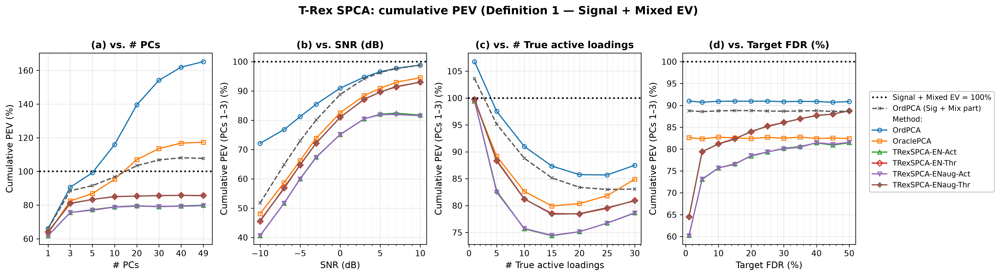
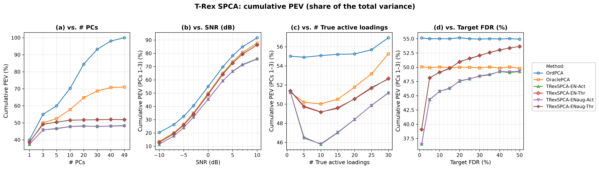
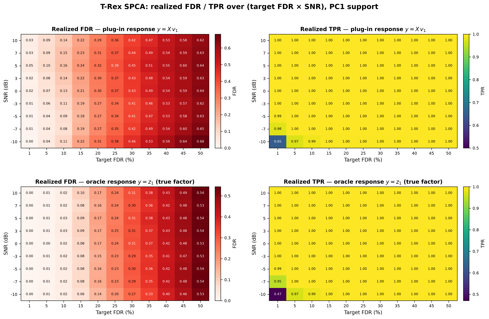

# Demo 02: Cumulative Explained Variance of T-Rex SPCA

## Purpose

While Demo 01 asks whether the loading support is FDR-controlled, this demo asks: **what proportion of
 variance does the selected support actually explain, and where does a non-sparse method's apparent advantage come
 from?**

It runs all four sweeps of **Fig. 3** of [[1]](#references) — cumulative explained variance under the
 paper's Definition 1 — and reports the conventional total-variance normalization alongside it so the two can
 be compared directly.
The pairing is the point: under one denominator ordinary PCA looks best, under the
 other it looks worst, and both statements are computed from the very same explained variance.

The Definition-1 denominator is the **Signal + Mixed EV of the data** — the variance carried by the true
 active variables, fixed per dataset and shared by all methods. This convention reproduces the published
 panels' qualitative behaviour (curves *rising* with SNR from ≈40 %, ordinary PCA overshooting far past
 100 %, sparse methods saturating near 100 %). An earlier revision of this demo instead normalized each
 method by its **own** Signal + Mixed EV ("Definition 1 as printed"), which is structurally ≥ 100 % for
 null-capturing methods and inverts the SNR trend — the published curves are unreachable under it.
 Digit-level coincidence with the paper's Fig. 3 remains impossible either way: the paper's exact
 normalization cannot be reconstructed from its text (see
 [the dedicated section below](#relation-to-the-papers-fig-3)).

---

## Data Generation Parameters (`DataGenerator::generate_sparse_factor_model`)

The sparse $M$-factor model of [demo 01](../demo_trex_spca_01_mc_sim/README.md#data-generation-parameters-datageneratorgenerate_sparse_factor_model),
 unchanged:

```math
\boldsymbol{X} = \boldsymbol{Z}\boldsymbol{V}^\top + \boldsymbol{E}
```

- $n = 50$, $p = 100$, $M = 3$ true factors, $\sigma_m \in \{5, 3, 1\}$.
- $p_1 = 10$ active loadings of value $0.9$ per factor, drawn without replacement from a **shared pool** of
   `overlap_pool_size` $= 30$ candidates, so factor supports partially coincide.
- All methods see the same **center-only** $\boldsymbol{X}$ (covariance-PCA footing).

---

## Control Parameters

```text
tFDR = 0.10           # Target FDR (swept in Part 4)
lambda_2 = -1         # < 0 selects the ridge penalty by k-fold CV (0 = none, > 0 = fixed)
scaling = L2          # Per-component selector scaling mode
MC = 200              # Monte Carlo repetitions per grid point
base_seed = 42        # Per-grid-point seed band, derived from the swept value
```

As in demo 01, only the **data** is seeded deterministically; each trial's dummies come from hardware
 entropy, which is what makes the Monte Carlo estimate valid. A re-run therefore reproduces the committed
 numbers to within Monte Carlo noise, not exactly.

---

## Methods Compared

Identical to [demo 01](../demo_trex_spca_01_mc_sim/README.md#methods-compared): **OrdPCA**, **OraclePCA**, and
 the four T-Rex SPCA variants crossing `TENET`/`TENET_AUG` with `ActiveSet`/`Thresholded`.

The metrics are those of [demo 01](../demo_trex_spca_01_mc_sim/README.md#metrics) — classical EV, corrected
 to the adjusted EV of [[3]](#references), reported as `PEV` (total-variance share), `PEVsig`
 (Definition 1) and `PEVsigmix` (the method's own Sig + Mix part; OrdPCA's is the paper's
 "Ordinary PCA (Sig + Mix)" reference curve). As in demo 01, realized FDR is evaluated on PC1's support
 only, and FDR *control* is assumed for PC1 only: the overlapping factor supports make later components'
 ground truth ambiguous.

---

## The Sweeps

Each part varies **one** axis and holds the rest at their defaults (#PCs $= 3$, SNR $= 0$ dB, $p_1 = 10$,
 $\mathrm{tFDR} = 0.10$):

| Part | Axis | Grid |
| --- | --- | --- |
| 1 | Number of **extracted** PCs | $\{1, 3, 5, 10, 20, 30, 40, 49\}$ |
| 2 | SNR (dB) | $\{-10, -7, -5, -3, 0, 3, 5, 7, 10\}$ |
| 3 | Number of true active loadings $p_1$ | $\{1, 5, 10, 15, 20, 25, 30\}$ |
| 4 | Target FDR | $\{0.01, 0.05, 0.10, 0.15, \ldots, 0.50\}$ |
| 5 | Realized FDR / TPR **heatmaps** over the full target-FDR $\times$ SNR grid | $11 \times 9$ points, PC1 support, two selector responses |

Notes on the grids:

- **Part 1 varies only how many components are *extracted*.** The data keeps its $M = 3$ true factors
   throughout, so every component beyond the third is null by construction and can contribute nothing but
   Null EV. That is exactly what makes the panel diagnostic.
- **Part 1 stops at 49, not at 50.** $\boldsymbol{X}$ is centered, so $\operatorname{rank}(\boldsymbol{X})
   \leq n - 1 = 49$ and a 50th component carries no variance at all — asking the per-PC selector to regress
   on that null direction throws outright, because its response vector is constant. 49 is the largest
   attainable PC count on an $n = 50$ design, not a safety margin.
- **Part 3 is bounded above by the overlap pool.** Each factor draws its support from a shared pool of 30
   candidates, so $p_1 \leq 30$.
- **Only the T-Rex variants respond to Part 4.** The two PCA baselines never see `tFDR`; they are reported
   as flat reference lines.
- **Parts 2–4 are displayed as cumulative PEV only.** Their extraction is held at the $M = 3$ true factors,
   so what they show is the cumulative PEV of PCs 1–3 under both normalizations — the tables and figures
   carry nothing else. Support-recovery metrics belong to demo 01's sweep; here they remain in the CSVs as
   the data record but are not displayed.
- **Part 5 is the support-recovery counterpart of Part 4**, run over the full 2D grid instead of the 0 dB
   slice, and only for PC1. Each trial runs the per-PC T-Rex+GVS(EN) selector twice on the same data: once
   on the **plug-in response** $y = \boldsymbol{X} v_1$ (what T-Rex SPCA actually regresses on) and once on
   the **oracle response** $y = z_1$, the true factor scores. The pairing isolates the mechanism behind the
   FDR overshoot at loose targets — see the caveat section below.

---

## Output Files

Written to `simulation_results/data/`, one pair per sweep:

- `demo_trex_spca_02_mc_sim_pev_pcs.txt` / `.csv`
- `demo_trex_spca_02_mc_sim_pev_snr.txt` / `.csv`
- `demo_trex_spca_02_mc_sim_pev_loadings.txt` / `.csv`
- `demo_trex_spca_02_mc_sim_pev_tfdr.txt` / `.csv`
- `demo_trex_spca_02_mc_sim_pev_fdr_heatmap.csv` — Part 5 (`response,metric,tfdr,snr_db,value`)

The `pcs` table carries FDR, TPR, `PEV` (total-variance normalization), `PEVsig` (Definition 1) and
 `PEVsigmix` (the method's Sig + Mix part) per method; the `snr`, `loadings` and `tfdr` **tables are
 restricted to the cumulative-PEV rows** (PCs 1–3). Every CSV still records all five metrics — the FDR
 caveat below reads its numbers from the `tfdr` CSV.

Figures (PNG + PDF) go to `simulation_results/plots/`, produced by `./generate_plots.sh`, which combines all
four sweeps into one panel figure per normalization:

- `demo_trex_spca_02_mc_sim_pev_signal.png` — cumulative PEV under Definition 1.
- `demo_trex_spca_02_mc_sim_pev_total.png` — cumulative PEV as a share of the total variance.
- `demo_trex_spca_02_mc_sim_pev_fdr_heatmap.png` — Part 5: realized FDR / TPR heatmaps, both responses.

---

## Running the Demo

```bash
./build/release/bin/trex_selector_methods/trex_spca/demo_trex_spca_02_mc_sim_pev/demo_trex_spca_02_mc_sim_pev
./generate_plots.sh   # render the figures below from the saved CSVs
```

`TREX_SPCA_NUM_MC=<k>` overrides the Monte Carlo count for quick pilot runs (e.g. `TREX_SPCA_NUM_MC=10`),
and `TREX_SPCA_PARTS` selects which parts run (default `12345`; e.g. `TREX_SPCA_PARTS=5` reruns only the
FDR/TPR heatmap sweep).

The PC-count sweep dominates the runtime: extracting 49 components means 49 independent T-Rex selections per
trial, so Part 1 alone costs several times what the other parts cost together.

---

## Simulation Results

### Cumulative PEV under Definition 1

- **Panel (a) is the clearest statement in this suite.** The data has three true factors, so every component
   past the third can only add Null EV — and that is exactly what the curves show. Ordinary PCA climbs from
   $66.1\%$ at one PC past the $100\%$ line at about five PCs to $165.2\%$ at 49: by the time it has
   extracted 49 components it is reporting two thirds more variance than the true active variables carry.
   Its dashed Sig + Mix decomposition saturates at $107.8\%$ — everything between the solid and dashed
   curves is Null EV. OraclePCA reaches $117.4\%$ and even overtakes the dashed reference (crossover
   between 10 and 20 PCs): it is an oracle only about the support *size* $p_1$, so on the noise directions
   beyond PC3 its top-$p_1$ thresholding selects mostly null variables ($\approx 26$ of $100$ are active)
   and the renormalization hands them full weight — the $\approx 10$-point gap above the dashed curve is
   its accumulated Null EV. Knowing the cardinality does not protect against thresholding noise; only the
   FDR-controlled selection, which may return (near-)empty supports on noise components, stays flat: the
   four T-Rex variants flatten out by three-to-five PCs and stay there ($79.6$–$80.0\%$ `ActiveSet`,
   $85.5$–$85.7\%$ `Thresholded` at 49), declining to claim variance that is not theirs even when handed
   46 components they do not need.
- **Panel (b) rises with SNR, as in the published Fig. 3(b).** At $-10$ dB the true active columns are
   dominated by noise that no 3-component method can capture, so everything sits low: $40.6$–$45.8\%$ for
   the T-Rex variants, $48.1\%$ for OraclePCA, $72.1\%$ for ordinary PCA — whose head start is exactly its
   Null EV, as the dashed Sig + Mix curve at $51.8\%$ shows. With rising SNR the `Thresholded` variants and
   OraclePCA converge toward the line ($93.0\%$ and $94.5\%$ at $+10$ dB), the `ActiveSet` variants level
   off near $82\%$ (the ridge-refit loadings' known variance gap), and ordinary PCA's solid and dashed
   curves merge at $98.8\%$ — at high SNR there is hardly any null variance left to harvest.
- **Panel (c) is non-monotone, and both ends are easy for the wrong reason.** All methods start near
   $100\%$ at $p_1 = 1$ (ordinary PCA at $106.8\%$, again split by its dashed curve at $103.6\%$), sag to a
   minimum around $p_1 = 15$–$20$ ($74.4\%$ `ActiveSet`, $78.5\%$ `Thresholded`, $80.0\%$ OraclePCA,
   $85.7\%$ ordinary), and recover toward $p_1 = 30$, where the true support fills the entire overlap pool
   and there are few null variables left to miss. The middle of the range is where support selection
   actually matters.
- **Panel (d) reproduces the paper's headline reading: T-Rex is insensitive to the target above
   $\approx 5\%$.** The two ordinary-PCA references are `tFDR`-blind and sit flat ($90.9\%$ solid,
   $88.7\%$ dashed). The T-Rex variants pay visibly only at the strictest target ($60.3\%$ `ActiveSet` /
   $64.5\%$ `Thresholded` at $\mathrm{tFDR} = 0.01$, where the selector keeps too few variables), then climb
   onto a gentle plateau ($75.7 \to 81.5\%$ and $81.2 \to 88.8\%$ from $\mathrm{tFDR} = 0.10$ to $0.50$).
   Loosening the target buys captured variance slowly — and pays for it in realized FDR (see the caveat
   below).



### The same variance, normalized by the total variance

Read through the conventional denominator, the ranking inverts and the story becomes "sparsity costs
variance":

- In panel (a) ordinary PCA rises to exactly $100.0\%$ at 49 PCs — with $n - 1 = 49$ components it spans the
   whole centered row space and reproduces the data completely. The T-Rex variants saturate at $48$–$52\%$
   after about five components and then stop, which is the same flatness as before seen from the other side:
   they are not adding anything after the true factors are covered.
- The gap between the two figures at $p_1 = 10$, 49 PCs is the whole argument in two numbers: ordinary PCA
   explains $100\%$ of the total variance, and $165\%$ of the variance that belongs to the true active
   variables.



### Relation to the paper's Fig. 3

The paper's text does not pin down the normalization behind its plotted curves — no constructible
 denominator reproduces all published anchors, so digit-level agreement with Fig. 3 is not attainable from
 the paper alone. (A self-normalized reading of Definition 1 is ruled out entirely: it is $\geq 100\%$ by
 construction for null-capturing methods and inverts the SNR trend.) This demo therefore uses the fixed
 active-column denominator throughout, which reproduces the figure's qualitative content: curves rising
 with SNR, ordinary PCA's Null-EV overshoot past $100\%$, the sparse methods saturating near $100\%$, and
 the ranking inversion between the two normalizations.

### A caveat on FDR at loose targets

Part 5 maps the realized FDR and TPR of PC1's support over the **full** (target FDR $\times$ SNR) grid —
 200 MC trials per cell, same datasets across each row's targets. The FDR panels show the realized FDR on a
 red scale from $0$; whether a cell is in control is read against its column's target. Each configuration is
 run for two selector responses; the pairing is a controlled test of the mechanism suspected behind the
 overshoot:

- **plug-in response** $y = \boldsymbol{X} v_1$ — the ordinary PC1, exactly what T-Rex SPCA regresses on.
   The regression's own true support is **dense** ($z_1$ loads on every variable), while the scoring truth
   is the sparse factor-model support.
- **oracle response** $y = z_1$ — the true factor scores (unobservable in practice). Here the regression
   truth **is** the sparse factor support, so selector-level control and factor-model scoring coincide.



What the grid shows:

- **Plug-in response: control holds up to the targets this suite actually uses, then breaks everywhere.**
   At $\mathrm{tFDR} = 0.05$ the realized FDR is $0.04$–$0.10$; at $0.10$ it is $0.08$–$0.16$ (fraying
   mildly above target from $+5$ dB up). From $\mathrm{tFDR} = 0.15$ the exceedance is systematic at every
   SNR — $+0.06$ to $+0.09$ at $0.15$, growing to $+0.12$ to $+0.18$ at $0.50$ (realized $0.62$–$0.68$).
   The pattern is nearly SNR-independent: this is not a noise effect (SE $\approx 0.02$–$0.03$ per cell).
- **Oracle response: the overshoot largely vanishes — the mechanism is confirmed.** With the true factor
   as response, the realized FDR stays **at or below target through $\mathrm{tFDR} \approx 0.30$ at every
   SNR** (e.g. $0.06$–$0.10$ against $0.15$, $0.14$–$0.18$ against $0.20$), and even at the loosest targets
   the residual exceedance is only $+0.03$–$0.04$ ($0.53$–$0.54$ against $0.50$). The bulk of the plug-in
   overshoot is therefore a property of the **evaluation mismatch** — a dense-truth regression scored
   against a sparse truth — not of the selector. A small selector-level residual remains at very loose
   targets.
- **TPR is a non-issue except in the strict-target / low-SNR corner.** It is $\geq 0.97$ everywhere except
   at $\mathrm{tFDR} = 0.01$, $-10$ dB, where the selector keeps too few variables ($0.65$ plug-in, $0.47$
   oracle) — the same corner that produces the PEV dip in panel (d).

**Consequences**: At this suite's default $\mathrm{tFDR} = 0.10$ the pipeline is safe across the whole
   SNR range. Loosening the target is a poor trade under factor-model scoring: from $0.10$ to $0.50$ it
   buys about six PEV points (panel (d), `ActiveSet`) while the realized factor-model FDR climbs roughly
   linearly to $\approx 0.62$–$0.68$.
The general lesson is the conditional nature of the guarantee:
 **T-Rex SPCA controls the FDR of the regression it is handed, and that transfers to the factor model
 only insofar as the plug-in PC is a faithful proxy for the factor** (see also demo 01's union-FDR
 section for the same condition read across components).

---

## References

1. Machkour, J., Breloy, A., Muma, M., Palomar, D. P., & Pascal, F., "Sparse PCA with False Discovery Rate Controlled
   Variable Selection.", IEEE International Conference on Acoustics, Speech and Signal Processing (ICASSP), 2024,
   pp. 9716–9720, IEEE.
   [DOI-Link](https://doi.org/10.1109/ICASSP48485.2024.10448237)
2. Machkour, J., Muma, M., & Palomar, D. P., "False Discovery Rate Control for Grouped Variable Selection
   in High-Dimensional Linear Models using the T-Knock Filter.", European Signal Processing Conference (EUSIPCO), 2022,
    pp. 892–896, EURASIP.
    [DOI-Link](https://doi.org/10.23919/EUSIPCO55093.2022.9909883)
3. Zou, H., Hastie, T., & Tibshirani, R., "Sparse Principal Component Analysis.", Journal of Computational
   and Graphical Statistics, vol. 15, no. 2, 2006, pp. 265–286, Taylor & Francis.
   [DOI-Link](https://doi.org/10.1198/106186006X113430)

---

**Last updated**: 2026-07-21
